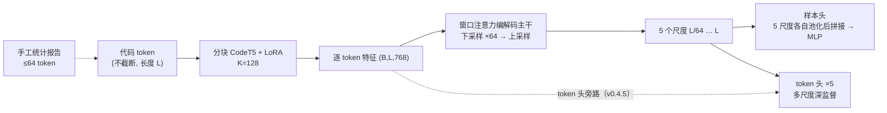

# U-Det 汇报

> 2026-09-21 · 面向专家读者的现状汇报（设计细节见 `docx/u-det-v0.4.md`，经验教训见 `docx/lessons.md`）

## 1. 任务与数据

**AI 生成代码检测**，两个互补的监督信号同时训练：

| 数据集 | 任务 | train / val / test | 长度 |
| --- | --- | --- | --- |
| CoDET-M4 | 文档级二分类（human / AI） | 16069 / 1991 / 1940 | 中位 293 tok，90 分位 3676，max 32948 |
| HybridCodeAuthorship | token → **行级**归属（AI 行 / human 行） | 6904 / 797 / 883 | 中位 1274，max 10475 |

两个已知数据陷阱（直接影响结论解读）：

* CoDET-M4 的**标签与长度强混淆**：AI 样本全部 <2048 token ⇒ 纯长度规则 val acc 就有 0.659；
  长度分桶时该数据集的 `>2048` 桶全是 human（F1 退化成 0/0，不可用于判断）。
* Hybrid 的**文档级标签恒为 1**（子集只保留含 AI 行的文件）⇒ 样本级 CE 只在 M4 上回传，
  且它不能进入选模型的监控指标（否则会随 token 级变好而下降）。

## 2. 模型：U-Det

一句话：**用「分块编码 + 可学多尺度编解码」替代「截断 / 滑窗的长上下文编码」，样本级与 token 级共享同一套主干。**

**① 分块编码器**（`codet5blk`，v0.4.2 起）

把序列切成 `K=128` 的块、打包成 `(block_batch, K)` 过 CodeT5 —— **块内 attention 真实存在，块间彼此独立**。
关键是**块的输入/输出向量数严格 1:1**（K 进 K 出，不池化、不重叠、不跨样本边界），
所以对下游完全透明：输出仍是 `(B, L, 768)`，**不截断、长度无上限**，也没有整段 O(L²) attention。
（`static` 把块数补齐到 `block_batch` 整数倍以获得固定形状，这是 `torch.compile` 生效的前提。）

> 这一项是历史上最大的单项收益（+7~+10.65 分）。它修的是一个**被当成"固有代价"接受了两代**的实现缺陷：
> 之前每个 token 单独前向（`seq_len=1`），softmax 单元素恒为 1 ⇒ attention 完全退化、
> **q/k 是死参数**、token 表示没有任何上下文。

**② 序列级编解码主干**（`models/hier2.py`）

4 级下采样（除数 `[4,4,2,2]`，累计 64×）+ 4 级上采样，全部由**窗口化跨注意力块**构成。
上采样的跨注意力**就是跳连**（q 来自粗层升维，kv 来自下采样前存的细层 skip）；
v0.4.0 在融合处加了**逐通道门控** `out = g⊙up + (1−g)⊙skip`，`g = σ(Linear([up, skip]))`，
权重零初始化 + 偏置 −1 ⇒ 起点偏向纯跳连。

**③ 多任务头**

* **样本头**读**全部 5 个尺度**（各尺度各自均值池化后拼接，宽度 768×5），再进 MLP；
* **token 头 ×5**（多尺度深监督，粗尺度标签用 mask-aware 池化对齐）；
  最细尺度的 token 头**额外拼接编码器的全长逐 token 输出**（v0.4.5 的 `token_bypass`，768→1536）。
  这里有个刻意不做的方案：**融合粗尺度的 token logits 是语义错配** —— 粗尺度目标是
  `lse`/`mean` **聚合后**的软标签，语义是"这个窗口里有没有 AI"，不是"每个 token 是不是 AI"。

**④ 损失**：样本级 CE（仅 M4） + token 级 BCE（5 尺度，粗三级用软 `lse` 目标）
+ 层级一致性 A（池化自蒸馏） + B2（下采样路径的位置探针）。

**参数量**

| | 可训练 | 冻结 | 合计 |
| --- | --- | --- | --- |
| CodeT5 滑窗基线（全量微调） | **109.61 M** | — | 109.61 M |
| U-Det v0.4.5 | **93.65 M**（主干+头 91.6 + LoRA 2.06） | 107.55 M（CodeT5 底座） | 201.2 M |

⚠️ 对等比较时要说清：U-Det **可训练参数少 16 M**，但它保留了一个冻结的大编码器底座，
**总参数反而更多**（201 M vs 110 M）。

## 3. 实验设置

* **同数据、同切分、同指标、同 epoch 预算**；batch=1 整段（不截断、不滑窗）。
* 两流**并行**：每个 optimizer step 同时消费 1 个 M4 + 1 个 Hybrid 样本 ⇒ `steps/epoch = 16069`，`grad_accum = 8`。
* AdamW，主干 lr 3e-4 / 编码器与 LoRA 5e-5，`OneCycleLR` 每 epoch 一个周期（续跑即热重启）。
* 基线：微调 CodeT5 编码器 + 逐 token 线性头，`window=512`、stride 按流（M4 512 / Hybrid 256）
  —— 每 token 只见 **512 局部上下文**，**109.6 M 全量微调**。
* 单卡 RTX 3080 Ti 12 GB，实测 **0.24~0.26 s/step**（各版本差异 < 7%）；显存峰值 10.4~11.9 GB。

## 4. 结果

**test 集，同数据同切分同预算**（`m4` = 文档级 F1；`line`/`chunk`/`token` = 行级 / 连续 AI 行段 / token 级 F1）

| 版本 | epoch | 可训练 | m4 | line | chunk | token |
| --- | --- | --- | --- | --- | --- | --- |
| **CodeT5 滑窗基线** | 4 | 109.61 M | 0.9736 | **0.7978** | **0.5081** | **0.8270** |
| v0.4.2 分块编码器 | 4 | 92.85 M | 0.9700 | 0.7895 | 0.5035 | 0.8190 |
| **v0.4.4 多尺度样本头** | 4 | 93.65 M | **0.9775** | 0.7878 | 0.5076 | 0.8187 |
| v0.4.5 token 头旁路 | 2 | 93.65 M | 0.9689 | 0.7880 | 0.4893 | 0.8186 |
| v0.4.1 门控 + 一致性损失 | 4 | 92.85 M | 0.9408 | 0.7139 | 0.3970 | 0.7489 |
| v0.3.1（无门控，逐 token 编码） | 4 | 87.31 M | 0.9307 | 0.6922 | 0.3733 | 0.7279 |
| 冻结特征 + 闭式线性（769 参） | — | 769 | 0.9069 | — | — | — |

**核心结论**

1. ★ **m4 已反超基线**（0.9775 vs 0.9736，同 4 epoch），且 **chunk 基本打平**（差 0.05）；
   line / token 仍差 **1.00 / 0.83**。
2. 但**这个反超是脆弱的**：基线的晚期增速反而略快，两版都远未收敛，
   「再加预算就能稳住」**不是自动成立的**。
3. ★★ **差距的性质是"工作点"，不是"能力"**：固定阈值 0.5 对 U-Det 系统性不利
   —— 它输出的概率偏低（欠自信），被压成"精确率高、召回低"的工作点。
   各自取最优阈值后，line 差距 **−1.00 → −0.40**、token **−0.83 → −0.55**：

   | | 最优阈值 (m4 / hybrid) | line F1 | chunk F1 | token F1 |
   | --- | --- | --- | --- | --- |
   | 基线 | 0.70 / 0.55 | **0.7979** | **0.5126** | **0.8274** |
   | v0.4.4 | 0.35 / 0.40 | 0.7939 | 0.5103 | 0.8219 |

   ⇒ **六成差距来自工作点**（这是零训练成本就能拿回的部分）。
4. ⚠️ **U-Det 的弱项定位明确：短文档。** Hybrid 按长度分桶（line F1，v0.4.4 / v0.4.2 / 基线）：

   | 长度区间 | n | v0.4.4 | v0.4.2 | 基线 |
   | --- | --- | --- | --- | --- |
   | `[0,512)` | 77 | 0.6568 | 0.6938 | **0.7090** |
   | `[512,2048)` | 560 | 0.7593 | 0.7622 | **0.7775** |
   | `[2048,8192)` | 241 | 0.8093 | 0.8113 | **0.8162** |
   | `[8192,∞)` | **5** | **0.7815** | 0.7403 | 0.7260 |

   成因与瓶颈诊断吻合：主干把整篇文档压进 `L/64` 的瓶颈，**文档越短压得越狠**
   （<512 token ⇒ 瓶颈不到 8 个位置），而基线在这个区间**一次 512 窗口就装下全文**且是逐 token 分辨率。
   反过来，声称的"全长上下文优势"**在当前 benchmark 上无法证明** ——
   `>8192` 桶只有 5 个样本，而有 241 个样本的长桶里基线仍领先。

## 5. 现状与下一步

**在跑**：v0.4.5 的 4 epoch 补跑（`--resume` 追加，与 v0.4.4 对齐预算），预计 04:00 前后完成并自动评测。

**已明确的下一步（按证据强度排序）**

1. **修工作点**（零训练成本）：把评测阈值与概率标定纳入正式口径，或从损失侧（正类加权 / 更锐的 `lse`）在源头修标定。
   —— 这是**当前性价比最高**的一步。
2. **按长度门控的 token 头旁路**（v0.4.5 的靶向版本）：让"绕过瓶颈"只在短文档上生效，
   因为长文档的 `L/64` 瓶颈本来就够用、额外输入反而可能冲突。
3. **补一个长文档测试集**：否则"全长上下文"这个核心卖点无法被验证（Hybrid 长桶只有 5 个样本）。
4. **继续加预算**（v0.4.4 → 6/8 epoch）：可靠，但可能不够 —— 基线晚期增速更快。
5. 已排队但优先级下降：把 q/k 加进 LoRA 目标（分块解锁的新能力，成本近零）、块长 K=256/512、重叠分块。

**方法论提醒（本项目已付出代价的五次教训）**

* **2 epoch 的读数在本项目已经五次指向错误结论**（最近一次：v0.4.5 的 line/token 在 2ep 是 +0.72/+0.56，
  但同一改动的 m4 已 −0.56，且它的 val 第 1 轮反而是 +0.58 ⇒ val/test 发散）。
  架构结论必须在**对齐 epoch 预算**后成立。
* 判收敛看**学习率周期末端**的指标是否还创新高，**不看损失**（SGDR 热重启会先砸一个坑）。
* **平均分会掩盖相反趋势**（短文档 vs 长文档方向相反），必须分桶。
* 评测必须用**训练时那份 config**（编码器语义不同时 `state_dict` 键仍对齐，会**静默**产出垃圾结果）。
