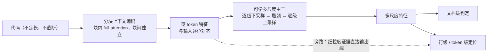

# U-Det 汇报

> 2026-09-21 · 面向专家读者的**整体进展与模型改进**汇报

## 1. 问题

**AI 生成代码检测**，需要同时给出**文档级**判定与**行级 / token 级**定位。

现有强基线的做法是：微调预训练代码模型，在**局部窗口**上做逐位置预测（窗口 512）。
它的结构性限制是——**每个 token 只能看到 512 个邻居**。要覆盖长文件就必须滑窗、重叠、再平均，
既丢掉全局信息，也无法真正处理超长输入。

U-Det 的目标：**在不截断、不滑窗的前提下，用一个统一的序列级主干同时服务两个任务。**

评测数据（同数据、同切分、同指标、同 epoch 预算）：

| 数据集 | 监督信号 | train / val / test |
| --- | --- | --- |
| CoDET-M4 | 文档级（human / AI） | 16069 / 1991 / 1940 |
| HybridCodeAuthorship | 行级（AI 行 / human 行），并衍生出 token 级与连续段级 | 6904 / 797 / 883 |

两条数据特性会影响结论的解读：CoDET-M4 的**标签与文档长度强混淆**（AI 样本全部 <2048 token）；
Hybrid 只保留含 AI 行的文件，因此其**文档级标签恒为 1**。

## 2. 模型思想

**① 分块上下文编码。** 把代码切成定长块，**块内做完整 attention、块间彼此独立**。
得到的是与输入**逐位对齐**的逐 token 特征（进多少 token 出多少向量），因此
**不截断、长度无上限**，同时避开了整段 O(L²) 的代价。

**② 可学的多尺度主干，取代“滑窗 + 平均”。** 逐级下采样把序列压到瓶颈，再逐级上采样回来。
上采样的跳连与下采样的窗口注意力共同构成“谁看谁”的机制，
因此“上下文该看多远”不再是超参数，而是**可学的算子**。

**③ 双任务共享主干，多尺度监督。** 文档级判定读**全部尺度**而不只是瓶颈；
行级 / token 级在每个尺度上都设监督，构成深监督。

**④ 一个反直觉的发现：token 级任务不是文档级的负担，而是它的“信息保值”机制。**
消融掉 token 级监督后，文档级反而掉了 **1.76 分** ——
因为主干的瓶颈会退化成“文档摘要”，细粒度证据被丢弃。
这条发现直接决定了后续的改进方向。

**参数量。** 可训练 **93.65 M**（主干与头 91.6 M + 适配器 2.06 M），另有约 **107 M** 的预训练编码器冻结；
基线是 **109.6 M 全量微调**。即 **可训练参数少 16 M，但总参数更多** —— 对等比较时需说明这一点。

## 3. 模型改进的脉络

每一代改动**解决什么问题、为什么有效**：

| 改动 | 解决什么 | 同预算效果 |
| --- | --- | --- |
| **门控跳连融合** | 上采样时“重建结果”与“跳连”谁更可靠，不该由人工定 | 文档级 +0.73；行级 / 段级 / token 级 **+1.5 ~ +1.7** |
| **层级一致性损失** | 不同尺度的预测应彼此自洽（池化可交换 + 自蒸馏） | 四项全面 **+0.7 ~ +1.3** |
| **分块上下文编码** | 此前每个 token 单独前向 ⇒ attention 退化，token 表示完全没有上下文 | **+7.0 ~ +10.7**（数量级最大） |
| **多尺度文档级头** | 瓶颈分辨率只有 1/64，文档级只读瓶颈等于把短文档压扁 | 文档级 **+0.75**（收益精确落在这一项，与设计意图一致） |
| **token 级旁路** | 把“绕过瓶颈”从文档级推广到 token 级 | **行级 +1.02 / 段级 +0.38 / token 级 +0.94；文档级 −0.82** |
| **+ 长度感知尺度权重 + 报告改文档级向量** | ① 粗尺度该不该信，取决于它还剩多少个位置；② 报告前缀占掉了瓶颈一半带宽 | **文档级 +0.52**，但 **行级 −0.70 / 段级 −0.71 / token 级 −0.52**（相对 token 级旁路版）|

**三条值得单独指出的观察**

1. ★ **收益的排序本身就是证据。** 门控这类改动的增益集中在最吃**位置与边界**的指标上
   （段级 ≫ 行级 / token 级 ≫ 文档级）；分块编码的增益是
   **段级 +10.7 > 行级 +7.6 ≈ token 级 +7.0 > 文档级 +2.9** ——
   最吃上下文的涨最多、最不吃上下文的涨最少。收益分布与“上下文就是瓶颈”这个假设完全一致。
2. ★★ **最大的一项收益，来自修一个“被当成固有代价接受了两代”的实现缺陷。**
   分块编码不是新想法，而是发现“逐 token 前向时 attention 完全退化、`q`/`k` 成了死参数”
   —— 它此前被写进设计文档，当作“逐 token 语义的固有代价”。
   **当结论说“这是固有代价”时，应该先怀疑实现。**
3. **“绕过瓶颈”是一条已被验证的通用思路，但它揭示了一个真实权衡。**
   瓶颈把文档压到 1/64 分辨率，短文档只剩不到 8 个位置；
   把它用在文档级输出上换来 +0.75，推广到 token 级换来行级 +1.02 / token 级 +0.94，
   **但文档级同时掉 0.82** —— 细粒度与文档级之间存在取舍，而不是“双赢”（机制猜测见 §4 结论 4）。
   另需克制：**直接把粗尺度的聚合预测融进细尺度是错的** ——
   粗尺度的监督目标是**聚合值**，语义是“这个窗口里有没有 AI”而不是“每个 token 是不是 AI”，
   语义错配会污染细尺度判决；只有旁路原始细粒度特征才是安全的。

## 4. 结果

**test 集，同数据、同切分、同预算**。四项指标：**文档级** F1（CoDET-M4）、**行级** F1、
**段级** F1（连续 AI 行段按 IoU≥0.5 匹配）、**token 级** F1（后三项均在 HybridCodeAuthorship 上）

| 版本 | epoch | 可训练 | 文档级 | 行级 | 段级 | token 级 |
| --- | --- | --- | --- | --- | --- | --- |
| **CodeT5 滑窗基线** | 4 | 109.61 M | 0.9736 | **0.7978** | **0.5081** | **0.8270** |
| 分块上下文编码 | 4 | 92.85 M | 0.9700 | 0.7895 | 0.5035 | 0.8190 |
| 多尺度文档级头 | 4 | 93.65 M | **0.9775** | 0.7878 | 0.5076 | 0.8187 |
| **token 级旁路** | 4 | 93.65 M | 0.9693 | **0.7980** | **0.5114** | **0.8281** |
| **+ 长度权重 + 报告向量** | 4 | 93.66 M | 0.9745 | 0.7909 | 0.5043 | 0.8229 |
| token 级旁路 | 2 | 93.65 M | 0.9689 | 0.7880 | 0.4893 | 0.8186 |
| 门控 + 一致性损失 | 4 | 92.85 M | 0.9408 | 0.7139 | 0.3970 | 0.7489 |
| 无门控，逐 token 编码 | 4 | 87.31 M | 0.9307 | 0.6922 | 0.3733 | 0.7279 |
| 冻结特征 + 闭式线性（769 参） | — | 769 | 0.9069 | — | — | — |

**五条结论**

1. ★★ **三项 token 级指标全部反超基线**（行级 +0.02、段级 +0.33、token 级 +0.11，同 4 epoch），
   文档级落后 −0.43。而上一版恰好相反：**赢文档级、输三项**。
   ⇒ 两版**互补**，如何同时拿住两个方向是下一步的核心问题。

2. ★★ **这次是"增益随预算放大"，与本项目此前的规律相反**（2 → 4 epoch，相对上一版）：

   | | 文档级 | 行级 | 段级 | token 级 |
   | --- | --- | --- | --- | --- |
   | 2 epoch | −0.56 | +0.72 | +0.08 | +0.56 |
   | **4 epoch** | **−0.82** | **+1.02** | **+0.38** | **+0.94** |

   收益与损失**同步放大** ⇒ 这是**真实的权衡**（细粒度 vs 文档级），不是"热身更快"的假象。

3. ★★ **在有统计意义的长文档桶上首次反超基线。** 按文档长度分桶（行级 F1，4 epoch）：

   | 长度区间 | n | 基线 | 多尺度文档级头 | **token 级旁路** |
   | --- | --- | --- | --- | --- |
   | `[0,512)` | 77 | **0.7090** | 0.6568 | 0.6784 |
   | `[512,2048)` | 560 | **0.7775** | 0.7593 | 0.7633 |
   | `[2048,8192)` | 241 | 0.8162 | 0.8093 | **0.8219** |
   | `[8192,∞)` | **5** | 0.7260 | 0.7815 | **0.8172** |

   在**唯一一个有足够样本量的长桶**（`[2048,8192)`，241 个）上，从落后 0.69 变为**领先 0.57**；
   同桶 token 级也领先 0.72。⇒ **"全长上下文"的优势第一次有了统计上站得住的证据**
   （此前只有一个 5 样本的桶支持它）。
   但 ⚠️ **短文档仍是明确弱项**：`[0,512)` 仍落后 **3.06**，这是当前最大的、定位最明确的问题。

4. ★ **机制假设（可验证）：文档级为什么会掉.** 旁路让 token 级头**直接拿到编码器的细粒度特征**，
   于是主干不再需要为 token 级任务保留细粒度信息 ——
   而消融实验已证明"token 级监督在替主干做**信息保值**"（去掉它文档级掉 1.76 分）。
   **旁路削弱了这个正则化作用。**
   ⇒ 可验证的修法：把旁路做成**独立的额外一路头**，而不是拼进主干那一级的头，
   让主干那一级继续承压（或对旁路路径降权）。
   **如果这个假设成立，就有机会同时拿住两个方向。**

5. ★ **工作点结论仍成立。** 各自取最优阈值后（文档级 / 行级）：

   | | 最优阈值 | 行级 F1 | 段级 F1 | token 级 F1 |
   | --- | --- | --- | --- | --- |
   | 基线 | 0.70 / 0.55 | 0.7979 | **0.5126** | 0.8274 |
   | 多尺度文档级头 | 0.35 / 0.40 | 0.7939 | 0.5103 | 0.8219 |
   | **token 级旁路** | 0.30 / 0.40 | **0.8022** | 0.5103 | **0.8295** |

   ⇒ 取最优阈值后**行级领先扩大到 +0.43、token 级 +0.21**，只剩段级 −0.23 未追上。

## 5. 现状与下一步

**上一版**：token 级旁路已训满 4 轮（与更前一版对齐预算），四项指标如上。
它在行级 / token 级上**均未到顶**（最后一轮仍在创新高），而文档级已饱和。

**在跑**：最新一版（长度感知的尺度权重 + 报告改文档级向量）已完成 2 轮，
正在补到 4 轮以对齐预算。它的两项改动的**取值都是先用零训练探针定下来的**
（一次前向 / 纯离线 / 纯 CPU，不占 GPU）：

* **尺度权重**：原提案的锚点经探针扫描后发现**比现有静态权重还差**
  （四个长度桶全部更差），按修正后的取值实现 ⇒ 探针**直接省掉一轮 2 小时的无效训练**；
* **报告**：探针量化出**近一半样本（长度 <256）上，报告占掉了瓶颈整整一半的位置**，
  于是把 7 维统计量改成**不进序列的文档级向量**，只喂文档级头。

探针自身有一个必须记下的局限：它们是在**冻结模型**上做"事后重加权"，
回答的是"怎样组合**现有**预测最优"，**不等于**"用哪套权重能**训出**最好的模型"
（多尺度监督还有正则化作用）。⇒ **强提示，不是判决。**

**下一步（按证据强度排序）**

1. ★★ **解决"细粒度 vs 文档级"的权衡**（结论 4 的假设）：
   把旁路改成**额外一路头**而非并入原头，让主干继续承压。
   这是**当前唯一有机会同时拿住两边**的改动。
2. **修工作点（零训练成本）**：把评测阈值与概率标定纳入正式口径，或从损失侧在源头上修标定。
3. **修短文档**：`[0,512)` 仍落后 3.06，是最大的、定位最明确的弱项。
4. **补一个长文档测试集**：现有长桶样本量仍偏少，结论需要一个真正的长文档基准来支撑。
5. **继续加预算**：行级 / token 级均未到顶，可靠；但文档级已饱和，收益只在 token 侧。

⚠️ **运维上的一条硬教训**：跨夜任务期间实例被关机，
**容器内的看门狗与队列、训练一起消失**（同一容器里的兄弟进程，实例一关就全死），
且没有报错、没有 OOM。真正救回任务的不是看门狗，而是**每轮落盘的检查点** ——
`last.pt` 能精确告知完成了多少轮并继续接着跑，而提前另存的"2 轮快照"保住了同预算的对比数据。
**连续性要寄托在落盘的检查点上，不是寄托在常驻进程上。**

**方法论提醒（本项目已付出代价的六次教训）**

* **2 epoch 的读数在本项目已经六次指向错误结论**。最近一次同样是"2 epoch 说某个桶退化了"
  （段级在 `[512,2048)` 上 2 epoch 是 −2.62），对齐到 4 epoch 后**恢复并反超基线**。
* 但也别一律不信小预算：本次 2 epoch 的**方向**（行级 / token 级改善、文档级受损）是对的，
  错的是**幅度**（2 epoch 系统性**低估**）。⇒ 2 epoch 可用来排方向，不能用来定量。
* 判收敛看**学习率周期末端**的指标是否还创新高，**不看损失**。
* **平均分会掩盖相反趋势**（短文档与长文档方向相反），必须分桶。
* **指标口径会改写结论**：同一模型在固定阈值与最优阈值下的排序不同 ——
  报告差距时必须声明工作点。
