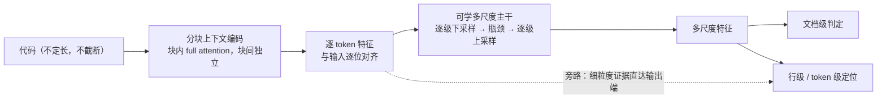

# U-Det 汇报

> 2026-09-21 · 面向专家读者的**整体进展与模型改进**汇报

## 1. 问题

**AI 生成代码检测**，需要同时给出**文档级**判定与**行级 / token 级**定位。

现有强基线的做法是：微调预训练代码模型，在**局部窗口**上做逐位置预测（窗口 512）。
它的结构性限制是——**每个 token 只能看到 512 个邻居**。要覆盖长文件就必须滑窗、重叠、再平均，
既丢掉全局信息，也无法真正处理超长输入。

U-Det 的目标：**在不截断、不滑窗的前提下，用一个统一的序列级主干同时服务两个任务。**

评测数据（同数据、同切分、同指标、同 epoch 预算）：

| 数据集 | 监督信号 | train / val / test |
| --- | --- | --- |
| CoDET-M4 | 文档级（human / AI） | 16069 / 1991 / 1940 |
| HybridCodeAuthorship | 行级（AI 行 / human 行），并衍生出 token 级与连续段级 | 6904 / 797 / 883 |

两条数据特性会影响结论的解读：CoDET-M4 的**标签与文档长度强混淆**（AI 样本全部 <2048 token）；
Hybrid 只保留含 AI 行的文件，因此其**文档级标签恒为 1**。

## 2. 模型思想

**① 分块上下文编码。** 把代码切成定长块，**块内做完整 attention、块间彼此独立**。
得到的是与输入**逐位对齐**的逐 token 特征（进多少 token 出多少向量），因此
**不截断、长度无上限**，同时避开了整段 O(L²) 的代价。

**② 可学的多尺度主干，取代“滑窗 + 平均”。** 逐级下采样把序列压到瓶颈，再逐级上采样回来。
上采样的跳连与下采样的窗口注意力共同构成“谁看谁”的机制，
因此“上下文该看多远”不再是超参数，而是**可学的算子**。

**③ 双任务共享主干，多尺度监督。** 文档级判定读**全部尺度**而不只是瓶颈；
行级 / token 级在每个尺度上都设监督，构成深监督。

**④ 一个反直觉的发现：token 级任务不是文档级的负担，而是它的“信息保值”机制。**
消融掉 token 级监督后，文档级反而掉了 **1.76 分** ——
因为主干的瓶颈会退化成“文档摘要”，细粒度证据被丢弃。
这条发现直接决定了后续的改进方向。

**参数量。** 可训练 **93.65 M**（主干与头 91.6 M + 适配器 2.06 M），另有约 **107 M** 的预训练编码器冻结；
基线是 **109.6 M 全量微调**。即 **可训练参数少 16 M，但总参数更多** —— 对等比较时需说明这一点。

## 3. 模型改进的脉络

每一代改动**解决什么问题、为什么有效**：

| 改动 | 解决什么 | 同预算效果 |
| --- | --- | --- |
| **门控跳连融合** | 上采样时“重建结果”与“跳连”谁更可靠，不该由人工定 | 文档级 +0.73；行级 / 段级 / token 级 **+1.5 ~ +1.7** |
| **层级一致性损失** | 不同尺度的预测应彼此自洽（池化可交换 + 自蒸馏） | 四项全面 **+0.7 ~ +1.3** |
| **分块上下文编码** | 此前每个 token 单独前向 ⇒ attention 退化，token 表示完全没有上下文 | **+7.0 ~ +10.7**（数量级最大） |
| **多尺度文档级头** | 瓶颈分辨率只有 1/64，文档级只读瓶颈等于把短文档压扁 | 文档级 **+0.75**（收益精确落在这一项，与设计意图一致） |
| **token 级旁路** | 把“绕过瓶颈”从文档级推广到 token 级 | 2 epoch 方向正确（行级 +0.72 / token +0.56），4 epoch 验证中 |

**三条值得单独指出的观察**

1. ★ **收益的排序本身就是证据。** 门控这类改动的增益集中在最吃**位置与边界**的指标上
   （段级 ≫ 行级 / token 级 ≫ 文档级）；分块编码的增益是
   **段级 +10.7 > 行级 +7.6 ≈ token 级 +7.0 > 文档级 +2.9** ——
   最吃上下文的涨最多、最不吃上下文的涨最少。收益分布与“上下文就是瓶颈”这个假设完全一致。
2. ★★ **最大的一项收益，来自修一个“被当成固有代价接受了两代”的实现缺陷。**
   分块编码不是新想法，而是发现“逐 token 前向时 attention 完全退化、`q`/`k` 成了死参数”
   —— 它此前被写进设计文档，当作“逐 token 语义的固有代价”。
   **当结论说“这是固有代价”时，应该先怀疑实现。**
3. **“绕过瓶颈”是一条已被验证的通用思路。** 瓶颈把文档压到 1/64 分辨率，短文档只剩不到 8 个位置；
   把它用在文档级输出上换来 +0.75，推广到 token 级就是当前在跑的版本。
   但需要克制：**直接把粗尺度的聚合预测融进细尺度是错的** ——
   粗尺度的监督目标是**聚合值**，语义是“这个窗口里有没有 AI”而不是“每个 token 是不是 AI”，
   语义错配会污染细尺度判决；只有旁路原始细粒度特征才是安全的。

## 4. 结果

**test 集，同数据、同切分、同预算**。四项指标：**文档级** F1（CoDET-M4）、**行级** F1、
**段级** F1（连续 AI 行段按 IoU≥0.5 匹配）、**token 级** F1（后三项均在 HybridCodeAuthorship 上）

| 版本 | epoch | 可训练 | 文档级 | 行级 | 段级 | token 级 |
| --- | --- | --- | --- | --- | --- | --- |
| **CodeT5 滑窗基线** | 4 | 109.61 M | 0.9736 | **0.7978** | **0.5081** | **0.8270** |
| v0.4.2 分块编码器 | 4 | 92.85 M | 0.9700 | 0.7895 | 0.5035 | 0.8190 |
| **v0.4.4 多尺度样本头** | 4 | 93.65 M | **0.9775** | 0.7878 | 0.5076 | 0.8187 |
| v0.4.5 token 头旁路 | 2 | 93.65 M | 0.9689 | 0.7880 | 0.4893 | 0.8186 |
| v0.4.1 门控 + 一致性损失 | 4 | 92.85 M | 0.9408 | 0.7139 | 0.3970 | 0.7489 |
| v0.3.1（无门控，逐 token 编码） | 4 | 87.31 M | 0.9307 | 0.6922 | 0.3733 | 0.7279 |
| 冻结特征 + 闭式线性（769 参） | — | 769 | 0.9069 | — | — | — |

**四条结论**

1. ★ **文档级已反超基线**（0.9775 vs 0.9736，同 4 epoch），且 **段级基本打平**（差 0.05）；
   **行级 / token 级**仍差 **1.00 / 0.83**。
2. 但**这个反超是脆弱的**：基线的晚期增速反而略快，两版都远未收敛，
   「再加预算就能稳住」**不是自动成立的**。
3. ★★ **差距的性质是"工作点"，不是"能力"**：固定阈值 0.5 对 U-Det 系统性不利
   —— 它输出的概率偏低（欠自信），被压成"精确率高、召回低"的工作点。
   各自取最优阈值后，行级差距 **−1.00 → −0.40**、token 级 **−0.83 → −0.55**：

   | | 最优阈值（文档级 / 行级） | 行级 F1 | 段级 F1 | token 级 F1 |
   | --- | --- | --- | --- | --- |
   | 基线 | 0.70 / 0.55 | **0.7979** | **0.5126** | **0.8274** |
   | v0.4.4 | 0.35 / 0.40 | 0.7939 | 0.5103 | 0.8219 |

   ⇒ **六成差距来自工作点**（这是零训练成本就能拿回的部分）。
4. ⚠️ **U-Det 的弱项定位明确：短文档。** 按文档长度分桶（行级 F1；v0.4.4 / v0.4.2 / 基线）：

   | 长度区间 | n | v0.4.4 | v0.4.2 | 基线 |
   | --- | --- | --- | --- | --- |
   | `[0,512)` | 77 | 0.6568 | 0.6938 | **0.7090** |
   | `[512,2048)` | 560 | 0.7593 | 0.7622 | **0.7775** |
   | `[2048,8192)` | 241 | 0.8093 | 0.8113 | **0.8162** |
   | `[8192,∞)` | **5** | **0.7815** | 0.7403 | 0.7260 |

   成因与瓶颈诊断吻合：主干把整篇文档压进 `L/64` 的瓶颈，**文档越短压得越狠**
   （<512 token ⇒ 瓶颈不到 8 个位置），而基线在这个区间**一次 512 窗口就装下全文**且是逐 token 分辨率。
   反过来，声称的"全长上下文优势"**在当前 benchmark 上无法证明** ——
   `>8192` 桶只有 5 个样本，而有 241 个样本的长桶里基线仍领先。

## 5. 现状与下一步

**在跑**：行级 / token 级旁路版本的 4 epoch 补跑（与文档级版本对齐预算），预计 04:00 前后完成。

**已明确的下一步（按证据强度排序）**

1. **修工作点（零训练成本）**：把评测阈值与概率标定纳入正式口径，
   或从损失侧在源头上修标定。这是**当前性价比最高**的一步。
2. **按长度门控的 token 级旁路**：让“绕过瓶颈”只在短文档上生效 ——
   长文档的瓶颈本来就够用，额外输入反而可能冲突。
3. **补一个长文档测试集**：否则“全长上下文”这个核心卖点无法被验证。
4. **继续加预算**：可靠，但可能不够 —— 基线的晚期增速更快。
5. 优先级下降：扩大适配器的作用范围、调整块长与重叠方式（都是工程型收益，不改变结论方向）。

**方法论提醒（本项目已付出代价的五次教训）**

* **2 epoch 的读数在本项目已经五次指向错误结论**（最近一次：行级 / token 级在 2 epoch 是 +0.72 / +0.56，
  但同一改动的文档级已 −0.56）。架构结论必须在**对齐 epoch 预算**后成立。
* 判收敛看**学习率周期末端**的指标是否还创新高，**不看损失**。
* **平均分会掩盖相反趋势**（短文档与长文档方向相反），必须分桶。
* **指标口径会改写结论**：同一模型在固定阈值与最优阈值下的排序不同 ——
  报告差距时必须声明工作点。
