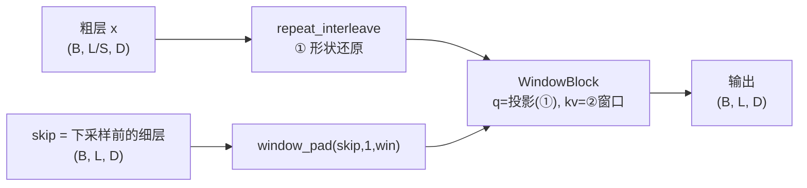
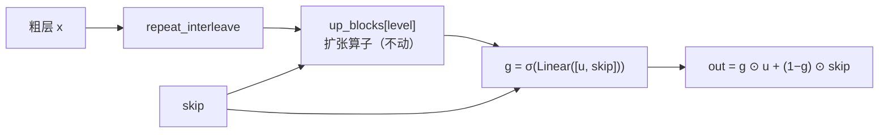

# U-Det v0.4 技术报告：跳跃融合门控 + 跳跃引导下采样的层级一致性损失

> 版本：`v0.4.0`（只改结构）/ `v0.4.1`（结构 + 损失）
> 对照：`v0.3.1`（8 套权重 + LoRA，test m4 F1 0.8999）、`v0.3.2`（8 套权重 + 编码器冻结，0.9047）
> 主线结论见 §6；设计依据见 §1–§4。

---

## 0. 速览

> ⚠️ **门控的结论目前是"未定"，不是"成功"。** 见 §7.3 / §7.4。

| | v0.3.1（无门控） | v0.4.0（门控） | 说明 |
| --- | --- | --- | --- |
| 跳跃融合 | 跳注意力（kv = skip） | **+ 逐通道门控** | v0.4.0 的结构改造 |
| 粗尺度目标 | 窗口内 AI **比例**（mean） | 同 v0.3 | v0.4.1 才改 |
| 层级一致性 | 无 | 无 | v0.4.1 才加 |
| 下采样约束 | "窗口内比例" | 同 v0.3 | v0.4.1 才加 |
| 主干参数 | 85.04M | **89.76M**（+4.72M 门控） | |
| 可训练参数 | 87.31M | 92.03M | |

**最好成绩（test，截至 v0.3.1 补到 4 epoch）**

| 模型 | epoch | m4 sample F1 | line F1 | chunk F1 | token F1 |
| --- | --- | --- | --- | --- | --- |
| base_codet5_ft（整段上下文微调） | — | **0.9756** | — | — | — |
| **v0.3.1（无门控）** | **4** | **0.9307** | **0.6922** | **0.3733** | **0.7279** |
| v0.4.0（门控） | 2 | 0.9223 | 0.6718 | 0.3643 | 0.7117 |

* **门控在 2 epoch 的同等预算下是正收益**（m4 +2.24 / chunk +1.94 / line、token 打平），至少不亏；
* 但把 v0.3.1 补到 4 epoch 后它反而全面领先 v0.4.0 @ 2ep ⇒ **对照被 epoch 混淆了**，
  正在补跑 v0.4.0 → 4 epoch（§7.4）；
* v0.4.1（损失那一半）**只列计划、暂不执行**（§8）——否则两层变量叠在一起无法归因。

---

## 1. 从 v0.3 出发：两个问题

v0.3 的三组零训练诊断（见 `docx/u-det-v0.3.md` §7）把主干**逼到了墙角**：

| 诊断 | 数字 | 含义 |
| --- | --- | --- |
| 各尺度线性探针极差 | 最细 0.8970 − 瓶颈 0.8830 = **+1.4**（v0.2 时代 +16.3） | 64× 压缩**几乎无损**，"下采样丢信息"已解决 |
| 逐层 LUT 探针 | 差 < 1.5 分，最后一层反而最好 | "取错层"假设**被否掉** |
| 冻结特征 + 平均池化 + 闭式线性 | test F1 **0.9069**（769 参数） | 样本级信息基本是**词袋级**的底线 |
| 同结构 SGD 头 | test F1 0.8309 | 闭式与 SGD 差 **7.6 分**，全是**优化差距** |

于是"主干下采样丢信息"这条线已经走到头，v0.4 转向两个新方向：

1. **跳跃连接怎么融合**（结构）—— v0.3 用**跨注意力**同时干了两件性质完全不同的事；
2. **粗尺度的监督信号怎么设计**（损失）—— 现在只要求粗位置交出"窗口内 AI 比例"这一个数。

---

## 2. v0.4.0 结构改造：跳跃融合门控

### 2.1 v0.3 的 `_up` 把三件事揉在一个操作里



一次 `WindowBlock` 同时承担：

| | 做的事情 | 位置是否对齐 | 该用什么算子 |
| --- | --- | --- | --- |
| ① | 形状还原 `L/S → L` | **不对齐**（一个粗位置要展开成 S 个） | 跨注意力 ✅ 正确 |
| ② | **跳跃注入**（细层信息进来） | **严格对齐**（`z_k[i]` 与 `h_k[i]` 说的是同一个源码区间） | 逐元素门控／concat |
| ③ | 邻域混合（窗口内自注意力） | 对齐之后 | 窗口自注意力（残差） |

②用跨注意力做，代价是三重的：

* **计算**：融合本该是 `O(L·D)`，跨注意力把它变成 `O(L·win·D)`；
* **参数**：位置对齐是一个**免费的先验**，跨注意力却要花参数去学"α→δ"的恒等映射；
* **梯度**（最关键）：skip 的回传梯度被 softmax 的 Jacobian `diag(α) − ααᵀ` 调制，
  这个矩阵是**秩亏**的，在 α 接近均匀时趋近于零 —— 于是"训练早期先让 skip 兜底、
  再慢慢让深路径接手"这个 U-Net 最宝贵的动态被掐掉了。

### 2.2 v0.4.0 的做法：末尾加一道逐通道门控



```python
# models/hier2.py · TransformerCodec._up
out = block(seq, dst, idx)                                   # 扩张算子（跨注意力）
if self.gate is not None:
    g = torch.sigmoid(self.gate[level](torch.cat([out, skip], dim=-1)))
    out = g * out + (1.0 - g) * skip
return out
```

设计要点：

* **每级独立**（4 套门控，与 `share: false` 的 8 套采样块一致）；`gate[level]` 是
  `Linear(2D → D)`，输出逐通道的 `g`，所以是"每个通道各自决定信谁"；
* **零初始化权重 + 偏置 −1.0** ⇒ 起点 `g ≡ σ(−1) ≈ 0.269`，即
  `out = 0.269·跨注意力 + 0.731·skip`，**起手偏向 skip**，让深路径慢慢把这个比例争回来；
* **不加 refine 块、不改扩张算子**：这一版刻意只动"融合"这一个变量，
  这样 v0.3.1/v0.3.2 → v0.4.0 的差值可以干净地归因到门控上。

### 2.3 明确**没有**做的三件事（以及为什么）

| 想法 | 状态 | 原因 |
| --- | --- | --- |
| 融合后加 `refine` 窗口自注意力块 | **放弃** | 最细一级 `L=24576`、窗口 16 时会再多一份 `(B, L, win, D)` gather（≈1.2 GB），而 12GB 卡上整模型峰值已经 11.4 GB；先只动融合，把变量控制住 |
| 扩张算子改用"kv = 粗层自己"的纯自注意力 | 保留原样 | 现在的 kv = skip，扩张结果天然带细粒度上下文；改成 kv = 粗层会让扩张算子退化成"平滑"，需要单独一组实验 |
| `share` 改回 true | 不动 | v0.3.1/v0.3.2 已经证明 8 套权重更好 |

---

## 3. v0.4.1 损失改造

### 3.1 A · 层级一致性（池化可交换 / 自蒸馏）

要求**更粗一级**的预测等于**更细一级**预测的窗口池化值：

$$\mathcal{L}_{A}=\sum_{k=0}^{3}\frac{1}{|\mathcal{V}_k|}\sum_{j\in\mathcal{V}_k}
\mathrm{BCE}\Big(\mathrm{logit}_k[j],\ \mathrm{pool}\big(\sigma(\mathrm{logit}_{k+1})\big)[j]\Big)$$

其中 `pool` 是长度对齐的平均池化，目标侧 `detach()`（自蒸馏），有效位由 token 级
`−100` 掩码池化后得到。

**为什么它是真的新约束**：现有 token 级损失在粗尺度的目标是把**标签**池化成比例。
一个 64 长的窗口里只有 1 个 AI token 时目标只有 `0.016`，而且窗口里那 1 个 token
是"真 AI"还是标注抖动根本分不出来 —— 目标糊、带噪。这里的目标换成
**模型自己更细一级的预测**池化而来：更细一级看得到全分辨率特征，它的池化是一个
**更锐、方差更小**的估计。信号从"细／skip 侧"流向"粗／下采样侧"。

### 3.2 ★ B 的原形为什么不成立（必须记下来的一条）

原本的设想是："把粗尺度预测广播回最细分辨率，直接对 token **硬标签**算 BCE，
逼下采样保住 token 级判别力"。**这个形式和现有损失逐字相同**：

设某窗口内有 $m$ 个正例、$n$ 个负例（$S=m+n$），窗口只对应**一个** logit $z$（$p=\sigma(z)$）：

$$
\mathcal{L}_{\text{广播}}=\frac{1}{S}\sum_{t}\mathrm{BCE}\big(\sigma(z),y_t\big)
=\frac{1}{S}\Big[m\cdot(-\log p)+n\cdot(-\log(1-p))\Big]
$$

而"把标签平均池化成软目标"是：

$$
\mathcal{L}_{\text{均值}}=\mathrm{BCE}\Big(\sigma(z),\tfrac{m}{S}\Big)
=-\frac{m}{S}\log p-\frac{n}{S}\log(1-p)
$$

**两式逐字相等**，而且与特征无关（无论特征来自哪一级）。加上 `valid` 掩码后两者
依然同时归一化到有效 token 数，仍然相等。所以"广播硬标签"不产生任何新约束，
只是现有损失的一个等价改写。

要让 B 真的成为新约束，只有两条路：

1. **换聚合方式**（目标本身变了）⇒ §3.4 的 B3；
2. **让一个位置能吐多个 logit**（函数类变了）⇒ §3.3 的 B2。

### 3.3 B2 · 跳跃连接引导下采样（下采样路径的窗口内逐 token 位置探针）

主干的下采样把 `span` 个 token 压成一个向量。现有损失只要求这个向量能回答
**一个问题**（"窗口内 AI 比例是多少"）——信息论上这**不要求**它保留窗口内的位置结构：
64 长窗口里有 1 个还是 32 个 AI token，目标分别是 0.016 / 0.5，而**那段 AI 落在哪、
边界在哪，完全没被约束**。位置与边界恰恰是行级、片段级评测真正吃的信号
（line 0.6528 / chunk 0.3357，是四项里最弱的）。

B2 把要求从"1 个问题"改成"**span 个问题**"：

$$\mathrm{logit}[b,j,t]=\big\langle \mathrm{proj}(d_k[b,j]),\ W[t]\big\rangle\Big/\sqrt{h},
\qquad y[b,j,t]=\text{token}\,[j\cdot S_k+t]$$

其中 $d_k$ 是**下采样路径**第 $k$ 级的输出，$S_k$ 是该级"一个位置代表多少个原始 token"
（本配置下 = 4 / 16 / 32 / 64），$W\in\mathbb{R}^{S_k\times h}$ 是一张**可学的位置码表**
（等价于给每个偏移一个专属读出方向）。于是下采样必须**自己**解出窗口内每个位置是不是 AI。

三个关键设计点：

* **挂在下采样路径上，不是上采样/skip 那一侧。** 这是"引导下采样"的字面含义，
  也保证 skip **无法替它兜底** —— 如果挂在 `levels[k]`（skip 融合后的特征）上，
  模型可以让 skip 去背这个任务，下采样照样可以糊。
* **先投影再点积，不做 gather。** 朴素做法要 gather 出 `(B, L_k, span, D)`，
  `L=24576, span=64` 时是 GB 级中间张量；这里算力只有 `L_k·span·h`，
  全部 logit 加起来 2.4 万个。位置码是 `(span, h)` 的小参数矩阵。
* **每级独立**（4 个探针，共 0.82M 参数）。

长度对齐是**精确**的：`ceil(ceil(L/a)/b) = ceil(L/(a·b))`，所以第 $k$ 级输出下标 $j$
恰好对应原始区间 $[j S_k,\ (j+1)S_k)$，目标直接 `reshape(-1, span)` 即可，无需索引。

### 3.4 B3 · 粗尺度聚合目标由 mean 改成软 max

把各粗尺度的目标从"窗口内 AI **比例**"（mean）换成"窗口内**是否有** AI"
（`max`，或 $\beta$ 可控的软 max / `lse`）：

$$y_k[j]=\frac{1}{\beta}\log\Big(\frac{1}{|\mathcal{V}_j|}\sum_{t\in\mathcal{V}_j}e^{\beta\,y_{jS+t}}\Big),
\qquad \beta\to\infty\ \Rightarrow\ \max$$

理由：行级/片段级评测是阈值 0.5 的**检测**——一段里只要有几个 AI token 就算正。
$\beta=4$ 时"64 个 token 里 1 个 AI"的目标从 `0.016` 抬到 `0.152`（10×），
而"全 0 窗口"仍是 `0`（`log(1)/β = 0`），所以它只抬正例、不抬负例。
**只在粗的三级上用**（最细两级窗口只有 4 个 token，`lse` 会过度锐化）。

风险：会整体推高正例倾向 ⇒ `line_p` 可能升、`line_r` 可能降；用 `β` 和
`--token-target mean` 一键回退。

### 3.5 总损失与开关

```
L = 1.0·样本级CE  +  1.0·多尺度tokenBCE(target: lse, lse, lse, mean, mean)
  +  0.3·A(cons_pool)  +  0.2·B2(cons_pos)
```

| 配置项 | 默认 | 说明 |
| --- | --- | --- |
| `loss.cons_pool` | 0.3（v0.4.1） | A 的权重；`--no-cons` 一键关掉 A + B2 |
| `loss.cons_pool_detach` | true | 自蒸馏（目标不回传） |
| `loss.cons_pos` | 0.2（v0.4.1） | B2 的权重 |
| `loss.token_target` | `[lse,lse,lse,mean,mean]` | 逐尺度聚合方式；`--token-target mean` 一键回退 |
| `loss.token_target_beta` | 4.0 | lse 锐化系数 |
| `model.gate` / `gate_init` | true / −1.0 | `--no-gate` 回到 v0.3 的纯跨注意力跳连 |

---

## 4. 参数量与显存（实测）

| 组件 | v0.3.2 | v0.4.0 | v0.4.1 |
| --- | --- | --- | --- |
| 下采样 4 块 + 上采样 4 块 | 56.61M | 56.61M | 56.61M |
| 瓶颈 4 层自注意力 | 28.31M | 28.31M | 28.31M |
| **跳跃融合门控 ×4** | — | **4.72M** | 4.72M |
| **下采样位置探针 ×4** | — | — | **0.82M** |
| 主干合计 | 85.04M | **89.76M** | 90.58M |
| + 样本头 / token 头 | 0.20M | 0.20M | 0.20M |
| + CodeT5 LoRA | 2.06M（冻结时不计） | 2.06M | 2.06M |
| **可训练参数** | 85.24M | **92.03M** | **92.85M** |

显存：见 §4.1。位置探针的开销可忽略（最大一级输出只有 `(1, 16, 64)`）。

### 4.1 显存：门控吃掉了最后 3% 的余量（实测）

单卡 12 GiB（`memory.total = 12288 MiB`）。本工作负载的真实峰值由**最长样本**决定
（m4 训练集长度：中位 293 / 90 分位 3676 / 99.9 分位 22230 / `max` 32948，
**超过 24000 的只有 3 条**）。用 60 s 间隔的 `nvidia-smi` 采样比对
（PyTorch 的 caching allocator 只增不减，因此偶发采样也足以拿到 reserved 峰值）：

| 组 | 主干 | 稳定峰值（reserved） |
| --- | --- | --- |
| v0.2 + LoRA | FrequencyUNet | 11854 MiB |
| v0.3.0 | codec（栈内共享权重） | **11428 MiB** ← 跑满 3 epoch，必含最长样本 |
| v0.3.1 | codec（8 套权重 + LoRA） | 11424 MiB |
| **v0.4.0** | codec（8 套权重 + **门控**） | **11900 MiB** |

* **门控的代价 = +472 MiB**，与它在 `L = 32948` 时的理论开销吻合：
  `torch.cat([u, skip])` 的反向输入（~101 MB）+ sigmoid 输出 + 两个乘法中间量
  + 反向的 `grad_cat` ≈ 450 MB。
* 余量只剩 **388 MiB**（11900 / 12288 = 96.8%），但**是安全的**：
  v0.3.0 的 11428 是 3 个完整 epoch 的峰值，必然已包含最长的 32948 样本；
  最坏情况按长度线性外推 `11428 + 472 × (32948 / 29000) ≈ 11964 MiB`，仍在 12288 以内。
* 实测轨迹也支持这个判断：v0.4.0 在第 ~2100 步就到了 11880 MiB，
  之后 4500 步只再涨 20 MiB ⇒ 已经收敛到峰值。

> **教训**：`L` 越长，"逐位置拼接"这类操作越贵，12 GiB 卡上的余量是**按 MB 算**的。
> 后续真要加 refine 块（§2.3）之前，必须先上 `expandable_segments` 或梯度检查点。
> 排查时还发现有两个上一天遗留的 `nvidia-smi` 采样循环仍在写 `v03*_mem.log`，
> 把 v0.4.0 的数字混进了 v0.3 的记录里 —— 清理后才有上面这张干净的表。

---

## 5. 验证清单

1. **形状/长度记账**：`L=1013` → `levels = [16, 32, 64, 254, 1013]`、
   `downs = [254, 64, 32, 16]`，与 `ceil(L/S)`（`S = 64, 32, 16, 4, 1`）逐一相等 ✓
2. **参数量**：主干 85.04M → 89.76M（+4.72M 门控）；可训练 92.03M（v0.4.0）/ 92.85M（v0.4.1）✓
3. **损失真的在算**：冒烟日志 `token=1.362 / cons_pool=1.398 / cons_pos=0.691` ✓
4. **回退等价性**：`--no-gate --no-cons --token-target mean` 应完全等价于 v0.3.2 的前向（待补）
5. **A/B2 对 v0.3 权重无影响**：`gate=None` 时 `_up` 直接返回，`cons_* = 0` 时不建探针参数 ✓

---

## 6. 实验队列与状态

单卡 12GB 跑不下并发，队列**串行**执行。

| # | 实验 | 命令 | 预算 | 状态 |
| --- | --- | --- | --- | --- |
| ① | **v0.4.0** 只改结构（跳跃融合门控） | `configs/udet_v04.yaml` | 2 epoch | ✅ 完成（test m4 **0.9223** / line 0.6718 / chunk **0.3643** / token 0.7117） |
| ② | **v0.3.2 续跑** +2 epoch（`codet5tok` 冻结） | `--resume runs/v0.3.2/best.pt --epochs 2 --encoder codet5tok --freeze-encoder` | +2 epoch | 🟡 运行中（epoch 2，21%，6.6 it/s） |
| ③ | **v0.3.1 续跑** +2 epoch（LoRA 微调） | `--resume runs/v0.3.1/best.pt --epochs 2` | +2 epoch | ⏳ 排队 |

队列脚本 `scripts/queue_extend.sh`（PID 见 `pgrep -af queue_extend.sh`）：
轮询 ① 的日志，出现 `结果已写入` **或**失败标志（`out of memory` / `CUDA error` /
`RuntimeError` / `Killed`）后自动接力 ② → ③，每组跑完自动 `--eval`。
②③ 的日志分别落在 `/tmp/v032x.log`、`/tmp/v031x.log`。

②③ 的配置文件都是 `configs/udet_v03.yaml`（`share: false`、无门控、无辅助损失），
所以能与 v0.3.1/v0.3.2 的既有 epoch 无缝接续。**续跑用的编码器必须复现原配置**：
③ 是 `codet5lora`（yaml 默认），② 是 `--encoder codet5tok --freeze-encoder`。

### 6.1 续跑（补 epoch）的实现与代价

`train.py` 新增 `--resume <ckpt>`：

* **只载模型权重**，优化器状态与 LR 计划**重新起**（原 `best.pt` 里本来也没存 optimizer）；
* `--epochs N` 的含义变成"**本次追加 N 个 epoch**"，日志会打印实际区间
  （如 `epochs=1（epoch 2…2）`）；
* `metrics.csv` 改为**追加**（不再截断）；`best` 的初值取 checkpoint 里的 `score`，
  避免用更差的 epoch 覆盖掉已存的好权重；
* 每轮额外存 `last.pt`；`best.pt` 用文件复制而非重新序列化 475MB，方便反复续跑。

验证：CPU 冒烟日志 `[resume] 载入 runs/v0.3.2/best.pt（已训到 epoch 1，monitor=0.7675）`、
可训练参数 `85.24M`（与 v0.3.2 原值逐位一致）、`metrics.csv` 接在 epoch 2 之后 ✓

> ⚠️ **可比性说明**：这是一次"热重启续训"，LR 轨迹与"一开始就跑 4 epoch"**不同**
> （OneCycleLR 会在新的 2 epoch 内重新爬坡到 `3e-4`）。
> 所以 **②③ 的 4-epoch 结果不能直接与 ① 的 2-epoch 结果比较**；
> ① 若要对齐到 4 epoch 需单独重跑，已列入 §8。

---

## 7. 结果

> ⚠️ **本节结论经过一次自我推翻。** 本项目此前几乎所有对比都建立在 **2 epoch** 预算上，
> 而 2 epoch 远未收敛（§6.2 / §7.2 都显示 loss 还在降）。把基线补到 4 epoch 后，
> 有两条结论被推翻（§7.3）。**请不要只读 §7.1 就下判断。**

### 7.1 同预算（2 epoch）下的门控对照

| 模型 | 门控 | m4 sample F1 | line F1 | chunk F1 | token F1 |
| --- | --- | --- | --- | --- | --- |
| v0.3.0（栈内共享权重，3 epoch） | ✗ | 0.8863 | 0.6462 | 0.3056 | 0.6864 |
| 冻结特征 + 平均池化 + **闭式线性**（769 参） | — | 0.9069 | — | — | — |
| v0.3.1（8 套权重 + LoRA 微调） | ✗ | 0.8999 | **0.6754** | 0.3449 | **0.7122** |
| v0.3.2（8 套权重 + 编码器冻结） | ✗ | 0.9047 | 0.6528 | 0.3357 | 0.6903 |
| **v0.4.0（8 套权重 + 门控，LoRA）** | **✓** | **0.9223** | 0.6718 | **0.3643** | 0.7117 |

**在 2 epoch 的同等预算下，门控是一次正收益：**

* **样本级 0.9223 突破了闭式线性底线 0.9069（+1.54）**，把 v0.3 §7.3 那句
  "当前主干不但没在样本级上产生正收益，反而把输入特征弄差了 1–2 分"**推翻**。
  但要注意：**v0.3.1 @4ep 也越过了这条线（0.9307）**，所以不能把这份功劳单独算给门控 ——
  它同样可能只是"多训了两轮"的结果（见 §7.3）。
* **chunk 0.3643 为 v0.3 系最好**（+1.94 于 v0.3.1），历史上仅次于 v0.2 频域 U-Net 的 0.3698。
* line 0.6718（−0.36）/ token 0.7117（−0.05）与 v0.3.1 基本打平 ⇒ **token 级不亏**。

### 7.1.1 逐 epoch：门控需要一轮"热身"

| epoch | val m4 F1 | val line F1 | val chunk F1 | val token F1 |
| --- | --- | --- | --- | --- |
| 0 | 0.8841 | 0.4925 | 0.2446 | 0.5277 |
| 1 | **0.9217** | **0.6512** | **0.3550** | **0.6818** |

epoch 0 的 hybrid 是 `line_p 0.7511 / line_r 0.3664`（precision 高、recall 低，预测偏保守），
epoch 1 收敛到 `p 0.6979 / r 0.6105`。原因很清楚：

* `gate_init = -1.0` ⇒ `g ≈ 0.269`，上采样输出有 **73% 是未经上下文处理的原始 skip**；
  token 头挂在 `levels` 上，因此第一轮被"生特征"主导，需要额外一轮把它调回来；
* **样本头读的是瓶颈 `levels[0]`，不在门控作用范围内**，所以样本级从第一轮就领先
  （0.8841 vs v0.3.2 的 0.8463）。

> 对 v0.4.1 / 后续的含义：`gate_init` 值得扫（§8.3）。起点更中性（−0.5 或 0）
> 可能让 token 级第一轮就不吃亏，同时保住样本级的收益。
> 另外注意 epoch 1 的 train loss 已经与 v0.3.1 的 epoch 1 几乎重合
> （`sample 0.286 / token 0.518` vs `0.277 / 0.522`），说明**门控没有拖慢收敛**，
> 只是把"先跳过深路径"这个先验显式化了。

### 7.2 v0.3.1 / v0.3.2 补到 4 epoch（热重启续训）

逐 epoch（val，m4 / line / chunk / token）：

| 组 | e0 | e1 | **e2（续）** | **e3（续）** |
| --- | --- | --- | --- | --- |
| v0.3.2 | 0.8463 / 0.5364 / 0.2600 / 0.5768 | 0.8979 / 0.6371 / 0.3402 / 0.6686 | **0.8438 / 0.5968 / 0.2968 / 0.6286** | 0.8971 / 0.6512 / 0.3432 / 0.6843 |
| v0.3.1 | 0.8263 / 0.6510 / 0.3357 / 0.6903 | 0.9008 / 0.6509 / 0.3394 / 0.6838 | 待填 | 待填 |

test（新 best）：

| 组 | 2 epoch | 4 epoch | 差 |
| --- | --- | --- | --- |
| v0.3.2 | 0.9047 / 0.6528 / 0.3357 / 0.6903 | **0.9086 / 0.6696 / 0.3487 / 0.7076** | +0.39 / +1.68 / +1.30 / +1.73 |
| v0.3.1 | 0.8999 / 0.6754 / 0.3449 / 0.7122 | 待填 | 待填 |

**两个结论：**

1. **热重启会先砸一个坑。** v0.3.2 的 e2（续跑第一轮）四项全跌 ——
   m4 −5.4 / line −4.0 / chunk −4.3 / token −4.0，train loss 从 0.834 反弹到 0.940。
   原因是 OneCycleLR 在新计划里重新爬坡到 `3e-4`，把已经收敛的状态踹了出去；
   e3 才收回来并小幅超过 e1。**所以 §6.1 那条可比性警告不是多余的。**
2. **收益递减明显。** e1→e3 的净收益（test：m4 +0.39 / line +1.68 / chunk +1.30 / token +1.73）
   远小于 e0→e1（m4 +5.2 / line +10.1）。训练已接近平台期
   （e3 train loss 0.801 对比 e1 的 0.834）。

### 7.2.1 把 v0.3.1 补到 4 epoch：**结论反转**

test 集：

| 指标 | v0.3.1 @ 2 epoch | **v0.3.1 @ 4 epoch** | 差 |
| --- | --- | --- | --- |
| m4 sample F1 | 0.8999 | **0.9307** | **+3.08** |
| line F1 | 0.6754 | **0.6922** | **+1.68** |
| chunk F1 | 0.3449 | **0.3733** | **+2.84** |
| token F1 | 0.7122 | **0.7279** | **+1.57** |

四项**全部创历史最好**。而且它们**全部高于 v0.4.0 @ 2 epoch**。

### 7.3 ★ 方法论更正：两条被推翻的结论

| 原结论（基于 2 epoch） | 4 epoch 后的事实 | 判定 |
| --- | --- | --- |
| "LoRA 微调对样本级有害"（v0.3 §9.1：0.8999 vs 冻结 0.9047） | LoRA **0.9307** vs 冻结 0.9086 | ❌ **推翻**：2 epoch 时 LoRA 还没收敛，负作用是欠训练的假象 |
| "门控是干净的正收益"（§7.1） | v0.3.1 @4ep 在四项上全面超过 v0.4.0 @2ep | ⚠️ **未定**：差 2 个 epoch，无法归因 |

**证据**（v0.3.1 全部 6 个 epoch；`mean = (val m4 F1 + val line F1) / 2` 是选 best.pt 用的综合分）：

| epoch | e0 | e1 | e2（续） | **e3（续）** | e4（续） | e5（续） |
| --- | --- | --- | --- | --- | --- | --- |
| train loss | 1.094 | 0.799 | 0.849 | 0.717 | 0.774 | **0.676** |
| val m4 F1 | 0.8263 | 0.9008 | 0.7931 | **0.9338** | 0.9220 | 0.9274 |
| val line F1 | 0.6510 | 0.6509 | 0.6424 | 0.6703 | 0.6567 | **0.6704** |
| val chunk F1 | 0.3357 | 0.3394 | 0.3108 | 0.3524 | 0.3156 | 0.3517 |
| val token F1 | 0.6903 | 0.6838 | 0.6776 | 0.7029 | 0.6946 | **0.7042** |
| **周期末端 mean** | — | 0.7759 | — | **0.8021** | — | 0.7989 |

对照：**冻结编码器的 v0.3.2 早在 e1 就平台**（train loss 0.834 → 0.801，val m4 0.8979 → 0.8971），
**LoRA 的 v0.3.1 多吃了一个周期的红利**，到 e3 才到顶。

### 7.3.1 到顶判据：train 还在降、val 不再涨

第 3 个周期（e4/e5）**没有创新高**：e5 的 `mean 0.7989 < e3 的 0.8021`。
而且 **e5 的 train loss 0.676 是全部 6 个 epoch 里最低的**，val 却停住了 ——
即 **train / val 开始分叉，轻微过拟合已出现**。

> 单看 val m4 的 0.9338 → 0.9274（−0.64）在 1991 条 val 上接近噪声量级
> （F1 的标准误约 0.8 分），line 的 0.6703 → 0.6704 则完全不动。
> 所以严谨的表述是：**e3 与 e5 在噪声内等价，模型已进入平台**，
> 加 epoch 只降 train loss、不涨 val。

**结论**：**v0.3.1 的保存点定在 e3（4 epoch）**，
`runs/v0.3.1/best.pt` = e3 ⇒ test `m4 0.9307 / line 0.6922 / chunk 0.3733 / token 0.7279`。

这组也顺便验证了判停规则有效：**看周期末端是否创新高，而不是看损失**。

**根因**：本项目几乎所有结论都建立在 2 epoch 上。教训：以后任何
"架构 A 比架构 B 好"的结论，**必须在对齐 epoch 预算后才有资格成立**；
2 epoch 的数字只能用来**排优先级**，不能用来**下结论**。

> 另一条附带发现：**热重启会先砸一个坑。** v0.3.1 的 e2 与 v0.3.2 的 e2 都四项全跌
> （m4 −10.8 / −5.4），train loss 反弹（0.799 → 0.849、0.834 → 0.940），
> 到 e3 才收回并创新高。原因是 OneCycleLR 在新计划里重新爬坡到 `3e-4`。
> 反过来看，这个"降不下去又弹回来"的模式正是 SGDR 的行为：**每个 LR 周期末端都创新高**
> （`mean=(m4+line)/2`：0.739 → 0.776 → 0.718 → **0.802**）

### 7.4 门控到底有没有效？—— 目前**未定**，需要补跑

| 指标（test） | v0.3.1 @ 4ep（无门控） | v0.4.0 @ 2ep（有门控） |
| --- | --- | --- |
| m4 sample F1 | **0.9307** | 0.9223 |
| line F1 | **0.6922** | 0.6718 |
| chunk F1 | **0.3733** | 0.3643 |
| token F1 | **0.7279** | 0.7117 |

目前能确定的只有一件事：**在 2 epoch 的同等预算下，门控是正收益**
（m4 +2.24 / chunk +1.94 / line 与 token 打平）。也就是说门控**至少不亏**；
但"+2.24"**不能当作架构结论**，因为它没在 4 epoch 上验证过。

已挂队列 `scripts/queue_round2.sh`（两段都用"热重启续跑"这同一协议，因此可做同协议对照）：

1. ✅ **v0.3.1 → 6 epoch** —— 已完成，**判停：到顶**（e5 末端 0.7989 < e3 的 0.8021，见 §7.3.1）
   ⇒ **基线确定：v0.3.1 @ 4 epoch（e3）**；
2. 🟡 **v0.4.0 → 4 epoch**（同协议）—— **正在跑**，与 v0.3.1 @4ep 做同预算的门控对照。

门控的结论只剩这一组能定：

* 若 v0.4.0 @4ep ≥ v0.3.1 @4ep ⇒ 门控是**真实收益**；
* 若明显低于 ⇒ §7.1 里那 +2.24 分是"2 epoch 欠训练下的假象"，门控应判为**无效或负效果**。

### 7.5 当前最好成绩（test）

| 模型 | epoch | m4 sample F1 | line F1 | chunk F1 | token F1 |
| --- | --- | --- | --- | --- | --- |
| base_codet5_ft（整段上下文微调，109.6M） | — | **0.9756** | — | — | — |
| **v0.3.1（LoRA，无门控）** | **4** | **0.9307** | **0.6922** | **0.3733** | **0.7279** |
| v0.4.0（LoRA + 门控） | 2 | 0.9223 | 0.6718 | 0.3643 | 0.7117 |
| v0.3.2（`codet5tok` 冻结） | 4 | 0.9086 | 0.6696 | 0.3487 | 0.7076 |
| 冻结特征 + 闭式线性（769 参） | — | 0.9069 | — | — | — |
| v0.3.2（`codet5tok` 冻结） | 2 | 0.9047 | 0.6528 | 0.3357 | 0.6903 |
| v0.3.1（LoRA） | 2 | 0.8999 | 0.6754 | 0.3449 | 0.7122 |
| v0.3.0（栈内共享权重） | 3 | 0.8863 | 0.6462 | 0.3056 | 0.6864 |
| v0.2 + LoRA（频域 U-Net） | — | 0.7705 | 0.6535 | 0.3698 | 0.6801 |
| v0.1（卷积 U-Net） | — | 0.8665 | 0.4740 | 0.1269 | 0.5465 |

---

## 8. 待跑计划

### 8.1 v0.4.0 对齐 epoch（必须，否则无法与 §7.2 比较）

v0.4.0 现在只跑 2 epoch，而 v0.3.1/v0.3.2 补到了 4 epoch。要让"门控"这个变量干净，
需要 ：

```
python train.py --config configs/udet_v04.yaml --tag v0.4.0-4ep --epochs 4
python train.py --config configs/udet_v04.yaml --tag v0.4.0-4ep --eval --ckpt runs/v0.4.0-4ep/best.pt
```

### 8.2 v0.4.1 = 结构 + 损失（暂不跑）

```
python train.py --config configs/udet_v04_cons.yaml --tag v0.4.1 --epochs 2
python train.py --config configs/udet_v04_cons.yaml --tag v0.4.1 --eval --ckpt runs/v0.4.1/best.pt
```

与 v0.4.0 的差值 = **A（层级一致性）+ B2（位置探针）+ B3（lse 目标）三项的净效应**。

### 8.3 损失逐项消融（v0.4.1 有正收益才做）

| tag | 命令 | 隔离出的变量 |
| --- | --- | --- |
| `v0.4.2-pool` | `configs/udet_v04_cons.yaml` + `--token-target mean`，并把 yaml 里 `cons_pos` 置 0 | 只留 **A** |
| `v0.4.3-pos` | `configs/udet_v04_cons.yaml` + `--token-target mean`，并把 yaml 里 `cons_pool` 置 0 | 只留 **B2** |
| `v0.4.4-lse` | `configs/udet_v04.yaml`（门控开、辅助损失关）+ `--token-target lse` | 只留 **B3** |
| `v0.4.5-nogate` | `configs/udet_v04_cons.yaml` + `--no-gate` | 门控 × 损失的**交互** |

注意 `--token-target lse` 会把五个尺度统一改成 lse（含最细两级），
而正式配置只改粗的三级；做 §8.3 的消融时要用逐尺度列表 `[lse, lse, lse, mean, mean]` 才是严格对照。

另外可扫：`cons_pos ∈ {0.1, 0.2, 0.5}`、`cons_pool ∈ {0.1, 0.3, 1.0}`、
`token_target_beta ∈ {2, 4, 8}`、`gate_init ∈ {-2, -1, 0}`。

### 8.4 B2 的零训练诊断（不训练，直接看探针权重）

v0.4.1 训完后，用 `runs/v0.4.1/best.pt` 里的位置探针做与 `docx/u-det-v0.3.md` §7 同风格的诊断：

* **下采样能解出多少"窗口内位置"信息**：把探针在 val 上的逐偏移 AUC 按偏移 `t` 画出来。
  如果 `t` 的两端（窗口边缘）明显低于中心，说明下采样仍然只保住了"窗口中心附近"的判别力；
* **AI 段边界可分辨性**：构造"窗口内 AI 段起点在偏移 t"的子集，看探针输出在 `t` 附近的
  跳变是否锐利。这直接对应 chunk 级 F1 缺的那部分能力；
* **与 `token_loss` 的冗余度**：把探针 logits 按窗口平均，与现有粗尺度头的 logits 做相关。
  若相关性 > 0.95，说明 B2 与现有损失高度冗余（§3.2 的等价性在"平均"这个口径下的残余）。

### 8.5 其他已记录但暂缓的方向

* **v0.4.0 后续 epoch**（用户指定暂不跑，只记录）；
* **`refine` 窗口自注意力块**（§2.3 已说明为何先放弃：最细一级 L=24576、窗口 16 时会再吃
  ~1.2GB gather，而 12GB 卡的训练峰值已到 11.4GB）。若要做，先上
  `torch.utils.checkpoint` 或把 refine 窗口缩到 `wins[level] // 2`；
* **扩张算子改 kv = 粗层自己**（把扩张与融合彻底解耦）；
* **样本级目标**：§7.3 的闭式解 0.9069 与 SGD 0.8309 差 7.6 分，
  是纯优化差距 —— 换 `lr / schedule` 或更长训练可能直接吃下这部分。

---

## 9. 结论与后续

### 9.1 门控（v0.4.0）：**未定**

不能下"成功"的结论：

* **已确定**：2 epoch 同等预算下是正收益（m4 +2.24 / chunk +1.94，line 与 token 打平）
  ⇒ **至少不亏**；
* **未确定**：把基线补到 4 epoch 后它全面反超了 v0.4.0 @2ep，所以"门控到底有没有净收益"
  必须等 v0.4.0 也跑到 4 epoch 才知道（正在跑）。

### 9.2 ★ 本次最大的收获是方法论，不是指标

**两条基于 2 epoch 的结论被推翻**（§7.3）：

| 原结论 | 4 epoch 后 |
| --- | --- |
| "LoRA 对样本级有害" | LoRA **0.9307** 全面碾压冻结 0.9086 |
| "门控是干净的正收益" | epoch 对齐后不成立 |

**根因**：2 epoch 远未收敛（v0.3.1 的 train loss 到 e3 还在 0.717 往下走），
而本项目此前几乎所有对比都用 2 epoch。

**规则**（以后照此执行）：

1. 任何"架构 A 比 B 好"的结论，**必须在对齐 epoch 预算后**才成立；
2. 2 epoch 的数字只能用来**排优先级**，不能用来**下结论**；
3. 基线没平台之前不要拿新架构去比，否则比的是"新架构 + 少训"。

### 9.3 下一步

1. **v0.3.1 → 6 epoch**（在跑）—— 确认基线是否还在涨（判停规则见 §7.4）；
2. **v0.4.0 → 4 epoch**（排队）—— 把门控的结论做实；
3. **v0.4.1**（§8.2）—— 等结构那一半定性后再跑；
4. **`gate_init` 扫描**（§8.3）—— §9.4 那个副作用的直接对策；
5. **B2 零训练诊断**（§8.4）与 **refine 块**（§2.3）—— 优先级再往后，
   在 epoch 预算对齐之前做架构对比没有意义。

### 9.4 已知副作用（仍成立）

`gate_init = −1.0` 使起点 73% 走 skip，v0.4.0 第一轮 token 级偏弱
（e0 val line 0.4925，`p 0.7511 / r 0.3664`），e1 收回（0.6512）。
修法：扫 `gate_init`（−2 / −1 / −0.5 / 0）；给 skip 分支加 LayerNorm；
前 N 步对 `g` 的初值做线性退火。

