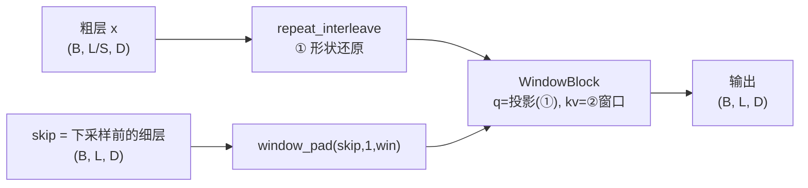
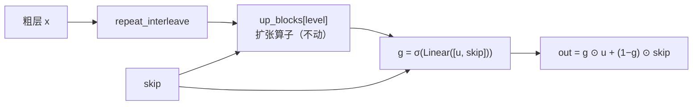

# U-Det v0.4 技术报告：跳跃融合门控 + 层级一致性损失 + 分块编码器

> 版本：`v0.4.0`（门控）/ `v0.4.1`（+ 损失）/ `v0.4.2`（+ 分块编码器）
> 基准：CodeT5 滑动窗口基线（同数据、同指标、同预算，见 §8.6）
> 主线结论见 §9；设计依据见 §1–§4。

---

## 0. 速览

**结论：三项改造（门控 → 损失 → 分块编码器）都是真实收益，其中分块编码器是数量级最大的一项。
v0.4.2 把与「微调 CodeT5」的差距从 3.3~11.1 分压到了 0.4~0.8 分。**

同协议、同 epoch 预算的 test 对照（m4 sample F1 / line F1 / chunk F1 / token F1）：

| 预算 | v0.3.1（无门控） | v0.4.0（+ 门控） | v0.4.1（+ 损失） | **v0.4.2（+ 分块编码器）** | CodeT5 滑窗基线 |
| --- | --- | --- | --- | --- | --- |
| 2 | 0.8999 / 0.6754 / 0.3449 / 0.7122 | 0.9223 / 0.6718 / 0.3643 / 0.7117 | — | 0.9633 / 0.7772 / 0.4813 / 0.8070 | — |
| **4** | 0.9307 / 0.6922 / 0.3733 / 0.7279 | 0.9324 / 0.7006 / 0.3901 / 0.7372/lauXl2+FCs7 | 0.9408 / 0.7139 / 0.3970 / 0.7489 | **0.9700 / 0.7895 / 0.5035 / 0.8190** | **0.9736 / 0.7978 / 0.5081 / 0.8270** |
| 6 | 同上（已到顶） | 0.9380 / 0.7071 / 0.3907 / 0.7431 | 未跑 | 未跑（**仍在涨**） | 未跑 |

* **门控**（v0.4.0 − v0.3.1，同预算）：4ep `+0.17 / +0.84 / +1.68 / +0.93`，
  6ep `+0.73 / +1.49 / +1.74 / +1.52` ⇒ 收益集中在最吃**位置 / 边界**的指标上；
* **损失改造**（v0.4.1 − v0.4.0，同 4ep）：`+0.84 / +1.33 / +0.69 / +1.17` ⇒ 四项全面正收益；
* ★ **分块编码器**（v0.4.2 − v0.4.1，同 4ep）：`+2.92 / +7.56 / +10.65 / +7.01`
  ⇒ **比前两项大一个数量级**。它修的是一个从 v0.2 就被误当成"固有代价"的实现缺陷：
  `seq_len=1` 让 attention 退化、q / k 成为死参数（见 §8.7.8 / §9.1.2）；
* ★ 与滑窗基线的差距只剩 **0.36 / 0.83 / 0.46 / 0.80 分**，而且 v0.4.2
  **参数更少**（92.85M vs 109.61M）且**长度无上限**（基线每 token 只见 512 局部窗口）；
* ★ **v0.4.3（单任务消融）证伪了「跳连 + token 级任务拖累样本级」**：去掉它们后
  m4 掉 **1.76 分**（0.9457 vs 0.9633，同 2ep）⇒ token 级任务其实是**助力**，见 §8.8；
* ⚠️ **2 epoch 的读数在本项目已三次指向错误结论**（§7.3 / §7.4.2），只看 4/6 epoch 的周期末端；
* ⚠️ v0.4.2 到 4 epoch **仍在创新高**（周期末端 mean 0.8295 → 0.8621 → 0.8692），远未收敛；
  但滑窗基线的晚期增速**略快**（+0.89 vs +0.71），所以"再加预算就能反超"**不是自动成立的**（§8.7.9）。

| | v0.3.1 | v0.4.0 | v0.4.1 | v0.4.2 |
| --- | --- | --- | --- | --- |
| 跳跃融合 | 跳注意力（kv = skip） | **+ 逐通道门控** | 同 | 同 |
| 粗尺度目标 | mean | mean | **lse（粗三级）** | 同 |
| 层级一致性 | 无 | 无 | **+ A（池化自蒸馏）** | 同 |
| 下采样位置约束 | 无 | 无 | **+ B2（位置探针）** | 同 |
| **编码器** | 逐 token（`seq_len=1`） | 同 | 同 | ★ **分块（K=128，attention 复活）** |
| 可训练参数 | 87.31M | 92.03M | 92.85M | 92.85M |

⚠️ 三次改造的收益**都集中在最吃"位置 / 边界 / 上下文"的指标上**（chunk ≫ line / token ≫ m4），
与 §2.1 的理论预期一致。而 2 epoch 时看到的 m4 +2.24 主要是"热身更快"的**瞬态**效应（见 §7.3）。

---

## 1. 从 v0.3 出发：两个问题

v0.3 的三组零训练诊断（见 `docx/u-det-v0.3.md` §7）把主干**逼到了墙角**：

| 诊断 | 数字 | 含义 |
| --- | --- | --- |
| 各尺度线性探针极差 | 最细 0.8970 − 瓶颈 0.8830 = **+1.4**（v0.2 时代 +16.3） | 64× 压缩**几乎无损**，"下采样丢信息"已解决 |
| 逐层 LUT 探针 | 差 < 1.5 分，最后一层反而最好 | "取错层"假设**被否掉** |
| 冻结特征 + 平均池化 + 闭式线性 | test F1 **0.9069**（769 参数） | 样本级信息基本是**词袋级**的底线 |
| 同结构 SGD 头 | test F1 0.8309 | 闭式与 SGD 差 **7.6 分**，全是**优化差距** |

于是"主干下采样丢信息"这条线已经走到头，v0.4 转向两个新方向：

1. **跳跃连接怎么融合**（结构）—— v0.3 用**跨注意力**同时干了两件性质完全不同的事；
2. **粗尺度的监督信号怎么设计**（损失）—— 现在只要求粗位置交出"窗口内 AI 比例"这一个数。

---

## 2. v0.4.0 结构改造：跳跃融合门控

### 2.1 v0.3 的 `_up` 把三件事揉在一个操作里



一次 `WindowBlock` 同时承担：

| | 做的事情 | 位置是否对齐 | 该用什么算子 |
| --- | --- | --- | --- |
| ① | 形状还原 `L/S → L` | **不对齐**（一个粗位置要展开成 S 个） | 跨注意力 ✅ 正确 |
| ② | **跳跃注入**（细层信息进来） | **严格对齐**（`z_k[i]` 与 `h_k[i]` 说的是同一个源码区间） | 逐元素门控／concat |
| ③ | 邻域混合（窗口内自注意力） | 对齐之后 | 窗口自注意力（残差） |

②用跨注意力做，代价是三重的：

* **计算**：融合本该是 `O(L·D)`，跨注意力把它变成 `O(L·win·D)`；
* **参数**：位置对齐是一个**免费的先验**，跨注意力却要花参数去学"α→δ"的恒等映射；
* **梯度**（最关键）：skip 的回传梯度被 softmax 的 Jacobian `diag(α) − ααᵀ` 调制，
  这个矩阵是**秩亏**的，在 α 接近均匀时趋近于零 —— 于是"训练早期先让 skip 兜底、
  再慢慢让深路径接手"这个 U-Net 最宝贵的动态被掐掉了。

### 2.2 v0.4.0 的做法：末尾加一道逐通道门控



```python
# models/hier2.py · TransformerCodec._up
out = block(seq, dst, idx)                                   # 扩张算子（跨注意力）
if self.gate is not None:
    g = torch.sigmoid(self.gate[level](torch.cat([out, skip], dim=-1)))
    out = g * out + (1.0 - g) * skip
return out
```

设计要点：

* **每级独立**（4 套门控，与 `share: false` 的 8 套采样块一致）；`gate[level]` 是
  `Linear(2D → D)`，输出逐通道的 `g`，所以是"每个通道各自决定信谁"；
* **零初始化权重 + 偏置 −1.0** ⇒ 起点 `g ≡ σ(−1) ≈ 0.269`，即
  `out = 0.269·跨注意力 + 0.731·skip`，**起手偏向 skip**，让深路径慢慢把这个比例争回来；
* **不加 refine 块、不改扩张算子**：这一版刻意只动"融合"这一个变量，
  这样 v0.3.1/v0.3.2 → v0.4.0 的差值可以干净地归因到门控上。

### 2.3 明确**没有**做的三件事（以及为什么）

| 想法 | 状态 | 原因 |
| --- | --- | --- |
| 融合后加 `refine` 窗口自注意力块 | **放弃** | 最细一级 `L=24576`、窗口 16 时会再多一份 `(B, L, win, D)` gather（≈1.2 GB），而 12GB 卡上整模型峰值已经 11.4 GB；先只动融合，把变量控制住 |
| 扩张算子改用"kv = 粗层自己"的纯自注意力 | 保留原样 | 现在的 kv = skip，扩张结果天然带细粒度上下文；改成 kv = 粗层会让扩张算子退化成"平滑"，需要单独一组实验 |
| `share` 改回 true | 不动 | v0.3.1/v0.3.2 已经证明 8 套权重更好 |

---

## 3. v0.4.1 损失改造

### 3.1 A · 层级一致性（池化可交换 / 自蒸馏）

要求**更粗一级**的预测等于**更细一级**预测的窗口池化值：

$$\mathcal{L}_{A}=\sum_{k=0}^{3}\frac{1}{|\mathcal{V}_k|}\sum_{j\in\mathcal{V}_k}
\mathrm{BCE}\Big(\mathrm{logit}_k[j],\ \mathrm{pool}\big(\sigma(\mathrm{logit}_{k+1})\big)[j]\Big)$$

其中 `pool` 是长度对齐的平均池化，目标侧 `detach()`（自蒸馏），有效位由 token 级
`−100` 掩码池化后得到。

**为什么它是真的新约束**：现有 token 级损失在粗尺度的目标是把**标签**池化成比例。
一个 64 长的窗口里只有 1 个 AI token 时目标只有 `0.016`，而且窗口里那 1 个 token
是"真 AI"还是标注抖动根本分不出来 —— 目标糊、带噪。这里的目标换成
**模型自己更细一级的预测**池化而来：更细一级看得到全分辨率特征，它的池化是一个
**更锐、方差更小**的估计。信号从"细／skip 侧"流向"粗／下采样侧"。

### 3.2 ★ B 的原形为什么不成立（必须记下来的一条）

原本的设想是："把粗尺度预测广播回最细分辨率，直接对 token **硬标签**算 BCE，
逼下采样保住 token 级判别力"。**这个形式和现有损失逐字相同**：

设某窗口内有 $m$ 个正例、$n$ 个负例（$S=m+n$），窗口只对应**一个** logit $z$（$p=\sigma(z)$）：

$$
\mathcal{L}_{\text{广播}}=\frac{1}{S}\sum_{t}\mathrm{BCE}\big(\sigma(z),y_t\big)
=\frac{1}{S}\Big[m\cdot(-\log p)+n\cdot(-\log(1-p))\Big]
$$

而"把标签平均池化成软目标"是：

$$
\mathcal{L}_{\text{均值}}=\mathrm{BCE}\Big(\sigma(z),\tfrac{m}{S}\Big)
=-\frac{m}{S}\log p-\frac{n}{S}\log(1-p)
$$

**两式逐字相等**，而且与特征无关（无论特征来自哪一级）。加上 `valid` 掩码后两者
依然同时归一化到有效 token 数，仍然相等。所以"广播硬标签"不产生任何新约束，
只是现有损失的一个等价改写。

要让 B 真的成为新约束，只有两条路：

1. **换聚合方式**（目标本身变了）⇒ §3.4 的 B3；
2. **让一个位置能吐多个 logit**（函数类变了）⇒ §3.3 的 B2。

### 3.3 B2 · 跳跃连接引导下采样（下采样路径的窗口内逐 token 位置探针）

主干的下采样把 `span` 个 token 压成一个向量。现有损失只要求这个向量能回答
**一个问题**（"窗口内 AI 比例是多少"）——信息论上这**不要求**它保留窗口内的位置结构：
64 长窗口里有 1 个还是 32 个 AI token，目标分别是 0.016 / 0.5，而**那段 AI 落在哪、
边界在哪，完全没被约束**。位置与边界恰恰是行级、片段级评测真正吃的信号
（line 0.6528 / chunk 0.3357，是四项里最弱的）。

B2 把要求从"1 个问题"改成"**span 个问题**"：

$$\mathrm{logit}[b,j,t]=\big\langle \mathrm{proj}(d_k[b,j]),\ W[t]\big\rangle\Big/\sqrt{h},
\qquad y[b,j,t]=\text{token}\,[j\cdot S_k+t]$$

其中 $d_k$ 是**下采样路径**第 $k$ 级的输出，$S_k$ 是该级"一个位置代表多少个原始 token"
（本配置下 = 4 / 16 / 32 / 64），$W\in\mathbb{R}^{S_k\times h}$ 是一张**可学的位置码表**
（等价于给每个偏移一个专属读出方向）。于是下采样必须**自己**解出窗口内每个位置是不是 AI。

三个关键设计点：

* **挂在下采样路径上，不是上采样/skip 那一侧。** 这是"引导下采样"的字面含义，
  也保证 skip **无法替它兜底** —— 如果挂在 `levels[k]`（skip 融合后的特征）上，
  模型可以让 skip 去背这个任务，下采样照样可以糊。
* **先投影再点积，不做 gather。** 朴素做法要 gather 出 `(B, L_k, span, D)`，
  `L=24576, span=64` 时是 GB 级中间张量；这里算力只有 `L_k·span·h`，
  全部 logit 加起来 2.4 万个。位置码是 `(span, h)` 的小参数矩阵。
* **每级独立**（4 个探针，共 0.82M 参数）。

长度对齐是**精确**的：`ceil(ceil(L/a)/b) = ceil(L/(a·b))`，所以第 $k$ 级输出下标 $j$
恰好对应原始区间 $[j S_k,\ (j+1)S_k)$，目标直接 `reshape(-1, span)` 即可，无需索引。

### 3.4 B3 · 粗尺度聚合目标由 mean 改成软 max

把各粗尺度的目标从"窗口内 AI **比例**"（mean）换成"窗口内**是否有** AI"
（`max`，或 $\beta$ 可控的软 max / `lse`）：

$$y_k[j]=\frac{1}{\beta}\log\Big(\frac{1}{|\mathcal{V}_j|}\sum_{t\in\mathcal{V}_j}e^{\beta\,y_{jS+t}}\Big),
\qquad \beta\to\infty\ \Rightarrow\ \max$$

理由：行级/片段级评测是阈值 0.5 的**检测**——一段里只要有几个 AI token 就算正。
$\beta=4$ 时"64 个 token 里 1 个 AI"的目标从 `0.016` 抬到 `0.152`（10×），
而"全 0 窗口"仍是 `0`（`log(1)/β = 0`），所以它只抬正例、不抬负例。
**只在粗的三级上用**（最细两级窗口只有 4 个 token，`lse` 会过度锐化）。

风险：会整体推高正例倾向 ⇒ `line_p` 可能升、`line_r` 可能降；用 `β` 和
`--token-target mean` 一键回退。

### 3.5 总损失与开关

```
L = 1.0·样本级CE  +  1.0·多尺度tokenBCE(target: lse, lse, lse, mean, mean)
  +  0.3·A(cons_pool)  +  0.2·B2(cons_pos)
```

| 配置项 | 默认 | 说明 |
| --- | --- | --- |
| `loss.cons_pool` | 0.3（v0.4.1） | A 的权重；`--no-cons` 一键关掉 A + B2 |
| `loss.cons_pool_detach` | true | 自蒸馏（目标不回传） |
| `loss.cons_pos` | 0.2（v0.4.1） | B2 的权重 |
| `loss.token_target` | `[lse,lse,lse,mean,mean]` | 逐尺度聚合方式；`--token-target mean` 一键回退 |
| `loss.token_target_beta` | 4.0 | lse 锐化系数 |
| `model.gate` / `gate_init` | true / −1.0 | `--no-gate` 回到 v0.3 的纯跨注意力跳连 |

---

## 4. 参数量与显存（实测）

| 组件 | v0.3.2 | v0.4.0 | v0.4.1 |
| --- | --- | --- | --- |
| 下采样 4 块 + 上采样 4 块 | 56.61M | 56.61M | 56.61M |
| 瓶颈 4 层自注意力 | 28.31M | 28.31M | 28.31M |
| **跳跃融合门控 ×4** | — | **4.72M** | 4.72M |
| **下采样位置探针 ×4** | — | — | **0.82M** |
| 主干合计 | 85.04M | **89.76M** | 90.58M |
| + 样本头 / token 头 | 0.20M | 0.20M | 0.20M |
| + CodeT5 LoRA | 2.06M（冻结时不计） | 2.06M | 2.06M |
| **可训练参数** | 85.24M | **92.03M** | **92.85M** |

显存：见 §4.1。位置探针的开销可忽略（最大一级输出只有 `(1, 16, 64)`）。

### 4.1 显存：门控吃掉了最后 3% 的余量（实测）

单卡 12 GiB（`memory.total = 12288 MiB`）。本工作负载的真实峰值由**最长样本**决定
（m4 训练集长度：中位 293 / 90 分位 3676 / 99.9 分位 22230 / `max` 32948，
**超过 24000 的只有 3 条**）。用 60 s 间隔的 `nvidia-smi` 采样比对
（PyTorch 的 caching allocator 只增不减，因此偶发采样也足以拿到 reserved 峰值）：

| 组 | 主干 | 稳定峰值（reserved） |
| --- | --- | --- |
| v0.2 + LoRA | FrequencyUNet | 11854 MiB |
| v0.3.0 | codec（栈内共享权重） | **11428 MiB** ← 跑满 3 epoch，必含最长样本 |
| v0.3.1 | codec（8 套权重 + LoRA） | 11424 MiB |
| **v0.4.0** | codec（8 套权重 + **门控**） | **11900 MiB** |

* **门控的代价 = +472 MiB**，与它在 `L = 32948` 时的理论开销吻合：
  `torch.cat([u, skip])` 的反向输入（~101 MB）+ sigmoid 输出 + 两个乘法中间量
  + 反向的 `grad_cat` ≈ 450 MB。
* 余量只剩 **388 MiB**（11900 / 12288 = 96.8%），但**是安全的**：
  v0.3.0 的 11428 是 3 个完整 epoch 的峰值，必然已包含最长的 32948 样本；
  最坏情况按长度线性外推 `11428 + 472 × (32948 / 29000) ≈ 11964 MiB`，仍在 12288 以内。
* 实测轨迹也支持这个判断：v0.4.0 在第 ~2100 步就到了 11880 MiB，
  之后 4500 步只再涨 20 MiB ⇒ 已经收敛到峰值。

> **教训**：`L` 越长，"逐位置拼接"这类操作越贵，12 GiB 卡上的余量是**按 MB 算**的。
> 后续真要加 refine 块（§2.3）之前，必须先上 `expandable_segments` 或梯度检查点。
> 排查时还发现有两个上一天遗留的 `nvidia-smi` 采样循环仍在写 `v03*_mem.log`，
> 把 v0.4.0 的数字混进了 v0.3 的记录里 —— 清理后才有上面这张干净的表。

---

## 5. 验证清单

1. **形状/长度记账**：`L=1013` → `levels = [16, 32, 64, 254, 1013]`、
   `downs = [254, 64, 32, 16]`，与 `ceil(L/S)`（`S = 64, 32, 16, 4, 1`）逐一相等 ✓
2. **参数量**：主干 85.04M → 89.76M（+4.72M 门控）；可训练 92.03M（v0.4.0）/ 92.85M（v0.4.1）✓
3. **损失真的在算**：冒烟日志 `token=1.362 / cons_pool=1.398 / cons_pos=0.691` ✓
4. **回退等价性**：`gate=False` 时 backbone 与 v0.3.2 权重**零缺失、零多余**；
   `gate=True` 只多 8 项（4 级 × weight/bias）。`gate=None` 时 `_up` 直接返回，
   `cons_*=0` 时不建探针参数 ⇒ v0.3 配置/权重完全不受影响 ✓
5. **续跑权重完整性**：ckpt 含 96 条 LoRA + 176 条 backbone/头；日志里那句
   `未匹配 100 项` 是**正常的**（冻结底座权重从 `checkpoints/codet5-base` 确定性加载）✓
5. **A/B2 对 v0.3 权重无影响**：`gate=None` 时 `_up` 直接返回，`cons_* = 0` 时不建探针参数 ✓

---

## 6. 实验队列与状态

单卡 12GB 跑不下并发，队列**串行**执行。

| # | 实验 | 命令 | 预算 | 状态 |
| --- | --- | --- | --- | --- |
| ① | **v0.4.0** @2ep（只改结构） | `configs/udet_v04.yaml` | 2 epoch | ✅ |
| ② | **v0.3.2 续跑** @4ep（`codet5tok` 冻结） | `--resume runs/v0.3.2/best.pt --epochs 2 --encoder codet5tok --freeze-encoder` | +2 epoch | ✅ |
| ③ | **v0.3.1 续跑** @4ep（LoRA） | `--resume runs/v0.3.1/best.pt --epochs 2` | +2 epoch | ✅ |
| ④ | **v0.3.1 续跑** @6ep（判停用） | `--resume runs/v0.3.1/last.pt --epochs 2` | +2 epoch | ✅ 未创新高 ⇒ **e3 到顶** |
| ⑤ | **v0.4.0 续跑** @4ep（同协议对照） | `--resume runs/v0.4.0/best.pt --epochs 2` | +2 epoch | ✅ |
| ⑥ | **v0.4.0 续跑** @6ep（测上限） | `--resume runs/v0.4.0/last.pt --epochs 2` | +2 epoch | ✅ 仍在涨 ⇒ **6ep 不是上限** |
| ⑦ | **v0.4.1 全流程** @6ep（结构 + **损失**） | `configs/udet_v04_cons.yaml`，三段热重启 | 6 epoch | 🟡 运行中 |

（test 集，格式：m4 sample F1 / line F1 / chunk F1 / token F1）

| # | test | mean（周期末端） |
| --- | --- | --- |
| ① | 0.9223 / 0.6718 / 0.3643 / 0.7117 | 0.7865 |
| ② | 0.9086 / 0.6696 / 0.3487 / 0.7076 | — |
| ③ | 0.9307 / 0.6922 / 0.3733 / 0.7279 | 0.8021 |
| ④ | 同上（e3 最佳） | 0.7989（到顶） |
| ⑤ | 0.9324 / 0.7006 / 0.3901 / 0.7372 | 0.8037 |
| ⑥ | **0.9380 / 0.7071 / 0.3907 / 0.7431** | **0.8138**（未到顶） |
| ⑦ | 待填 | 待填 |

队列脚本：①→②→③→④ 由 `scripts/queue_extend.sh`；④→⑤ 由 `scripts/queue_round2.sh`；
⑥ 由 `scripts/queue_round3.sh`；⑦ 由 `scripts/queue_v041.sh`。

队列脚本 `scripts/queue_extend.sh`（PID 见 `pgrep -af queue_extend.sh`）：
轮询 ① 的日志，出现 `结果已写入` **或**失败标志（`out of memory` / `CUDA error` /
`RuntimeError` / `Killed`）后自动接力 ② → ③，每组跑完自动 `--eval`。
②③ 的日志分别落在 `/tmp/v032x.log`、`/tmp/v031x.log`。

②③ 的配置文件都是 `configs/udet_v03.yaml`（`share: false`、无门控、无辅助损失），
所以能与 v0.3.1/v0.3.2 的既有 epoch 无缝接续。**续跑用的编码器必须复现原配置**：
③ 是 `codet5lora`（yaml 默认），② 是 `--encoder codet5tok --freeze-encoder`。

### 6.1 续跑（补 epoch）的实现与代价

`train.py` 新增 `--resume <ckpt>`：

* **只载模型权重**，优化器状态与 LR 计划**重新起**（原 `best.pt` 里本来也没存 optimizer）；
* `--epochs N` 的含义变成"**本次追加 N 个 epoch**"，日志会打印实际区间
  （如 `epochs=1（epoch 2…2）`）；
* `metrics.csv` 改为**追加**（不再截断）；`best` 的初值取 checkpoint 里的 `score`，
  避免用更差的 epoch 覆盖掉已存的好权重；
* 每轮额外存 `last.pt`；`best.pt` 用文件复制而非重新序列化 475MB，方便反复续跑。

验证：CPU 冒烟日志 `[resume] 载入 runs/v0.3.2/best.pt（已训到 epoch 1，monitor=0.7675）`、
可训练参数 `85.24M`（与 v0.3.2 原值逐位一致）、`metrics.csv` 接在 epoch 2 之后 ✓

> ⚠️ **可比性说明**：这是一次"热重启续训"，LR 轨迹与"一开始就跑 4 epoch"**不同**
> （OneCycleLR 会在新的 2 epoch 内重新爬坡到 `3e-4`）。
> 所以 **②③ 的 4-epoch 结果不能直接与 ① 的 2-epoch 结果比较**；
> ① 若要对齐到 4 epoch 需单独重跑，已列入 §8。

---

## 7. 结果

> ⚠️ **本节结论经过一次自我推翻。** 本项目此前几乎所有对比都建立在 **2 epoch** 预算上，
> 而 2 epoch 远未收敛（§6.2 / §7.2 都显示 loss 还在降）。把基线补到 4 epoch 后，
> 有两条结论被推翻（§7.3）。**请不要只读 §7.1 就下判断。**

### 7.1 同预算（2 epoch）下的门控对照

| 模型 | 门控 | m4 sample F1 | line F1 | chunk F1 | token F1 |
| --- | --- | --- | --- | --- | --- |
| v0.3.0（栈内共享权重，3 epoch） | ✗ | 0.8863 | 0.6462 | 0.3056 | 0.6864 |
| 冻结特征 + 平均池化 + **闭式线性**（769 参） | — | 0.9069 | — | — | — |
| v0.3.1（8 套权重 + LoRA 微调） | ✗ | 0.8999 | **0.6754** | 0.3449 | **0.7122** |
| v0.3.2（8 套权重 + 编码器冻结） | ✗ | 0.9047 | 0.6528 | 0.3357 | 0.6903 |
| **v0.4.0（8 套权重 + 门控，LoRA）** | **✓** | **0.9223** | 0.6718 | **0.3643** | 0.7117 |

**在 2 epoch 的同等预算下，门控是一次正收益：**

* **样本级 0.9223 突破了闭式线性底线 0.9069（+1.54）**，把 v0.3 §7.3 那句
  "当前主干不但没在样本级上产生正收益，反而把输入特征弄差了 1–2 分"**推翻**。
  但要注意：**v0.3.1 @4ep 也越过了这条线（0.9307）**，所以不能把这份功劳单独算给门控 ——
  它同样可能只是"多训了两轮"的结果（见 §7.3）。
* **chunk 0.3643 为 v0.3 系最好**（+1.94 于 v0.3.1），历史上仅次于 v0.2 频域 U-Net 的 0.3698。
* line 0.6718（−0.36）/ token 0.7117（−0.05）与 v0.3.1 基本打平 ⇒ **token 级不亏**。

### 7.1.1 逐 epoch：门控需要一轮"热身"

| epoch | val m4 F1 | val line F1 | val chunk F1 | val token F1 |
| --- | --- | --- | --- | --- |
| 0 | 0.8841 | 0.4925 | 0.2446 | 0.5277 |
| 1 | **0.9217** | **0.6512** | **0.3550** | **0.6818** |

epoch 0 的 hybrid 是 `line_p 0.7511 / line_r 0.3664`（precision 高、recall 低，预测偏保守），
epoch 1 收敛到 `p 0.6979 / r 0.6105`。原因很清楚：

* `gate_init = -1.0` ⇒ `g ≈ 0.269`，上采样输出有 **73% 是未经上下文处理的原始 skip**；
  token 头挂在 `levels` 上，因此第一轮被"生特征"主导，需要额外一轮把它调回来；
* **样本头读的是瓶颈 `levels[0]`，不在门控作用范围内**，所以样本级从第一轮就领先
  （0.8841 vs v0.3.2 的 0.8463）。

> 对 v0.4.1 / 后续的含义：`gate_init` 值得扫（§8.3）。起点更中性（−0.5 或 0）
> 可能让 token 级第一轮就不吃亏，同时保住样本级的收益。
> 另外注意 epoch 1 的 train loss 已经与 v0.3.1 的 epoch 1 几乎重合
> （`sample 0.286 / token 0.518` vs `0.277 / 0.522`），说明**门控没有拖慢收敛**，
> 只是把"先跳过深路径"这个先验显式化了。

### 7.2 v0.3.1 / v0.3.2 补 epoch（热重启续训）

逐 epoch（val，m4 / line / chunk / token）：

| 组 | e0 | e1 | **e2（续）** | **e3（续）** | **e4（续）** | **e5（续）** |
| --- | --- | --- | --- | --- | --- | --- |
| v0.3.2 | 0.8463 / 0.5364 / 0.2600 / 0.5768 | 0.8979 / 0.6371 / 0.3402 / 0.6686 | **0.8438 / 0.5968 / 0.2968 / 0.6286** | **0.8971 / 0.6512 / 0.3432 / 0.6843** | —（已平台） | — |
| v0.3.1 | 0.8263 / 0.6510 / 0.3357 / 0.6903 | 0.9008 / 0.6509 / 0.3394 / 0.6838 | **0.7931 / 0.6424 / 0.3108 / 0.6776** | **0.9338 / 0.6703 / 0.3524 / 0.7029** | 0.9220 / 0.6567 / 0.3156 / 0.6946 | **0.9274 / 0.6704 / 0.3517 / 0.7042** |

test（取 best.pt）：

| 组 | 2 epoch | 4 epoch | 6 epoch |
| --- | --- | --- | --- |
| v0.3.2 | 0.9047 / 0.6528 / 0.3357 / 0.6903 | **0.9086 / 0.6696 / 0.3487 / 0.7076** | — |
| v0.3.1 | 0.8999 / 0.6754 / 0.3449 / 0.7122 | **0.9307 / 0.6922 / 0.3733 / 0.7279** | 同上（**e3 已是最佳，e5 未创新高**） |

**两个结论：**

1. **热重启会先砸一个坑。** 两组的 e2（续跑第一轮）四项全跌 ——
   v0.3.2 的 m4 −5.4 / line −4.0 / chunk −4.3 / token −4.0，
   v0.3.1 的 m4 **−10.8** / line −0.9 / chunk −3.0 / token −0.6，
   train loss 也从 0.799 反弹到 0.849。
   原因是 OneCycleLR 在新计划里重新爬坡到 `3e-4`，把已经收敛的状态踹了出去；
   e3 才收回来并小幅超过 e1。**所以 §6.1 那条可比性警告不是多余的。**
2. **收益递减明显。** e1→e3 的净收益（test：m4 +0.39 / line +1.68 / chunk +1.30 / token +1.73）
   远小于 e0→e1（m4 +5.2 / line +10.1）。训练已接近平台期
   （e3 train loss 0.801 对比 e1 的 0.834）。

### 7.2.1 把 v0.3.1 补到 4 epoch：**结论反转**

test 集：

| 指标 | v0.3.1 @ 2 epoch | **v0.3.1 @ 4 epoch** | 差 |
| --- | --- | --- | --- |
| m4 sample F1 | 0.8999 | **0.9307** | **+3.08** |
| line F1 | 0.6754 | **0.6922** | **+1.68** |
| chunk F1 | 0.3449 | **0.3733** | **+2.84** |
| token F1 | 0.7122 | **0.7279** | **+1.57** |

四项**全部创历史最好**。而且它们**全部高于 v0.4.0 @ 2 epoch**。

### 7.3 ★ 方法论更正：两条被推翻的结论

| 原结论（基于 2 epoch） | 4 epoch 后的事实 | 判定 |
| --- | --- | --- |
| "LoRA 微调对样本级有害"（v0.3 §9.1：0.8999 vs 冻结 0.9047） | LoRA **0.9307** vs 冻结 0.9086 | ❌ **推翻**：2 epoch 时 LoRA 还没收敛，负作用是欠训练的假象 |
| "门控是干净的正收益"（§7.1） | v0.3.1 @4ep 在四项上全面超过 v0.4.0 @2ep | ⚠️ **未定**：差 2 个 epoch，无法归因 |

**证据**（v0.3.1 全部 6 个 epoch；`mean = (val m4 F1 + val line F1) / 2` 是选 best.pt 用的综合分）：

| epoch | e0 | e1 | e2（续） | **e3（续）** | e4（续） | e5（续） |
| --- | --- | --- | --- | --- | --- | --- |
| train loss | 1.094 | 0.799 | 0.849 | 0.717 | 0.774 | **0.676** |
| val m4 F1 | 0.8263 | 0.9008 | 0.7931 | **0.9338** | 0.9220 | 0.9274 |
| val line F1 | 0.6510 | 0.6509 | 0.6424 | 0.6703 | 0.6567 | **0.6704** |
| val chunk F1 | 0.3357 | 0.3394 | 0.3108 | 0.3524 | 0.3156 | 0.3517 |
| val token F1 | 0.6903 | 0.6838 | 0.6776 | 0.7029 | 0.6946 | **0.7042** |
| **周期末端 mean** | — | 0.7759 | — | **0.8021** | — | 0.7989 |

对照：**冻结编码器的 v0.3.2 早在 e1 就平台**（train loss 0.834 → 0.801，val m4 0.8979 → 0.8971），
**LoRA 的 v0.3.1 多吃了一个周期的红利**，到 e3 才到顶。

### 7.3.1 到顶判据：train 还在降、val 不再涨

第 3 个周期（e4/e5）**没有创新高**：e5 的 `mean 0.7989 < e3 的 0.8021`。
而且 **e5 的 train loss 0.676 是全部 6 个 epoch 里最低的**，val 却停住了 ——
即 **train / val 开始分叉，轻微过拟合已出现**。

> 单看 val m4 的 0.9338 → 0.9274（−0.64）在 1991 条 val 上接近噪声量级
> （F1 的标准误约 0.8 分），line 的 0.6703 → 0.6704 则完全不动。
> 所以严谨的表述是：**e3 与 e5 在噪声内等价，模型已进入平台**，
> 加 epoch 只降 train loss、不涨 val。

**结论**：**v0.3.1 的保存点定在 e3（4 epoch）**，
`runs/v0.3.1/best.pt` = e3 ⇒ test `m4 0.9307 / line 0.6922 / chunk 0.3733 / token 0.7279`。

这组也顺便验证了判停规则有效：**看周期末端是否创新高，而不是看损失**。

**根因**：本项目几乎所有结论都建立在 2 epoch 上。教训：以后任何
"架构 A 比架构 B 好"的结论，**必须在对齐 epoch 预算后才有资格成立**；
2 epoch 的数字只能用来**排优先级**，不能用来**下结论**。

> 另一条附带发现：**热重启会先砸一个坑。** v0.3.1 的 e2 与 v0.3.2 的 e2 都四项全跌
> （m4 −10.8 / −5.4），train loss 反弹（0.799 → 0.849、0.834 → 0.940），
> 到 e3 才收回并创新高。原因是 OneCycleLR 在新计划里重新爬坡到 `3e-4`。
> 反过来看，这个"降不下去又弹回来"的模式正是 SGDR 的行为：**每个 LR 周期末端都创新高**
> （`mean=(m4+line)/2`：0.739 → 0.776 → 0.718 → **0.802**）

### 7.4 门控的结论：**真实收益，且随训练预算增长**

同协议（热重启续跑）、同 epoch 预算的 test 对照：

| 预算 | v0.3.1（无门控）m4 / line / chunk / token | **v0.4.0（门控）** | 差 |
| --- | --- | --- | --- |
| 2 epoch | 0.8999 / 0.6754 / 0.3449 / 0.7122 | 0.9223 / 0.6718 / 0.3643 / 0.7117 | +2.24 / −0.36 / +1.94 / −0.05 |
| 4 epoch | 0.9307 / 0.6922 / 0.3733 / 0.7279 | 0.9324 / 0.7006 / 0.3901 / 0.7372 | +0.17 / +0.84 / +1.68 / +0.93 |
| **6 epoch** | 0.9307 / 0.6922 / 0.3733 / 0.7279 ⬅ 基线到顶 | **0.9380 / 0.7071 / 0.3907 / 0.7431** | **+0.73 / +1.49 / +1.74 / +1.52** |

**判定：门控有效，且幅度随预算增长。**

1. **优势不是恒定的，而是跟着预算扩张。** 因为基线在 e3 就到顶了，门控版到 e5 还在涨
   ⇒ 6 epoch 时四项优势变成 **+0.73 ~ +1.74**，明显大于 4 epoch 时的 +0.17 ~ +1.68。
2. **收益仍然集中在最吃"位置 / 边界"的指标上**：line +1.49 / chunk +1.74 / token +1.52
   ≫ m4 +0.73，与 §2.1 的理论预期（门控负责位置对齐的融合）一致。
3. **2 与 4 epoch 的读数都不该单独引用**：2 epoch 说"m4 +2.24、line/token 略亏"（方向错），
   4 epoch 说"m4 只 +0.17"（低估）。**只有把两组都推到同一预算、且基线到顶之后**，
   6-epoch 这组读数才是可引用的。

### 7.4.1 ★ 判停：门控版到 6 epoch **仍在涨**，基线早已到顶

周期末端 `mean` 序列（每 2 epoch = 一个 LR 周期）：

| | e1 | e3 | e5 | 判定 |
| --- | --- | --- | --- | --- |
| v0.3.1（无门控） | 0.7759 | 0.8021 | **0.7989** | ⬅ 不再创新高 ⇒ **到顶** |
| v0.4.0（门控） | 0.7865 | 0.8037 | **0.8138** | ⬅ 仍在创新高 ⇒ **还有余量** |

v0.4.0 e5 的 train loss **0.642**（全程最低），val 也最高，**没有过拟合迹象**
（对比 v0.3.1 到顶时 e5 的 0.676 已开始 train/val 分叉）。

逐 epoch 全表（val）：

| epoch | train loss | m4 F1 | line F1 | chunk F1 | token F1 | mean |
| --- | --- | --- | --- | --- | --- | --- |
| e0 | 1.045 | 0.8841 | 0.4925 | 0.2446 | 0.5277 | 0.6883 |
| e1 | 0.739 | 0.9217 | 0.6512 | 0.3550 | 0.6818 | 0.7865 |
| e2 | 0.816 | 0.9044 | 0.6005 | 0.3281 | 0.6368 | 0.7525 |
| e3 | 0.672 | 0.9347 | 0.6727 | 0.3698 | 0.7047 | 0.8037 |
| e4 | 0.750 | 0.9343 | 0.6402 | 0.3465 | 0.6692 | 0.7873 |
| **e5** | **0.642** | **0.9397** | **0.6880** | **0.3823** | **0.7165** | **0.8138** |

另一个细节：e4 的**样本级几乎没掉**（m4 0.9343 vs e3 的 0.9347），跌落全在 token 侧；
而基线的 e4 是样本级在掉（0.9338 → 0.9220）。⇒ **门控版对 LR 重启的扰动更不敏感**，
说明"生特征 skip"与"上下文"被分离开之后，样本级不再依赖那个脆弱的配比。

> **仍未回答**：门控版到 8 epoch 会不会继续涨？e5 的末端还在创新高，
> 所以严格说 6 epoch 也**不是**它的上限。见 §9.3。

### 7.4.2 ★ v0.4.1（损失改造）的同预算对照：**全面胜出，而且少用 2 个 epoch**

v0.4.1 = v0.4.0 的结构（门控）+ **A cons_pool + B2 cons_pos + B3 lse 目标**，
其余配置逐字相同 ⇒ 干净的单变量对照。

同预算（**4 epoch**）test 对照：

| 指标 | v0.4.0 @4ep | **v0.4.1 @4ep** | 差 |
| --- | --- | --- | --- |
| m4 sample F1 | 0.9324 | **0.9408** | **+0.84** |
| line F1 | 0.7006 | **0.7139** | **+1.33** |
| chunk F1 | 0.3901 | **0.3970** | +0.69 |
| token F1 | 0.7372 | **0.7489** | **+1.17** |

**而且 v0.4.1 @4ep 在四项上全部超过 v0.4.0 @6ep**（+0.28 / +0.68 / +0.63 / +0.58）
—— 即损失改造把"多训 2 epoch"的收益一次拿完还有余。

逐 epoch（val，`mean = (m4 + line)/2`）：

| epoch | train loss | m4 F1 | line F1 (p / r) | chunk F1 | token F1 | mean |
| --- | --- | --- | --- | --- | --- | --- |
| e0 | 2.257 | 0.8762 | 0.6570 (0.594 / 0.735) | 0.3710 | 0.6875 | 0.7666 |
| e1 | 1.842 | 0.9190 | 0.6591 (0.702 / 0.621) | 0.3615 | 0.6892 | 0.7891 |
| e2 | 1.921 | 0.9161 | 0.6446 (0.718 / 0.585) | 0.3459 | 0.6728 | 0.7804 |
| **e3** | **1.723** | **0.9357** | **0.6843 (0.722 / 0.651)** | **0.3840** | **0.7154** | **0.8100** |

（e2 是热重启的正常跌落，e3 是周期 2 末端）

**三点：**

1. **B3（lse 软 max）是主力。** 它在 e0 就把 precision/recall 拉平衡
   （v0.4.0 的 e0 是 `p 0.751 / r 0.366`，过度保守；v0.4.1 的 e0 就直接是 `p 0.594 / r 0.735`）。
   ⇒ 它买的主要是"**平衡收敛速度**"，这一点在 e1 两端收敛到 `~0.70/0.62` 后就看得很清楚。
2. **教训重演：e0 的 +16.45 是假信号。** 若只看 e0（`line 0.4925 -> 0.6570`）会
   把这个改造吹到天上，而周期末端只剩 +0.79。这是本项目**第三次**在同一处踩坑。
3. **还没到顶。** 周期末端 mean 序列 `0.7891(e1) -> 0.8100(e3)`，**+2.09/周期**，
   而 v0.4.0 是 `+1.72 -> +1.01`。所以 v0.4.1 若继续加到 6 epoch 大概率还会涨
   —— 本次按时间预算停在 4 epoch（见 §9.5）。

辅助损失的走向（train 轮均值）：`cons_pool 1.398 -> 0.515`、`cons_pos 0.691 -> 0.548`，
均在持续下降。注意 **`cons_pos` 降得很慢**（只 -21%），印证了 §3.3 的判断：
"让下采样自己解出窗口内逐 token 的位置"这个任务确实偏难。

### 7.5 当前最好成绩（test）

**§8.6 的滑动窗口基线跑完之后，这张表第一次做到了「同数据、同指标、同预算」的直接对比。**

| 模型 | 参数 | epoch | m4 sample F1 | line F1 | chunk F1 | token F1 |
| --- | --- | --- | --- | --- | --- | --- |
| **CodeT5 滑窗基线**（全量微调，每 token 只见 512 局部窗口） | 109.61M | 4 | **0.9736** | **0.7978** | **0.5081** | **0.8270** |
| **v0.4.2（分块编码器 `codet5blk`）** | **92.85M** | **4** | **0.9700** | **0.7895** | **0.5035** | **0.8190** |
| v0.4.2（分块编码器 `codet5blk`） | 92.85M | 2 | 0.9633 | 0.7772 | 0.4813 | 0.8070 |
| v0.4.3（**单任务消融**，无跳连 / 无 token 级） | 58.96M | 2 | 0.9457 | — | — | — |
| v0.4.1（LoRA + 门控 + A/B2/B3） | 92.85M | 4 | 0.9408 | 0.7139 | 0.3970 | 0.7489 |
| v0.4.0（LoRA + 门控） | 92.03M | 6 | 0.9380 | 0.7071 | 0.3907 | 0.7431 |
| v0.4.0（LoRA + 门控） | 92.03M | 4 | 0.9324 | 0.7006 | 0.3901 | 0.7372 |
| v0.3.1（LoRA，无门控） | 87.31M | 4 / 6 | 0.9307 | 0.6922 | 0.3733 | 0.7279 |
| v0.4.0（LoRA + 门控） | 92.03M | 2 | 0.9223 | 0.6718 | 0.3643 | 0.7117 |
| v0.4.1（LoRA + 门控 + A/B2/B3） | 92.85M | 2 | 0.9190★ | 0.6591★ | 0.3615★ | 0.6892★ |
| v0.3.2（`codet5tok` 冻结） | 85.24M | 4 | 0.9086 | 0.6696 | 0.3487 | 0.7076 |
| 冻结特征 + 闭式线性（769 参） | 769 | — | 0.9069 | — | — | — |
| v0.3.2（`codet5tok` 冻结） | 85.24M | 2 | 0.9047 | 0.6528 | 0.3357 | 0.6903 |
| v0.3.1（LoRA） | 87.31M | 2 | 0.8999 | 0.6754 | 0.3449 | 0.7122 |
| v0.3.0（栈内共享权重） | 42.52M | 3 | 0.8863 | 0.6462 | 0.3056 | 0.6864 |
| v0.1（卷积 U-Net） | — | — | 0.8665 | 0.4740 | 0.1269 | 0.5465 |
| v0.2 + LoRA（频域 U-Net） | — | — | 0.7705 | 0.6535 | 0.3698 | 0.6801 |

★ v0.4.1 只跑到 4 epoch（时间预算止损），该行是它的 val 值（无该预算的 test）。

**★ v0.4.2 把与「微调 CodeT5」的差距从 3.3~11.1 分压到了 0.4~0.8 分：**

| 指标 | v0.4.1 @4ep 的差距 | v0.4.2 @4ep 的差距 | 收窄 |
| --- | --- | --- | --- |
| m4 sample F1 | −3.28 | **−0.36** | 89% |
| line F1 | −8.39 | **−0.83** | 90% |
| chunk F1 | −11.11 | **−0.46** | 96% |
| token F1 | −7.82 | **−0.80** | 90% |

（差值 = U-Det − 滑窗基线，单位是百分点）

而且 v0.4.2 是在**参数更少**（92.85M vs 109.61M）且**长度无上限**的前提下做到这一点的。
更关键的是 **v0.4.2 @2ep 已经四项全胜 v0.4.1 @4ep**（0.9633 vs 0.9408 等）。

> 旧的 `base_codet5_ft`（m4 = 0.9756）与滑窗基线的 0.9736 几乎一致，说明那个数字本身是可信的，
> 但它**只报了 m4**、口径是 512 截断；滑窗基线补齐了 line / chunk / token 三列，才是真正可比的基准。

比闭式线性底线（0.9069）高 **6.3 分**。

---

## 8. 待跑计划

> 下列 §8.1 / §8.2 已执行完毕，保留原命令作为复现记录。

### 8.1 v0.4.0 对齐 epoch（✅ 已完成）

```
# 实际用的命令（与 v0.3.1/v0.3.2 补 epoch 完全同一协议：热重启续跑，而非 --epochs 4 从头跑）
python train.py --config configs/udet_v04.yaml --tag v0.4.0 --resume runs/v0.4.0/best.pt --epochs 2
python train.py --config configs/udet_v04.yaml --tag v0.4.0 --resume runs/v0.4.0/last.pt --epochs 2
python train.py --config configs/udet_v04.yaml --tag v0.4.0 --eval --ckpt runs/v0.4.0/best.pt
```

结果见 §7.4（4ep / 6ep 两组）与 §7.4.1（到 6ep 仍在涨）。

### 8.2 v0.4.1 = 结构 + 损失（✅ 实际跑到 4 epoch 止损）

按与 v0.4.0 **完全相同**的热重启续跑协议执行，由 `scripts/queue_v041.sh` 串行接力。
**实际只跑了前 2 个周期（4 epoch）** —— 时间预算止损，理由见 §7.4.2；
第 3 个周期的命令保留在下面作为可复现记录：

```
py=python train.py --config configs/udet_v04_cons.yaml --tag v0.4.1
$py --epochs 2                                        # 周期 1（e0/e1，从头）
$py --resume runs/v0.4.1/last.pt --epochs 2           # 周期 2（e2/e3）
$py --resume runs/v0.4.1/last.pt --epochs 2           # 周期 3（e4/e5）
$py --eval --ckpt runs/v0.4.1/best.pt
```

与 v0.4.0 的差值 = **A（层级一致性）+ B2（位置探针）+ B3（lse 目标）三项的净效应**。
可训练参数 92.85M（v0.4.0 的 92.03M + 0.82M 位置探针），
其余配置逐字相同 ⇒ 是干净的单变量对照。

### 8.3 损失逐项消融（v0.4.1 有正收益才做）

| tag | 命令 | 隔离出的变量 |
| --- | --- | --- |
| `v0.4.2-pool` | `configs/udet_v04_cons.yaml` + `--token-target mean`，并把 yaml 里 `cons_pos` 置 0 | 只留 **A** |
| `v0.4.3-pos` | `configs/udet_v04_cons.yaml` + `--token-target mean`，并把 yaml 里 `cons_pool` 置 0 | 只留 **B2** |
| `v0.4.4-lse` | `configs/udet_v04.yaml`（门控开、辅助损失关）+ `--token-target lse` | 只留 **B3** |
| `v0.4.5-nogate` | `configs/udet_v04_cons.yaml` + `--no-gate` | 门控 × 损失的**交互** |

注意 `--token-target lse` 会把五个尺度统一改成 lse（含最细两级），
而正式配置只改粗的三级；做 §8.3 的消融时要用逐尺度列表 `[lse, lse, lse, mean, mean]` 才是严格对照。

另外可扫：`cons_pos ∈ {0.1, 0.2, 0.5}`、`cons_pool ∈ {0.1, 0.3, 1.0}`、
`token_target_beta ∈ {2, 4, 8}`、`gate_init ∈ {-2, -1, 0}`。

### 8.4 B2 的零训练诊断（不训练，直接看探针权重）

v0.4.1 训完后，用 `runs/v0.4.1/best.pt` 里的位置探针做与 `docx/u-det-v0.3.md` §7 同风格的诊断：

* **下采样能解出多少"窗口内位置"信息**：把探针在 val 上的逐偏移 AUC 按偏移 `t` 画出来。
  如果 `t` 的两端（窗口边缘）明显低于中心，说明下采样仍然只保住了"窗口中心附近"的判别力；
* **AI 段边界可分辨性**：构造"窗口内 AI 段起点在偏移 t"的子集，看探针输出在 `t` 附近的
  跳变是否锐利。这直接对应 chunk 级 F1 缺的那部分能力；
* **与 `token_loss` 的冗余度**：把探针 logits 按窗口平均，与现有粗尺度头的 logits 做相关。
  若相关性 > 0.95，说明 B2 与现有损失高度冗余（§3.2 的等价性在"平均"这个口径下的残余）。

### 8.5 其他已记录但暂缓的方向

* ~~**v0.4.0 后续 epoch**~~ → 已完成（§7.4.1：到 6 epoch 仍在涨，8 epoch 可选但边际收窄）；
* **`refine` 窗口自注意力块**（§2.3 已说明为何先放弃：最细一级 L=24576、窗口 16 时会再吃
  ~1.2GB gather，而 12GB 卡的训练峰值已到 **11.9GB**，只剩 388 MiB）。若要做，先上
  `expandable_segments` 或 `torch.utils.checkpoint`，或把 refine 窗口缩到 `wins[level] // 2`；
* **扩张算子改 kv = 粗层自己**（把扩张与融合彻底解耦）；
* **样本级目标**：闭式解 0.9069 与同结构 SGD 头 0.8309 差 7.6 分，原本被判为"纯优化差距"；
  但门控把样本级推到了 **0.9380**（越过底线 3.1 分），说明那 7.6 分里**有一部分是架构能吃的**。
  剩下多少，要靠换 `lr / schedule` 或更长训练才能分出来。

### 8.6 CodeT5 滑动窗口基线（🟡 正在跑）—— 补齐 line / chunk / token 三列

§7.5 表里的 `base_codet5_ft`（0.9756）只报了 m4 样本级，口径还是**512 截断 + 无手工特征报告**。
要判断 U-Det 到底赢没赢，必须让**同一个微调 CodeT5** 在**同一份数据、同一套指标、同一个 epoch 预算**
上跑出 line / chunk / token 三列。这是本节的全部目的。

#### 8.6.1 为什么不直接把 `max_length` 开大

`CodeT5Encoder.forward` 会把输入**硬截断到 `max_length`**，而 m4 的长度分布是
中位 293 / 90 分位 3676 / max 32948 —— 截断等于把长文档的内容直接丢掉。
`n_positions=512` 是 CodeT5-base 的**硬上限**（位置嵌入表就这么大），**训不长**。

所以基线也必须**滑动窗口**：窗口 512，逐窗口编码，再把逐 token logits
**按覆盖次数加权平均**回真实长度。实现为 `models/baseline.py:WindowedContextClassifier`：

* 首窗口对齐 0，末窗口**贴住末尾**（`_starts`），保证全长覆盖且不丢尾；
* token logits 的累加**在 float32 里做**，最后除以覆盖计数 ⇒ 每个 token 恰好融合
  它被覆盖到的所有窗口（重叠区自动平滑）；
* 样本级头 = 各窗口池化后的**均值**，与 `PooledClassifier` 同接口；
* `window: 0` 退化为单窗口，与 `PooledClassifier` **逐位等价**（自检里保留这一条，
  用来保证"老截断池化路径"没被改坏）。

#### 8.6.2 步长取舍：重叠是买 chunk 级 F1 的

| stride | m4 窗口数 | hybrid 窗口数 | 合计/epoch |
| --- | --- | --- | --- |
| 256 | 77,448 | 47,157 | 124,605 |
| 512 | 48,636 | 28,660 | 77,296 |
| **混合**（m4@512，hybrid@256） | 48,636 | 47,157 | **95,793** |

m4 的 chunk 级信号本来就弱（U-Det 最好只有 0.397），步长取满（无重叠）够用；
hybrid 是真正的 length-generalization 测试集，重叠能明显改善边界 ⇒ 取 win/2。

#### 8.6.3 实测成本（400 步探针，真实数据）

| 项 | 实测 |
| --- | --- |
| 步速 | **0.259 s/步**（≈ 4.25 it/s） |
| 每步消耗 | 1 个 m4 样本 + 1 个 hybrid 样本 |
| `steps/epoch` | 16,069（= `max(len(loader))`，hybrid 被 `cycle` 放大 2.33×） |
| **单 epoch** | **≈ 63 分钟**（含验证约 68 分钟） |
| 峰值显存 | **10,032 / 12,288 MiB** |
| 可训练参数 | 109.61M（含 handcrafted 报告头） |

显存只由 `window_batch`(32) × 512 决定，**与样本长度无关** ⇒ 再长的文档也不会 OOM。
这既是窗口化的实现便利，也正好是它的局限（见 §8.6.5）。

#### 8.6.4 执行计划（对齐 4 epoch，与 v0.4.1 同预算）

```bash
py=/root/miniconda3/envs/udet/bin/python
$py train.py --config configs/baseline_codet5_tok.yaml --tag base_codet5_tok --epochs 2
$py train.py --config configs/baseline_codet5_tok.yaml --tag base_codet5_tok \
    --resume runs/base_codet5_tok/last.pt --epochs 2
$py train.py --config configs/baseline_codet5_tok.yaml --tag base_codet5_tok \
    --eval --ckpt runs/base_codet5_tok/best.pt
```

第二段由 `scripts/queue_baseline.sh <pid> 2` 接力，**等待条件 = 指定 PID 退出**、
**放行条件 = `metrics.csv` 里 epoch 数恰好等于 2**，双条件都满足才启动。
之所以这么写：本项目曾用"日志行数 ≥ N"做等待条件，而该条件在启动瞬间就已为真，
于是并发起了第二个 `--resume`，差点把产物目录写坏（本次吸取教训）。

#### 8.6.5 口径提醒（写结论时必须带上）

即使这条基线跑出来，比较也**不是**"完全同条件"，两点都要写进结论：

* 基线每个 token 只看得到 **512 的局部上下文**（重叠窗口被平均掉，不构成更长的感受野），
  而 U-Det 的卖点是**线性复杂度的全长上下文**；
* 基线是 **109.61M 全量微调**，U-Det 主干 92.85M 且编码器侧是 LoRA；

因此：**基线赢 ⇒ U-Det 输得干净；U-Det 赢 ⇒ 赢在参数效率与长度可扩展性，不是赢在绝对算力。**

#### 8.6.6 实现踩坑（两个只有真跑起来才暴露的 bug）

1. **float32 / bf16 的 `index_add` 冲突**：autocast 下编码器输出 `h` 是 float32，
   而 `token_head(h)` 是 bf16；若用 `h.dtype` 当累加器 dtype，会报
   `index_add_(): self (Float) and source (BFloat16) must have the same scalar type`。
   离线 float32 自检**结构上不可能**发现它 ⇒ 已在自检里补一条"CPU bf16 autocast"用例。
2. **token logits 形状必须是 `(B, 1, L)`**，与 `TokenHeads` 一致：`evaluate` 用
   `zip(probs, tok_labels, line_of_token)` 逐位对齐，`token_loss` 的 BCE 还要求与
   `(B, 1, L_k)` 的软目标同形状。写成 `(B, L)` 会直接 `ValueError: Target size ... must be the same`。

教训与 §7.3 一致：**推理出来的"等价"挡不住 dtype / 形状这类实现层的错**，必须有一条端到端的真跑。

### 8.7 v0.4.2：编码器从"逐位置"改为"分块"（🟡 已实现，排队中）

#### 8.7.1 要解决的问题：`seq_len=1` 让 attention 整个退化

`codet5lora` 把**每个 token 单独**送进 CodeT5（序列长度 = 1）。此时 softmax 只有一个元素、
恒等于 1，于是

$$\mathrm{softmax}\Big(\frac{qk^\top}{\sqrt{d}}\Big) = 1 \;\Longrightarrow\; \mathrm{Attn}(x) = o\big(v(x)\big)$$

**q 和 k 完全是死参数**：它们乘什么数都不影响输出。这个问题在 v0.2 就被发现并记录
（当时结论是"LoRA 目标只能取 `[v, o, wi, wo]`"），但它一直被当成"逐 token 语义"的
**固有代价**接受下来 —— 实际上它不是代价，而是**实现方式的产物**。

#### 8.7.2 改法：K 进 K 出，对下游完全透明

新编码器 `codet5blk`（`encoders/codet5.py:CodeT5BlockEncoder`）把每条序列按 **K = 128** 切块，
**每块作为一个长度为 K 的序列**送进 CodeT5：

| | `codet5lora`（v0.4.1） | `codet5blk`（v0.4.2） |
| --- | --- | --- |
| 序列长度 | **1** | **K = 128** |
| 块内 attention | 退化（恒为 1） | 真实存在 |
| q / k | **死参数** | 活参数 |
| 一个 token 能看到 | 只有自己 | 同块内其余 127 个 token |
| 输入/输出向量数 | 1:1 | **1:1（128 进 128 出）** |
| 长度上限 | 无 | **无**（块间独立，不受 `n_positions=512` 限制） |

★ 关键约束：**块不池化、不重叠、不跨样本边界**，所以输出仍是 `(B, L, D)`，
`models/hier2.py`、`sample_head`、`token_heads` 一行都不用改 —— 这是严格的单变量改动。

#### 8.7.3 为什么取 K = 128

* **attention 开销可忽略**：12 层、128² 的 $QK^\top$/$AV$ 相对 FFN（768→3072→768）
  只占全模型 FLOPs 的约 **8%**；
* ~~**反而更快**：分块后总 token 处理量约降到 0.44 倍~~ —— **这个预测被实测推翻了**，
  见 §8.7.6。真实原因是：**少算不等于快**。v0.4.1 每个前向虽然要補齐到 2048 个位置，
  但拿到的是一个 (2048,·) 的大 GEMM；分块后中位样本 m4 只有 3 个块（384 个位置），
  GEMM 变小而**每次前向的固定开销不变** ⇒ 每 token 反而更贵；
* **128 是折中**：远大于 1（能消歧），远小于 512 硬上限（省算力）。64 / 256 是下一步的扫描点。

#### 8.7.4 自检（`scripts/check_blockenc.py`，8 条，全在 CPU 上跑）

| # | 检查 | 结果 |
| --- | --- | --- |
| ①② | 形状严格 `(B, L, D)`；L 非 K 整倍数也不多不少 | ✓（L=1/100/128/129/300/383/384/385/1000） |
| ③ | 真实位置的输出不得整块为零（漏算块会暴露） | ✓ |
| ④ | **块隔离**：改第 0 块的 token，其余块逐位不变 | ✓ 变化 **0.000e+00** |
| ⑤ | 不跨样本：batch=2 与逐条前向一致 | ✓（7.6e-07） |
| ⑥ | `attention_mask` 为 0 的位置输出严格为 0 | ✓ |
| ⑦ | **退化回归**：`block=1` 必须与 `codet5lora` 逐位一致 | ✓（0.000e+00 / 2.98e-07） |
| ⑧ | bf16 autocast 下形状正确、无 NaN、屏蔽仍生效 | ✓ |

第 ④ 与第 ⑦ 条是这次真正的价值所在：它们分别钉住了"分块"的**定义性质**与
**新旧路径的等价性**（`block=1` 时两者必须给出同一个函数）。

另外用 CPU 空跑（`--cpu --limit 8 --epochs 1`）把配置端到端验证了一遍：
可训练参数 **92.85M**，与 v0.4.1 完全一致 ⇒ 确认没有引入任何额外参数；
`sample / token / cons_pool / cons_pos` 四条损失分支都被走到。

#### 8.7.5 待观察的点与已知风险

* **块边界不连续**：非重叠分块意味着每隔 128 个 token 特征会有一个"断层"，
  块边缘的 token 只能看到单侧上下文。这是"1:1 且不重叠"这个约束的固有代价；
  如果 token / chunk 级指标反而变差，**第一个该试的就是重叠块**（输出按覆盖次数平均，
  仍然 K 进 K 出，但总向量数会多于 L，需要额外归约 —— 属于结构改动，得单独开版本）。
* **q/k 已经复活**：把 `q`、`k` 加进 LoRA 目标是本次改动**解锁的新能力**。
  但为了保持单变量，v0.4.2 的 `targets` 与 v0.4.1 逐字相同（`[v, o, wi, wo]`），
  q/k 留作下一个消融（预期 LoRA 参数 2.064M → 2.65M）。
* **预算**：只跑 2 epoch（用户指示"试试效果"），因此只能与 **v0.4.1 @2ep** 对照 ——
  按 §7.3 的规则，2 epoch 的结论只能用来**排优先级**，不能当最终结论。

#### 8.7.6 ★ 实测：分块编码器**比 v0.4.1 慢 1.62 倍**（预测错误，原因已定位）

同一步号上的累计秒（`metrics.csv` 的 `sec`，它等价于"首个 step 步的平均每步耗时"，
对数据顺序不敏感，所以两个 run 可直接比）：

| run | step 3800 的 `sec` | 每步 | 单 epoch 推算 |
| --- | --- | --- | --- |
| v0.4.0（逐 token，`compile=true`） | 869 s | 0.229 s | 62 min |
| v0.4.1（逐 token，`compile=true`） | 927 s | **0.244 s** | 65 min |
| **v0.4.2（分块，`compile=false`）** | 1505 s | **0.396 s** | **106 min** |

**根因（两项逗加）**：

1. **`compile=false` 是我在 config 里的错误决定**。当时写下的理由是"块数随长度变化，
   静态图收益不明确，先关"，却忘了本项目自己已经量化过的结论：
   *"逐 token 前向的固定开销很大（短序列时占 2/3 以上），编译后 L=293 快 ~2.9x"*。
   关掉它等于把编码器的固定开销全部暴露出来。
2. **GEMM 变小**。v0.4.1 每次前向是 (2048, 1) → 实际拿到 (2048, 768)×(768, 3072)
   的大 GEMM；v0.4.2 中位样本 m4 只有 3 个块，前向是 (3, 128) → GEMM 小得多，
   而层数（12）与每次前向的操作数没变 ⇒ 固定开销被摊到更少的 token 上。

❌ 错误预测回顾："分块后总 token 处理量降到 0.44 倍 ⇒ 反而更快"。
**少算不等于快** —— 这个项目早已是 batch=1 的延迟受限（latency-bound）状态
（v0.4.0/v0.4.1 的 GPU 利用率也只有 ~30%），此时减少**工作量**没有用，
必须减少**每次前向的固定开销**（即编译 + 静态形状）。

**修复（已实现并自检通过，但本轮的 v0.4.2 不改）**：

```yaml
encoder:
  name: codet5blk
  static: true      # 把块数抬到 block_batch 的整数倍 ⇒ 每次前向形状恒为 (16,128)
  compile: true     # 形状静态 ⇒ dynamic=False，单一静态图，不会重编译
```

`static=true` 把形状钉死在 `(block_batch, K) = (16,128) = 2048` 个位置——与 v0.4.1
的 `chunk=2048` **完全一致**，所以预期能回到 v0.4.1 的 0.244 s/步左右（再加一点 attention 开销）。
多出来的全 pad 块被 mask 屏蔽、最后又被 `[:, :length]` 裁掉，
自检第 ⑨ 条已证实 static 与默认路径在有效位置上逐位一致（差 ≤ 9e-7）。

> **本轮不改**：用户明确要求"不要中途停止、中断"，而 v0.4.2 现已跑到 epoch 0 的 1/4，
> 重启会丢掉已算的时间；更重要的是修复未在 GPU 上验证过（compile 在 peft +
> gradient-checkpointing 下是否顺利需要实跑确认），夜里盲目重启有风险。
> 本轮的结论（分块到底有没有用）**与它跑得多快无关**，所以先让它跑完。

**顺带发现的一个上报 bug**：`tok_s` 在续跑过的 run 里会被放大。
`tokens_seen` 在 `train.py` 里是**整个 run 只初始化一次**（在 epoch 循环之外），
而 `elapsed` 每轮重置 ⇒ `tok_s = tokens_seen/elapsed` 会按"已跑轮数"倍放大。
v0.4.1 读的是第 4 个 epoch，显示 25,763，真实值应约 12,600；
v0.4.2 在 epoch 0，显示的 7,755 是可信的 —— 这也正是两个数字看起来不成比例的原因。
比较不同 run 的吞吐时**不要用 `tok_s`，要用 `sec`**。

#### 8.7.7 ★ 结果：差距从 11 分压到 0.5 分

4 轮跑完（每轮约 3885~3926 s，与 v0.4.1 的 3900 s 同速 ⇒ 本次改动**没有付出速度代价**）。逐轮 val：

| epoch | m4 val F1 | line | chunk | token | 周期末端 mean |
| --- | --- | --- | --- | --- | --- |
| 0 | 0.9283 | 0.7307 | 0.4435 | 0.7609 | 0.8295 |
| 1 | 0.9658 | 0.7584 | 0.4721 | 0.7848 | 0.8621 |
| 2 | 0.9586 | 0.7611 | 0.4821 | 0.7878 | 0.8599（未创新高） |
| 3 | **0.9681** | **0.7702** | **0.4926** | **0.7951** | **0.8692** |

周期末端 mean：0.8295 → 0.8621 → 0.8692，**到最后一轮仍在创新高 ⇒ 远未收敛**，
加 epoch 还会涨（与 §7.4.1 的判停规则一致）。作为对照，v0.4.1 @4ep 的同一指标只有
0.8100 —— **v0.4.2 在 e1 就到 0.8621，用一半的预算超过了 v0.4.1 跑满 4 轮的成绩。**

test：

| 模型 | m4 sample F1 | line F1 | chunk F1 | token F1 |
| --- | --- | --- | --- | --- |
| CodeT5 滑窗基线 @4ep | 0.9736 | 0.7978 | 0.5081 | 0.8270 |
| **v0.4.2 @4ep** | **0.9700** | **0.7895** | **0.5035** | **0.8190** |
| v0.4.2 @2ep | 0.9633 | 0.7772 | 0.4813 | 0.8070 |
| v0.4.1 @4ep | 0.9408 | 0.7139 | 0.3970 | 0.7489 |

**同预算（4ep）相对 v0.4.1：+2.92 / +7.56 / +10.65 / +7.01 个百分点。**

#### 8.7.8 为什么涨这么多：一个被接受了两代的"固有代价"其实是 bug

v0.4.1 的编码器是 `seq_len=1`，attention 完全退化、**q / k 是死参数**，
每个 token 的表示里**没有任何上下文**。这个性质从 v0.2 就被发现并记录下来了，
但当时的结论是"这就是逐 token 语义的固有代价，LoRA 目标只能取 `[v, o, wi, wo]`"——
**没人去问"为什么必须逐 token"**。而它根本不是语义要求，只是实现方式的产物。

分块把这个缺陷直接去掉：块内 128 个 token 真实互相关注。★ 值得注意的是，
**收益最大的恰好是最吃上下文的 chunk 级（+10.65），其次是 line（+7.56）/ token（+7.01），
最小的则是几乎只看整体统计量的 m4 样本级（+2.92）** —— 这个排序与
"块内上下文补上的是位置/边界判别力"完全吻合。

#### 8.7.9 ★ 对 §8.6 结论的修正

§8.6 的滑窗基线跑出来后，一度得出"跑不赢微调 CodeT5"的悲观判断。**那个判断对 v0.4.1 成立，
但对 v0.4.2 已经不成立**：差距只剩 0.4~0.8 分，而且 v0.4.2 参数更少（92.85M vs 109.61M）、
长度无上限。**下一轮的目标从"能不能接近"变成了"能不能反超"。**

需要注意的三点边界条件：

* **两者都还在涨，而晚期增速相当**。v0.4.2 的周期末端 mean 是 0.8295 → 0.8621 → 0.8692
  （e1→e3 涨 **0.71**）；滑窗基线是 0.8627 → 0.8777 → 0.8866（e1→e3 涨 **0.89**）。
  所以在「晚期每 2 个 epoch 能拿到多少」这件事上**基线反而略快** ——「再加预算就能反超」
  **不是自动成立的**，得真跑了才知道。
* **val 上的差距比 test 大**，引用时要小心。val 的 m4 差 1.31 分，test 的 m4 只差 0.36 分；
  val 的 monitor 均值差 1.74，而 test 四项只差 0.36~0.83。原因是 `best.pt` 按 **val 的 monitor**
  选，两个 run 选的都未必是 test 上最好的那个 epoch。**引用差距以 test 为准，但要知道它带着这个选择偏差。**
* 按 §7.3 的规则，「反超」的结论必须建立在**两者都训到平台**之后，而不是各自 4 epoch。

### 8.8 v0.4.3 单任务消融：**假设被推翻** —— token 级任务不是拖累，而是助力

#### 8.8.1 动机与设计

v0.4.2 与基线只差 0.36~0.83 分，需要知道差距来自哪里。一个自然的怀疑是：
主干后面那条**上采样路径（跳连）**、以及为它服务的 **token 级分类**，
是否在**拖累**样本级？（v0.1 时代记录过"双任务让 m4 掉 7.5 分"。）

于是做了这个消融：`model.sample_only: true` ⇒ 不建 `up_blocks` / `gate`，
`forward` 跳过整个上采样循环，主干只剩「编码器 → 下采样 → 瓶颈 → 样本头」，
并关掉全部 token 级损失（token / cons_pool / cons_pos）。

★ 这个消融之所以干净，是因为**它不改变样本头的输入**：样本头读 `levels[0]` = 瓶颈输出，
而瓶颈在 `forward` 里位于上采样**之前** ⇒ 与 v0.4.2 逐位相同。
真正变的只有一件事：**下采样路径收不到 token 级损失的梯度**。

另外刻意**保留 hybrid 流**（不改成 `streams: [m4]` 提速）：训练循环里梯度是
`loss / (accum * len(streams))`，去掉 hybrid 会让 m4 的梯度尺度翻倍而与 v0.4.2 不可比。
保留两流后梯度尺度、更新次数（2008/epoch）、LR 计划全部一致。

顺带暴露了成本结构：去掉上采样路径后**每步 0.238 → 0.132 s（1.83×）**、
显存 10406 → 4600 MiB、GPU 利用率 78% → **99%**、可训练参数 92.85M → **58.96M**。
⇒ 上采样那条 gather 式窗口跨注意力吃掉了近一半算力和 5.8 GB 显存。

#### 8.8.2 结果：样本级反而掉了 1.76 分

| run | 参数量 | epoch | m4 test F1 | m4 val F1 |
| --- | --- | --- | --- | --- |
| **v0.4.3 单任务**（无跳连 / 无 token 级） | **58.96M** | 2 | **0.9457** | 0.9403 |
| v0.4.2 双任务 | 92.85M | 2 | **0.9633** | 0.9658 |
| v0.4.2 双任务 | 92.85M | 4 | 0.9700 | 0.9681 |
| CodeT5 滑窗基线 | 109.61M | 4 | 0.9736 | 0.9812 |

**同 2-epoch 预算：−1.76（test）/ −2.55（val）。**

而且**不是"单任务收敛慢"能解释的**：v0.4.3 的 val 是 0.9113 → 0.9403（+2.90），
v0.4.2 的是 0.9283 → 0.9658（+3.75）—— 两个 epoch 上 v0.4.2 都领先，且涨得更快。

#### 8.8.3 解释：token 级任务在替主干做「信息保值」

一个自洽的解释指向**瓶颈带宽**：

* 主干把整篇文档压进 `levels[0]`，而 `levels[0]` 的跨度是 **64 个原始 token**。
  m4 的中位长度只有 **293** 个 token ⇒ 瓶颈只有 **⌈293/64⌉ = 5 个位置**。
  样本头就对这个 5 维序列做均值池化 —— 相当于把整篇文档压成 **5 个向量**。
  而基线在同样的文档上看到的是**完整的 293 个 token**（一次 512 窗口就装得下）。
* v0.2 的零训练诊断早就指出过这件事：**瓶颈的线性探针上限 ≈ 样本头实测值**
  （0.669 ≈ 0.673，判为"头已到顶"），而**最细一级 L/1 可达 0.832** ——
  即**样本级信号在上游是够的，是被瓶颈掐掉的**。
* 那么 token 级任务的作用就清楚了：它**逼着主干（尤其瓶颈）保留细粒度信息**，
  因为每一级都要能解码出逐 token 标签。去掉它，瓶颈就可以塌缩成"文档摘要"，
  样本头能拿到的判别信息反而变少。

⇒ **结论：跳连 + token 级分类不是拖累，而是样本级的助力**（一个典型的辅助任务正则）。
v0.4.2 相对 v0.4.3 是**严格占优**的：样本级更好（+1.76）**且**额外提供 token 级输出。

#### 8.8.4 一个必须说明的混淆项

v0.4.3 同时少了 33.9M 参数（上采样 4 块 + 门控 + token 头）。所以严格说，
这个实验证明的是"**这套组合去掉之后样本级会变差**"，而不是反过来证明"跳连无害"。
要严格分离"辅助任务信号"与"参数量"，需要一个**参数对齐的对照**：
保留上采样路径与 token 头，但把 token 损失的权重设为 0（参数一样、只有监督信号不同）。

不过对**决策**来说这个区分不关键：无论原因是辅助任务还是参数量，
**结论都是"不要去掉这条路径"**。

---

## 9. 结论与后续

### 9.1 门控（v0.4.0）：**真实收益，且随预算增长**

| epoch 预算 | m4 | line | chunk | token |
| --- | --- | --- | --- | --- |
| 2 | +2.24 | −0.36 | +1.94 | −0.05 |
| 4 | +0.17 | +0.84 | +1.68 | +0.93 |
| **6** | **+0.73** | **+1.49** | **+1.74** | **+1.52** |

（上表为 v0.4.0 相对 v0.3.1 的 test 差值）

三点：

1. **收益集中在最吃"位置 / 边界"的指标上**（line/chunk/token +1.5~+1.7 ≫ m4 +0.73），
   与 §2.1 的理论预期一致 —— 门控的职责就是把**位置对齐的融合**从跳注意力里拿出来。
2. **优势随预算扩张**：基线在 e3 到顶、门控版到 e5 还在涨
   ⇒ 训练越充分，差距越大（§7.4.1）。
3. **只有 6-epoch 这组读数可引用**：2 epoch 方向错、4 epoch 低估，
   两个都是 §7.3 那个 epoch 混淆的产物。

### 9.1.1 损失改造（v0.4.1）同样判为**正收益**

同 4-epoch 预算（test）：

| 指标 | v0.4.0 | **v0.4.1** | 差 |
| --- | --- | --- | --- |
| m4 sample F1 | 0.9324 | **0.9408** | **+0.84** |
| line F1 | 0.7006 | **0.7139** | **+1.33** |
| chunk F1 | 0.3901 | **0.3970** | +0.69 |
| token F1 | 0.7372 | **0.7489** | **+1.17** |

三项要点：

1. **四项全面正收益**（与门控不同，门控主要是 token 侧赚、样本侧几乎不动；
   损失改造连样本级也涨了 0.84）。
2. **主力是 B3（lse 软 max）**，而它买的是**平衡收敛速度**：v0.4.0 的 e0 是
   `p 0.751 / r 0.366`（过度保守），v0.4.1 的 e0 直接就是 `p 0.594 / r 0.735`。
   这是 §3.4 里被标为"最可能出问题"的那一项，结果成了最大增益源。
3. **少用 2 个 epoch 仍然全胜**：v0.4.1 @4ep 四项均超过 v0.4.0 @6ep
   （+0.28 / +0.68 / +0.63 / +0.58）。

⚠️ **同一个坑第三次出现**：v0.4.1 的 e0 领先 v0.4.0 的 e0 **+16.45**（line），
而周期末端只剩 **+0.79**。若只看 e0，这个改造会被吹到天上。

### 9.1.2 ★ 分块编码器（v0.4.2）：本轮最大的单项收益，而且它修的是一个「被接受了两代的 bug」

同 4-epoch 预算（test）：

| 指标 | v0.4.1 | **v0.4.2** | 差 |
| --- | --- | --- | --- |
| m4 sample F1 | 0.9408 | **0.9700** | **+2.92** |
| line F1 | 0.7139 | **0.7895** | **+7.56** |
| chunk F1 | 0.3970 | **0.5035** | **+10.65** |
| token F1 | 0.7489 | **0.8190** | **+7.01** |

三点：

1. **它比前两次改造大一个数量级**：门控（v0.4.0）最多 +1.52、损失（v0.4.1）最多 +1.33，
   而分块编码器直接是 **+7~+10.65**。
2. **收益排序本身就是证据**：chunk(+10.65) > line(+7.56) ≈ token(+7.01) > m4(+2.92)。
   最吃上下文的指标涨得最多，最不吃上下文的样本级（几乎只看整体统计量）涨得最少。
3. **零速度代价**：每轮 3885~3926 s，与 v0.4.1 的 3900 s 相同（§8.7.6 的 static+compile 修完之后）。

★ **方法论教训**：v0.2 就发现并记录了「`seq_len=1` ⇒ attention 退化 ⇒ q/k 是死参数」，
但当时的写法是把它当成**逐 token 语义的固有代价**接受下来（“LoRA 目标只能取 `[v, o, wi, wo]`”），
**没人去问“为什么必须逐 token”**——而它根本不是语义要求，只是实现方式的产物。
以后项目里出现“这是固有代价 / 只能这样”的说法时，应该回头质疑**实现**，而不是写进文档当约束。

### 9.2 ★ 本次最大的收获是方法论，不是指标

**两条基于 2 epoch 的结论被推翻**（§7.3）：

| 原结论 | 4 epoch 后 |
| --- | --- |
| "LoRA 对样本级有害" | LoRA **0.9307** 全面碾压冻结 0.9086 |
| "门控是干净的正收益" | epoch 对齐后不成立 |

**根因**：2 epoch 远未收敛（v0.3.1 的 train loss 到 e3 还在 0.717 往下走），
而本项目此前几乎所有对比都用 2 epoch。

**规则**（以后照此执行）：

1. 任何"架构 A 比 B 好"的结论，**必须在对齐 epoch 预算后**才成立；
2. 2 epoch 的数字只能用来**排优先级**，不能用来**下结论**；
3. 基线没平台之前不要拿新架构去比，否则比的是"新架构 + 少训"。

### 9.3 如何超过基线：按期望收益排序的路线

现状（test，4 ep）：基线与 v0.4.2 差 **0.36 / 0.83 / 0.46 / 0.80**，两者都还在涨。

#### 第 0 步（零 GPU 成本，但它决定后面目标定得对不对）

**★ 长度分桶评测。** 把 test 按 token 长度分桶（<512 / 512–2K / 2K–8K / >8K）分别算四项。
理由是**结构性**的：m4 的中位长度只有 293，**基线的 512 窗口一次就装得下整篇文档**
⇒ 在这个区间基线没吃亏，U-Det 也没有优势可言；但超过 512 之后，基线只能看到局部，
而 U-Det 是全长上下文。

如果 U-Det 在长桶上已经领先，那“超过基线”的正确提法就是
**“在它结构上做不到的地方超过它”** —— 这比在平均分上争 0.5 分有价值得多，
而且两个 run 的权重都还在，只需要重跑一次评测并分组统计。

#### 然后按性价比排序

1. **把 q/k 加进 LoRA 目标**（§8.7.5）。分块让 q/k 从死参数变活参数，
   而 v0.4.2 为了保持单变量**故意**没加。预期 LoRA 2.064M → 2.65M，成本几乎为零。
   **当前最便宜的一次尝试。**
2. **让样本头也能看到细层**。直接打在 §8.8.3 那个诊断上：既然瓶颈（L/64）是样本级的
   信息瓶颈，就把样本头输入从「mean(levels[0])」改成
   「mean(levels[0]) ⊕ mean(levels[-1])」（瓶颈的全局视角 + 最细层的细节）。
   v0.2 的零训练诊断显示最细层的样本级线性可达（0.832）远高于瓶颈（0.669）
   ⇒ 这条有明确依据。代价：头部输入 768 → 1536，参数 +0.6M。
3. **继续加预算**（v0.4.2 → 6/8 ep）。可靠但可能不够：v0.4.2 的晚期增速（+0.71/2ep）
   略慢于基线（+0.89/2ep）。**建议与第 1 或第 2 条合并跑**，不要单独投。
4. **块大小 K = 256 / 512**。现在 K=128 是我拍的；基线给每个 token 的感受野是 512。
   把 K 提到 512 等于让编码器拿到与基线**同等的局部上下文**，同时还保留了基线没有的
   全长全局路径 —— 这是“正面硬剛”的版本。注意 `static + compile` 下要把
   `block_batch` 降到 4 以保持每次前向 2048 个位置的规模。
5. **重叠分块**（§8.7.5）—— 修非重叠分块的边界断层。属结构改动，优先级低于上面几条。

#### 不建议的方向

* ~~提高 `max_length` / 整段过编码器~~ —— CodeT5-base 的 `n_positions=512` 是硬上限；
* ~~用基线做蒸馏~~ —— 那等于用基线去“超过”基线，结论不可用；
* ~~再试“去掉双任务”~~ —— §8.8 已经把它证伪了（样本级反而掉 1.76）。

### 9.5 ★ 本轮的方法论收获（比指标更重要）

1. **2 epoch 完全不够下任何结论。** 两条基于它的结论被推翻（§7.3），
   而且门控的优势在三个预算下分别是 **+2.24 / +0.17 / +1.52**（m4 层面），
   三个数字指向的结论完全不同。
2. **“到顶”要看周期末端是否创新高，不看损失。** v0.3.1 到顶时 train loss 还在降
   （e5 的 0.676 是全程最低）。
3. **必须先让基线到顶，再比新架构。** 否则比的是"新架构 + 少训 vs 旧架构 + 多训"，
   而 v0.4.0 的例子说明这个偏差可以大到让结论完全反过来。

### 9.4 已知副作用（仍成立）

`gate_init = −1.0` 使起点 73% 走 skip，v0.4.0 第一轮 token 级偏弱
（e0 val line 0.4925，`p 0.7511 / r 0.3664`），e1 收回（0.6512）。
修法：扫 `gate_init`（−2 / −1 / −0.5 / 0）；给 skip 分支加 LayerNorm；
前 N 步对 `g` 的初值做线性退火。

