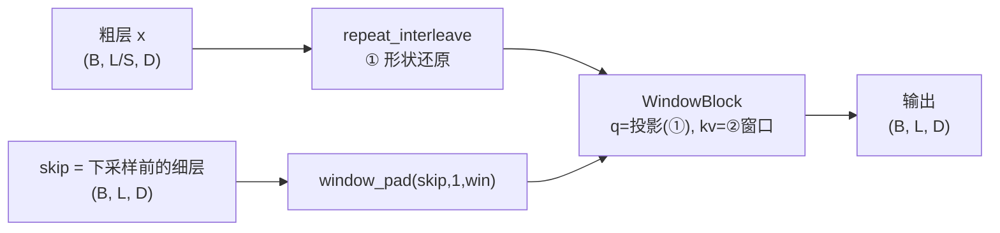
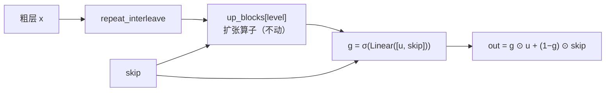

# U-Det v0.4 技术报告：跳跃融合门控 + 层级一致性损失 + 分块编码器 + 多尺度样本头 + token 头旁路

> 版本：`v0.4.0`（门控）/ `v0.4.1`（+ 损失）/ `v0.4.2`（+ 分块编码器）
> / `v0.4.3`（单任务消融，**负结果**）/ `v0.4.4`（+ 多尺度样本头，**m4 已反超基线**）
> 基准：CodeT5 滑动窗口基线（同数据、同指标、同预算，见 §8.6）
> 主线结论见 §9；阈值扫描与长度分桶诊断见 §8.10。
> ⚠️ 评测必须用**训练时那份 config**（§8.10 末尾有踩坑记录，现已加防呆中止）。

---

## 0. 速览

**结论：四项改造（门控 → 损失 → 分块编码器 → 多尺度样本头）都是真实收益，其中分块编码器是数量级最大的一项。
v0.4.2 把与「微调 CodeT5」的差距从 3.3~11.1 分压到了 0.4~0.8 分，v0.4.4 再进一步在 m4 上反超。
v0.4.5（token 头旁路）已在 4ep 上验证：**首次让 line/chunk/token 三项全部反超基线**，代价是 m4 −0.43。
v0.4.6~v0.4.8 三次改动之后出现了一个**跨版本一致的现象**：
★ **“给文档级加表达力”三次全部拉低 token 三项** ⇒ 两个目标在共享主轴上**结构性竞争**（§8.15.1）。**

同协议、同 epoch 预算的 test 对照（m4 sample F1 / line F1 / chunk F1 / token F1）：

| 预算 | v0.3.1（无门控） | v0.4.0（+ 门控） | v0.4.1（+ 损失） | v0.4.2（+ 分块编码器） | **v0.4.4（+ 多尺度样本头）** | **v0.4.5（+ token 旁路）** | CodeT5 滑窗基线 |
| --- | --- | --- | --- | --- | --- | --- | --- |
| 2 | 0.8999 / 0.6754 / 0.3449 / 0.7122 | 0.9223 / 0.6718 / 0.3643 / 0.7117 | — | 0.9633 / 0.7772 / 0.4813 / 0.8070 | 0.9745 / 0.7808 / 0.4885 / 0.8130 | 0.9689 / **0.7880** / 0.4893 / **0.8186** | — |
| **4** | 0.9307 / 0.6922 / 0.3733 / 0.7279 | 0.9324 / 0.7006 / 0.3901 / 0.7372 | 0.9408 / 0.7139 / 0.3970 / 0.7489 | **0.9700 / 0.7895 / 0.5035 / 0.8190** | **0.9775 / 0.7878 / 0.5076 / 0.8187** | 0.9693 / **0.7980** / **0.5114** / **0.8281** | **0.9736 / 0.7978 / 0.5081 / 0.8270** |
| 6 | 同上（已到顶） | 0.9380 / 0.7071 / 0.3907 / 0.7431 | 未跑 | 未跑（**仍在涨**） | 未跑 | 未跑 | 未跑 |

* **门控**（v0.4.0 − v0.3.1，同预算）：4ep `+0.17 / +0.84 / +1.68 / +0.93`，
  6ep `+0.73 / +1.49 / +1.74 / +1.52` ⇒ 收益集中在最吃**位置 / 边界**的指标上；
* **损失改造**（v0.4.1 − v0.4.0，同 4ep）：`+0.84 / +1.33 / +0.69 / +1.17` ⇒ 四项全面正收益；
* ★ **分块编码器**（v0.4.2 − v0.4.1，同 4ep）：`+2.92 / +7.56 / +10.65 / +7.01`
  ⇒ **比前两项大一个数量级**。它修的是一个从 v0.2 就被误当成"固有代价"的实现缺陷：
  `seq_len=1` 让 attention 退化、q / k 成为死参数（见 §8.7.8 / §9.1.2）；
* ★ 与滑窗基线的差距只剩 **0.36 / 0.83 / 0.46 / 0.80 分**，而且 v0.4.2
  **参数更少**（92.85M vs 109.61M）且**长度无上限**（基线每 token 只见 512 局部窗口）；
* ★★ **v0.4.4（多尺度样本头）：m4 已经反超基线**（0.9775 vs 0.9736，同 4ep）、
  **chunk 基本打平**（−0.06）、line/token 还差 1 分以内；而且参数少 16M；
  ★ 差距**纯粹是召回**（line 精确率反而高 4.34），§8.10.1 显示**六成差距来自固定阈值 0.5**
  这个工作点（改阈值能白捡 0.3~0.6 分）；
* ★★ **v0.4.5（token 头旁路）：line / chunk / token 三项全部反超基线**
  （0.7980 vs 0.7978、0.5114 vs 0.5081、0.8281 vs 0.8270，同 4ep），
  且 **`[2048,8192)` 长文档桶（241 样本）首次反超**（line +0.57 / token +0.72）
  ⇒ 「全长上下文优势」第一次有了统计上站得住的证据；代价是 **m4 掉到 0.9693（−0.43）**。
  ⚠️ 这是**真实的权衡**而非瞬态：2→4ep 收益与损失**同步放大**（line +0.72→+1.02、m4 −0.56→−0.82）；
  §8.11.6 给出机制假设（bypass 让 token 头不再依赖主干 ⇒ 削弱了 §8.8 的「信息保值」正则化）；
* ⚠️ **短文档仍是最大弱项**：`[0,512)` 行级仍落后基线 **3.06**、`[512,2048)` 落后 **1.42**
  （bypass 让短桶大幅改善、但仍未追平）；
* ★ 但 §8.10.2 的长度分桶给出了一个**不利的诚实结论**：U-Det 的弱项集中在
  **短文档**（`[0,512)` 桶基线领先最多），而「全长上下文」的优势
  **在当前 benchmark 上无法证明**（`>8192` 桶只有 5 个样本；有 241 个样本的
  `[2048,8192)` 长桶里基线仍领先）；
* ★ **v0.4.3（单任务消融）证伪了「跳连 + token 级任务拖累样本级」**：去掉它们后
  m4 掉 **1.76 分**（0.9457 vs 0.9633，同 2ep）⇒ token 级任务其实是**助力**，见 §8.8；
* ⚠️ **2 epoch 的读数在本项目已四次指向错误结论**（§7.3 / §7.4.2 / §8.11.4），只看 4/6 epoch 的周期末端；
* ★★ **v0.4.6~v0.4.8 的公共结论**：三次“给文档级加表达力”的改动**符号一致**地拉低了 token 三项，
  唯一“给 token 级加通路”的改动拉低文档级，而唯一改 **loss 监督强度**的改动只涨段级
  ⇒ **“加表达力”是本项目已知有害的旋钮**，两个目标在共享主轴上竞争（§8.15.1 / lessons A11）；
* ★ **编码器层数分配已被零训练探针否掉一半**（§8.16）：文档级信息在**第 5 层就饱和**、
  **在瓶颈带宽下同样饱和** ⇒ 瓶颈缺的是**位置数**而不是层数，“搬到瓶颈”没有依据；
  token 侧**删 2~3 层近乎免费**（删 2 层甚至略好）、删 4 层才开始有 0.5~1 分代价；
* ⚠️ v0.4.7 / v0.4.8 只跑了 2 轮，**不得与 4 轮的版本比幅度**（只能看方向）；
* ⚠️ v0.4.2 到 4 epoch **仍在创新高**（周期末端 mean 0.8295 → 0.8621 → 0.8692），远未收敛；
  但滑窗基线的晚期增速**略快**（+0.89 vs +0.71），所以"再加预算就能反超"**不是自动成立的**（§8.7.9）。

| | v0.3.1 | v0.4.0 | v0.4.1 | v0.4.2 | v0.4.4 | v0.4.5 |
| --- | --- | --- | --- | --- | --- | --- |
| 跳跃融合 | 跳注意力（kv = skip） | **+ 逐通道门控** | 同 | 同 | 同 | 同 |
| 粗尺度目标 | mean | mean | **lse（粗三级）** | 同 | 同 | 同 |
| 层级一致性 | 无 | 无 | **+ A（池化自蒸馏）** | 同 | 同 | 同 |
| 下采样位置约束 | 无 | 无 | **+ B2（位置探针）** | 同 | 同 | 同 |
| **编码器** | 逐 token（`seq_len=1`） | 同 | 同 | ★ **分块（K=128，attention 复活）** | 同 | 同 |
| 样本头尺度数 | 1 | 1 | 1 | 1 | ★ **5（各自池化后拼接）** | 同 |
| token 头旁路 | 无 | 无 | 无 | 无 | 无 | ★ **最细尺度拼接编码器全长输出** |
| 可训练参数 | 87.31M | 92.03M | 92.85M | 92.85M | 93.65M | 93.65M |

⚠️ 三次改造的收益**都集中在最吃"位置 / 边界 / 上下文"的指标上**（chunk ≫ line / token ≫ m4），
与 §2.1 的理论预期一致。而 2 epoch 时看到的 m4 +2.24 主要是"热身更快"的**瞬态**效应（见 §7.3）。

---

## 1. 从 v0.3 出发：两个问题

v0.3 的三组零训练诊断（见 `docx/u-det-v0.3.md` §7）把主干**逼到了墙角**：

| 诊断 | 数字 | 含义 |
| --- | --- | --- |
| 各尺度线性探针极差 | 最细 0.8970 − 瓶颈 0.8830 = **+1.4**（v0.2 时代 +16.3） | 64× 压缩**几乎无损**，"下采样丢信息"已解决 |
| 逐层 LUT 探针 | 差 < 1.5 分，最后一层反而最好 | "取错层"假设**被否掉** |
| 冻结特征 + 平均池化 + 闭式线性 | test F1 **0.9069**（769 参数） | 样本级信息基本是**词袋级**的底线 |
| 同结构 SGD 头 | test F1 0.8309 | 闭式与 SGD 差 **7.6 分**，全是**优化差距** |

于是"主干下采样丢信息"这条线已经走到头，v0.4 转向两个新方向：

1. **跳跃连接怎么融合**（结构）—— v0.3 用**跨注意力**同时干了两件性质完全不同的事；
2. **粗尺度的监督信号怎么设计**（损失）—— 现在只要求粗位置交出"窗口内 AI 比例"这一个数。

---

## 2. v0.4.0 结构改造：跳跃融合门控

### 2.1 v0.3 的 `_up` 把三件事揉在一个操作里



一次 `WindowBlock` 同时承担：

| | 做的事情 | 位置是否对齐 | 该用什么算子 |
| --- | --- | --- | --- |
| ① | 形状还原 `L/S → L` | **不对齐**（一个粗位置要展开成 S 个） | 跨注意力 ✅ 正确 |
| ② | **跳跃注入**（细层信息进来） | **严格对齐**（`z_k[i]` 与 `h_k[i]` 说的是同一个源码区间） | 逐元素门控／concat |
| ③ | 邻域混合（窗口内自注意力） | 对齐之后 | 窗口自注意力（残差） |

②用跨注意力做，代价是三重的：

* **计算**：融合本该是 `O(L·D)`，跨注意力把它变成 `O(L·win·D)`；
* **参数**：位置对齐是一个**免费的先验**，跨注意力却要花参数去学"α→δ"的恒等映射；
* **梯度**（最关键）：skip 的回传梯度被 softmax 的 Jacobian `diag(α) − ααᵀ` 调制，
  这个矩阵是**秩亏**的，在 α 接近均匀时趋近于零 —— 于是"训练早期先让 skip 兜底、
  再慢慢让深路径接手"这个 U-Net 最宝贵的动态被掐掉了。

### 2.2 v0.4.0 的做法：末尾加一道逐通道门控



```python
# models/hier2.py · TransformerCodec._up
out = block(seq, dst, idx)                                   # 扩张算子（跨注意力）
if self.gate is not None:
    g = torch.sigmoid(self.gate[level](torch.cat([out, skip], dim=-1)))
    out = g * out + (1.0 - g) * skip
return out
```

设计要点：

* **每级独立**（4 套门控，与 `share: false` 的 8 套采样块一致）；`gate[level]` 是
  `Linear(2D → D)`，输出逐通道的 `g`，所以是"每个通道各自决定信谁"；
* **零初始化权重 + 偏置 −1.0** ⇒ 起点 `g ≡ σ(−1) ≈ 0.269`，即
  `out = 0.269·跨注意力 + 0.731·skip`，**起手偏向 skip**，让深路径慢慢把这个比例争回来；
* **不加 refine 块、不改扩张算子**：这一版刻意只动"融合"这一个变量，
  这样 v0.3.1/v0.3.2 → v0.4.0 的差值可以干净地归因到门控上。

### 2.3 明确**没有**做的三件事（以及为什么）

| 想法 | 状态 | 原因 |
| --- | --- | --- |
| 融合后加 `refine` 窗口自注意力块 | **放弃** | 最细一级 `L=24576`、窗口 16 时会再多一份 `(B, L, win, D)` gather（≈1.2 GB），而 12GB 卡上整模型峰值已经 11.4 GB；先只动融合，把变量控制住 |
| 扩张算子改用"kv = 粗层自己"的纯自注意力 | 保留原样 | 现在的 kv = skip，扩张结果天然带细粒度上下文；改成 kv = 粗层会让扩张算子退化成"平滑"，需要单独一组实验 |
| `share` 改回 true | 不动 | v0.3.1/v0.3.2 已经证明 8 套权重更好 |

---

## 3. v0.4.1 损失改造

### 3.1 A · 层级一致性（池化可交换 / 自蒸馏）

要求**更粗一级**的预测等于**更细一级**预测的窗口池化值：

$$\mathcal{L}_{A}=\sum_{k=0}^{3}\frac{1}{|\mathcal{V}_k|}\sum_{j\in\mathcal{V}_k}
\mathrm{BCE}\Big(\mathrm{logit}_k[j],\ \mathrm{pool}\big(\sigma(\mathrm{logit}_{k+1})\big)[j]\Big)$$

其中 `pool` 是长度对齐的平均池化，目标侧 `detach()`（自蒸馏），有效位由 token 级
`−100` 掩码池化后得到。

**为什么它是真的新约束**：现有 token 级损失在粗尺度的目标是把**标签**池化成比例。
一个 64 长的窗口里只有 1 个 AI token 时目标只有 `0.016`，而且窗口里那 1 个 token
是"真 AI"还是标注抖动根本分不出来 —— 目标糊、带噪。这里的目标换成
**模型自己更细一级的预测**池化而来：更细一级看得到全分辨率特征，它的池化是一个
**更锐、方差更小**的估计。信号从"细／skip 侧"流向"粗／下采样侧"。

### 3.2 ★ B 的原形为什么不成立（必须记下来的一条）

原本的设想是："把粗尺度预测广播回最细分辨率，直接对 token **硬标签**算 BCE，
逼下采样保住 token 级判别力"。**这个形式和现有损失逐字相同**：

设某窗口内有 $m$ 个正例、$n$ 个负例（$S=m+n$），窗口只对应**一个** logit $z$（$p=\sigma(z)$）：

$$
\mathcal{L}_{\text{广播}}=\frac{1}{S}\sum_{t}\mathrm{BCE}\big(\sigma(z),y_t\big)
=\frac{1}{S}\Big[m\cdot(-\log p)+n\cdot(-\log(1-p))\Big]
$$

而"把标签平均池化成软目标"是：

$$
\mathcal{L}_{\text{均值}}=\mathrm{BCE}\Big(\sigma(z),\tfrac{m}{S}\Big)
=-\frac{m}{S}\log p-\frac{n}{S}\log(1-p)
$$

**两式逐字相等**，而且与特征无关（无论特征来自哪一级）。加上 `valid` 掩码后两者
依然同时归一化到有效 token 数，仍然相等。所以"广播硬标签"不产生任何新约束，
只是现有损失的一个等价改写。

要让 B 真的成为新约束，只有两条路：

1. **换聚合方式**（目标本身变了）⇒ §3.4 的 B3；
2. **让一个位置能吐多个 logit**（函数类变了）⇒ §3.3 的 B2。

### 3.3 B2 · 跳跃连接引导下采样（下采样路径的窗口内逐 token 位置探针）

主干的下采样把 `span` 个 token 压成一个向量。现有损失只要求这个向量能回答
**一个问题**（"窗口内 AI 比例是多少"）——信息论上这**不要求**它保留窗口内的位置结构：
64 长窗口里有 1 个还是 32 个 AI token，目标分别是 0.016 / 0.5，而**那段 AI 落在哪、
边界在哪，完全没被约束**。位置与边界恰恰是行级、片段级评测真正吃的信号
（line 0.6528 / chunk 0.3357，是四项里最弱的）。

B2 把要求从"1 个问题"改成"**span 个问题**"：

$$\mathrm{logit}[b,j,t]=\big\langle \mathrm{proj}(d_k[b,j]),\ W[t]\big\rangle\Big/\sqrt{h},
\qquad y[b,j,t]=\text{token}\,[j\cdot S_k+t]$$

其中 $d_k$ 是**下采样路径**第 $k$ 级的输出，$S_k$ 是该级"一个位置代表多少个原始 token"
（本配置下 = 4 / 16 / 32 / 64），$W\in\mathbb{R}^{S_k\times h}$ 是一张**可学的位置码表**
（等价于给每个偏移一个专属读出方向）。于是下采样必须**自己**解出窗口内每个位置是不是 AI。

三个关键设计点：

* **挂在下采样路径上，不是上采样/skip 那一侧。** 这是"引导下采样"的字面含义，
  也保证 skip **无法替它兜底** —— 如果挂在 `levels[k]`（skip 融合后的特征）上，
  模型可以让 skip 去背这个任务，下采样照样可以糊。
* **先投影再点积，不做 gather。** 朴素做法要 gather 出 `(B, L_k, span, D)`，
  `L=24576, span=64` 时是 GB 级中间张量；这里算力只有 `L_k·span·h`，
  全部 logit 加起来 2.4 万个。位置码是 `(span, h)` 的小参数矩阵。
* **每级独立**（4 个探针，共 0.82M 参数）。

长度对齐是**精确**的：`ceil(ceil(L/a)/b) = ceil(L/(a·b))`，所以第 $k$ 级输出下标 $j$
恰好对应原始区间 $[j S_k,\ (j+1)S_k)$，目标直接 `reshape(-1, span)` 即可，无需索引。

### 3.4 B3 · 粗尺度聚合目标由 mean 改成软 max

把各粗尺度的目标从"窗口内 AI **比例**"（mean）换成"窗口内**是否有** AI"
（`max`，或 $\beta$ 可控的软 max / `lse`）：

$$y_k[j]=\frac{1}{\beta}\log\Big(\frac{1}{|\mathcal{V}_j|}\sum_{t\in\mathcal{V}_j}e^{\beta\,y_{jS+t}}\Big),
\qquad \beta\to\infty\ \Rightarrow\ \max$$

理由：行级/片段级评测是阈值 0.5 的**检测**——一段里只要有几个 AI token 就算正。
$\beta=4$ 时"64 个 token 里 1 个 AI"的目标从 `0.016` 抬到 `0.152`（10×），
而"全 0 窗口"仍是 `0`（`log(1)/β = 0`），所以它只抬正例、不抬负例。
**只在粗的三级上用**（最细两级窗口只有 4 个 token，`lse` 会过度锐化）。

风险：会整体推高正例倾向 ⇒ `line_p` 可能升、`line_r` 可能降；用 `β` 和
`--token-target mean` 一键回退。

### 3.5 总损失与开关

```
L = 1.0·样本级CE  +  1.0·多尺度tokenBCE(target: lse, lse, lse, mean, mean)
  +  0.3·A(cons_pool)  +  0.2·B2(cons_pos)
```

| 配置项 | 默认 | 说明 |
| --- | --- | --- |
| `loss.cons_pool` | 0.3（v0.4.1） | A 的权重；`--no-cons` 一键关掉 A + B2 |
| `loss.cons_pool_detach` | true | 自蒸馏（目标不回传） |
| `loss.cons_pos` | 0.2（v0.4.1） | B2 的权重 |
| `loss.token_target` | `[lse,lse,lse,mean,mean]` | 逐尺度聚合方式；`--token-target mean` 一键回退 |
| `loss.token_target_beta` | 4.0 | lse 锐化系数 |
| `model.gate` / `gate_init` | true / −1.0 | `--no-gate` 回到 v0.3 的纯跨注意力跳连 |

---

## 4. 参数量与显存（实测）

| 组件 | v0.3.2 | v0.4.0 | v0.4.1 |
| --- | --- | --- | --- |
| 下采样 4 块 + 上采样 4 块 | 56.61M | 56.61M | 56.61M |
| 瓶颈 4 层自注意力 | 28.31M | 28.31M | 28.31M |
| **跳跃融合门控 ×4** | — | **4.72M** | 4.72M |
| **下采样位置探针 ×4** | — | — | **0.82M** |
| 主干合计 | 85.04M | **89.76M** | 90.58M |
| + 样本头 / token 头 | 0.20M | 0.20M | 0.20M |
| + CodeT5 LoRA | 2.06M（冻结时不计） | 2.06M | 2.06M |
| **可训练参数** | 85.24M | **92.03M** | **92.85M** |

显存：见 §4.1。位置探针的开销可忽略（最大一级输出只有 `(1, 16, 64)`）。

### 4.1 显存：门控吃掉了最后 3% 的余量（实测）

单卡 12 GiB（`memory.total = 12288 MiB`）。本工作负载的真实峰值由**最长样本**决定
（m4 训练集长度：中位 293 / 90 分位 3676 / 99.9 分位 22230 / `max` 32948，
**超过 24000 的只有 3 条**）。用 60 s 间隔的 `nvidia-smi` 采样比对
（PyTorch 的 caching allocator 只增不减，因此偶发采样也足以拿到 reserved 峰值）：

| 组 | 主干 | 稳定峰值（reserved） |
| --- | --- | --- |
| v0.2 + LoRA | FrequencyUNet | 11854 MiB |
| v0.3.0 | codec（栈内共享权重） | **11428 MiB** ← 跑满 3 epoch，必含最长样本 |
| v0.3.1 | codec（8 套权重 + LoRA） | 11424 MiB |
| **v0.4.0** | codec（8 套权重 + **门控**） | **11900 MiB** |

* **门控的代价 = +472 MiB**，与它在 `L = 32948` 时的理论开销吻合：
  `torch.cat([u, skip])` 的反向输入（~101 MB）+ sigmoid 输出 + 两个乘法中间量
  + 反向的 `grad_cat` ≈ 450 MB。
* 余量只剩 **388 MiB**（11900 / 12288 = 96.8%），但**是安全的**：
  v0.3.0 的 11428 是 3 个完整 epoch 的峰值，必然已包含最长的 32948 样本；
  最坏情况按长度线性外推 `11428 + 472 × (32948 / 29000) ≈ 11964 MiB`，仍在 12288 以内。
* 实测轨迹也支持这个判断：v0.4.0 在第 ~2100 步就到了 11880 MiB，
  之后 4500 步只再涨 20 MiB ⇒ 已经收敛到峰值。

> **教训**：`L` 越长，"逐位置拼接"这类操作越贵，12 GiB 卡上的余量是**按 MB 算**的。
> 后续真要加 refine 块（§2.3）之前，必须先上 `expandable_segments` 或梯度检查点。
> 排查时还发现有两个上一天遗留的 `nvidia-smi` 采样循环仍在写 `v03*_mem.log`，
> 把 v0.4.0 的数字混进了 v0.3 的记录里 —— 清理后才有上面这张干净的表。

---

## 5. 验证清单

1. **形状/长度记账**：`L=1013` → `levels = [16, 32, 64, 254, 1013]`、
   `downs = [254, 64, 32, 16]`，与 `ceil(L/S)`（`S = 64, 32, 16, 4, 1`）逐一相等 ✓
2. **参数量**：主干 85.04M → 89.76M（+4.72M 门控）；可训练 92.03M（v0.4.0）/ 92.85M（v0.4.1）✓
3. **损失真的在算**：冒烟日志 `token=1.362 / cons_pool=1.398 / cons_pos=0.691` ✓
4. **回退等价性**：`gate=False` 时 backbone 与 v0.3.2 权重**零缺失、零多余**；
   `gate=True` 只多 8 项（4 级 × weight/bias）。`gate=None` 时 `_up` 直接返回，
   `cons_*=0` 时不建探针参数 ⇒ v0.3 配置/权重完全不受影响 ✓
5. **续跑权重完整性**：ckpt 含 96 条 LoRA + 176 条 backbone/头；日志里那句
   `未匹配 100 项` 是**正常的**（冻结底座权重从 `checkpoints/codet5-base` 确定性加载）✓
5. **A/B2 对 v0.3 权重无影响**：`gate=None` 时 `_up` 直接返回，`cons_* = 0` 时不建探针参数 ✓

---

## 6. 实验队列与状态

> 📌 **本节是 v0.4.0 / v0.4.1 时期的队列存档**（截至 ⑦）。v0.4.2 起的实验见 §8.7 之后：
> 队列脚本为 `scripts/queue_v042*.sh` / `queue_v043.sh` / `queue_v044*.sh` / `queue_v045*.sh`
> （支持 `--resume` 追加 epoch 并自动接力评测、`--dump-raw` 批量落盘）；
> 夜间看门狗为 `scripts/watchdog.sh`（**PID file + `kill -0`** 做单例保护，
> 只用 `flock` 或 `pgrep -f` 都会被自己的命令行匹配到，见 lessons D1）。

单卡 12GB 跑不下并发，队列**串行**执行。

| # | 实验 | 命令 | 预算 | 状态 |
| --- | --- | --- | --- | --- |
| ① | **v0.4.0** @2ep（只改结构） | `configs/udet_v04.yaml` | 2 epoch | ✅ |
| ② | **v0.3.2 续跑** @4ep（`codet5tok` 冻结） | `--resume runs/v0.3.2/best.pt --epochs 2 --encoder codet5tok --freeze-encoder` | +2 epoch | ✅ |
| ③ | **v0.3.1 续跑** @4ep（LoRA） | `--resume runs/v0.3.1/best.pt --epochs 2` | +2 epoch | ✅ |
| ④ | **v0.3.1 续跑** @6ep（判停用） | `--resume runs/v0.3.1/last.pt --epochs 2` | +2 epoch | ✅ 未创新高 ⇒ **e3 到顶** |
| ⑤ | **v0.4.0 续跑** @4ep（同协议对照） | `--resume runs/v0.4.0/best.pt --epochs 2` | +2 epoch | ✅ |
| ⑥ | **v0.4.0 续跑** @6ep（测上限） | `--resume runs/v0.4.0/last.pt --epochs 2` | +2 epoch | ✅ 仍在涨 ⇒ **6ep 不是上限** |
| ⑦ | **v0.4.1 全流程** @6ep（结构 + **损失**） | `configs/udet_v04_cons.yaml`，三段热重启 | 6 epoch | 🟡 运行中 |

（test 集，格式：m4 sample F1 / line F1 / chunk F1 / token F1）

| # | test | mean（周期末端） |
| --- | --- | --- |
| ① | 0.9223 / 0.6718 / 0.3643 / 0.7117 | 0.7865 |
| ② | 0.9086 / 0.6696 / 0.3487 / 0.7076 | — |
| ③ | 0.9307 / 0.6922 / 0.3733 / 0.7279 | 0.8021 |
| ④ | 同上（e3 最佳） | 0.7989（到顶） |
| ⑤ | 0.9324 / 0.7006 / 0.3901 / 0.7372 | 0.8037 |
| ⑥ | **0.9380 / 0.7071 / 0.3907 / 0.7431** | **0.8138**（未到顶） |
| ⑦ | 待填 | 待填 |

队列脚本：①→②→③→④ 由 `scripts/queue_extend.sh`；④→⑤ 由 `scripts/queue_round2.sh`；
⑥ 由 `scripts/queue_round3.sh`；⑦ 由 `scripts/queue_v041.sh`。

队列脚本 `scripts/queue_extend.sh`（PID 见 `pgrep -af queue_extend.sh`）：
轮询 ① 的日志，出现 `结果已写入` **或**失败标志（`out of memory` / `CUDA error` /
`RuntimeError` / `Killed`）后自动接力 ② → ③，每组跑完自动 `--eval`。
②③ 的日志分别落在 `/tmp/v032x.log`、`/tmp/v031x.log`。

②③ 的配置文件都是 `configs/udet_v03.yaml`（`share: false`、无门控、无辅助损失），
所以能与 v0.3.1/v0.3.2 的既有 epoch 无缝接续。**续跑用的编码器必须复现原配置**：
③ 是 `codet5lora`（yaml 默认），② 是 `--encoder codet5tok --freeze-encoder`。

### 6.1 续跑（补 epoch）的实现与代价

`train.py` 新增 `--resume <ckpt>`：

* **只载模型权重**，优化器状态与 LR 计划**重新起**（原 `best.pt` 里本来也没存 optimizer）；
* `--epochs N` 的含义变成"**本次追加 N 个 epoch**"，日志会打印实际区间
  （如 `epochs=1（epoch 2…2）`）；
* `metrics.csv` 改为**追加**（不再截断）；`best` 的初值取 checkpoint 里的 `score`，
  避免用更差的 epoch 覆盖掉已存的好权重；
* 每轮额外存 `last.pt`；`best.pt` 用文件复制而非重新序列化 475MB，方便反复续跑。

验证：CPU 冒烟日志 `[resume] 载入 runs/v0.3.2/best.pt（已训到 epoch 1，monitor=0.7675）`、
可训练参数 `85.24M`（与 v0.3.2 原值逐位一致）、`metrics.csv` 接在 epoch 2 之后 ✓

> ⚠️ **可比性说明**：这是一次"热重启续训"，LR 轨迹与"一开始就跑 4 epoch"**不同**
> （OneCycleLR 会在新的 2 epoch 内重新爬坡到 `3e-4`）。
> 所以 **②③ 的 4-epoch 结果不能直接与 ① 的 2-epoch 结果比较**；
> ① 若要对齐到 4 epoch 需单独重跑，已列入 §8。

---

## 7. 结果

> ⚠️ **本节结论经过一次自我推翻。** 本项目此前几乎所有对比都建立在 **2 epoch** 预算上，
> 而 2 epoch 远未收敛（§6.2 / §7.2 都显示 loss 还在降）。把基线补到 4 epoch 后，
> 有两条结论被推翻（§7.3）。**请不要只读 §7.1 就下判断。**

### 7.1 同预算（2 epoch）下的门控对照

| 模型 | 门控 | m4 sample F1 | line F1 | chunk F1 | token F1 |
| --- | --- | --- | --- | --- | --- |
| v0.3.0（栈内共享权重，3 epoch） | ✗ | 0.8863 | 0.6462 | 0.3056 | 0.6864 |
| 冻结特征 + 平均池化 + **闭式线性**（769 参） | — | 0.9069 | — | — | — |
| v0.3.1（8 套权重 + LoRA 微调） | ✗ | 0.8999 | **0.6754** | 0.3449 | **0.7122** |
| v0.3.2（8 套权重 + 编码器冻结） | ✗ | 0.9047 | 0.6528 | 0.3357 | 0.6903 |
| **v0.4.0（8 套权重 + 门控，LoRA）** | **✓** | **0.9223** | 0.6718 | **0.3643** | 0.7117 |

**在 2 epoch 的同等预算下，门控是一次正收益：**

* **样本级 0.9223 突破了闭式线性底线 0.9069（+1.54）**，把 v0.3 §7.3 那句
  "当前主干不但没在样本级上产生正收益，反而把输入特征弄差了 1–2 分"**推翻**。
  但要注意：**v0.3.1 @4ep 也越过了这条线（0.9307）**，所以不能把这份功劳单独算给门控 ——
  它同样可能只是"多训了两轮"的结果（见 §7.3）。
* **chunk 0.3643 为 v0.3 系最好**（+1.94 于 v0.3.1），历史上仅次于 v0.2 频域 U-Net 的 0.3698。
* line 0.6718（−0.36）/ token 0.7117（−0.05）与 v0.3.1 基本打平 ⇒ **token 级不亏**。

### 7.1.1 逐 epoch：门控需要一轮"热身"

| epoch | val m4 F1 | val line F1 | val chunk F1 | val token F1 |
| --- | --- | --- | --- | --- |
| 0 | 0.8841 | 0.4925 | 0.2446 | 0.5277 |
| 1 | **0.9217** | **0.6512** | **0.3550** | **0.6818** |

epoch 0 的 hybrid 是 `line_p 0.7511 / line_r 0.3664`（precision 高、recall 低，预测偏保守），
epoch 1 收敛到 `p 0.6979 / r 0.6105`。原因很清楚：

* `gate_init = -1.0` ⇒ `g ≈ 0.269`，上采样输出有 **73% 是未经上下文处理的原始 skip**；
  token 头挂在 `levels` 上，因此第一轮被"生特征"主导，需要额外一轮把它调回来；
* **样本头读的是瓶颈 `levels[0]`，不在门控作用范围内**，所以样本级从第一轮就领先
  （0.8841 vs v0.3.2 的 0.8463）。

> 对 v0.4.1 / 后续的含义：`gate_init` 值得扫（§8.3）。起点更中性（−0.5 或 0）
> 可能让 token 级第一轮就不吃亏，同时保住样本级的收益。
> 另外注意 epoch 1 的 train loss 已经与 v0.3.1 的 epoch 1 几乎重合
> （`sample 0.286 / token 0.518` vs `0.277 / 0.522`），说明**门控没有拖慢收敛**，
> 只是把"先跳过深路径"这个先验显式化了。

### 7.2 v0.3.1 / v0.3.2 补 epoch（热重启续训）

逐 epoch（val，m4 / line / chunk / token）：

| 组 | e0 | e1 | **e2（续）** | **e3（续）** | **e4（续）** | **e5（续）** |
| --- | --- | --- | --- | --- | --- | --- |
| v0.3.2 | 0.8463 / 0.5364 / 0.2600 / 0.5768 | 0.8979 / 0.6371 / 0.3402 / 0.6686 | **0.8438 / 0.5968 / 0.2968 / 0.6286** | **0.8971 / 0.6512 / 0.3432 / 0.6843** | —（已平台） | — |
| v0.3.1 | 0.8263 / 0.6510 / 0.3357 / 0.6903 | 0.9008 / 0.6509 / 0.3394 / 0.6838 | **0.7931 / 0.6424 / 0.3108 / 0.6776** | **0.9338 / 0.6703 / 0.3524 / 0.7029** | 0.9220 / 0.6567 / 0.3156 / 0.6946 | **0.9274 / 0.6704 / 0.3517 / 0.7042** |

test（取 best.pt）：

| 组 | 2 epoch | 4 epoch | 6 epoch |
| --- | --- | --- | --- |
| v0.3.2 | 0.9047 / 0.6528 / 0.3357 / 0.6903 | **0.9086 / 0.6696 / 0.3487 / 0.7076** | — |
| v0.3.1 | 0.8999 / 0.6754 / 0.3449 / 0.7122 | **0.9307 / 0.6922 / 0.3733 / 0.7279** | 同上（**e3 已是最佳，e5 未创新高**） |

**两个结论：**

1. **热重启会先砸一个坑。** 两组的 e2（续跑第一轮）四项全跌 ——
   v0.3.2 的 m4 −5.4 / line −4.0 / chunk −4.3 / token −4.0，
   v0.3.1 的 m4 **−10.8** / line −0.9 / chunk −3.0 / token −0.6，
   train loss 也从 0.799 反弹到 0.849。
   原因是 OneCycleLR 在新计划里重新爬坡到 `3e-4`，把已经收敛的状态踹了出去；
   e3 才收回来并小幅超过 e1。**所以 §6.1 那条可比性警告不是多余的。**
2. **收益递减明显。** e1→e3 的净收益（test：m4 +0.39 / line +1.68 / chunk +1.30 / token +1.73）
   远小于 e0→e1（m4 +5.2 / line +10.1）。训练已接近平台期
   （e3 train loss 0.801 对比 e1 的 0.834）。

### 7.2.1 把 v0.3.1 补到 4 epoch：**结论反转**

test 集：

| 指标 | v0.3.1 @ 2 epoch | **v0.3.1 @ 4 epoch** | 差 |
| --- | --- | --- | --- |
| m4 sample F1 | 0.8999 | **0.9307** | **+3.08** |
| line F1 | 0.6754 | **0.6922** | **+1.68** |
| chunk F1 | 0.3449 | **0.3733** | **+2.84** |
| token F1 | 0.7122 | **0.7279** | **+1.57** |

四项**全部创历史最好**。而且它们**全部高于 v0.4.0 @ 2 epoch**。

### 7.3 ★ 方法论更正：两条被推翻的结论

| 原结论（基于 2 epoch） | 4 epoch 后的事实 | 判定 |
| --- | --- | --- |
| "LoRA 微调对样本级有害"（v0.3 §9.1：0.8999 vs 冻结 0.9047） | LoRA **0.9307** vs 冻结 0.9086 | ❌ **推翻**：2 epoch 时 LoRA 还没收敛，负作用是欠训练的假象 |
| "门控是干净的正收益"（§7.1） | v0.3.1 @4ep 在四项上全面超过 v0.4.0 @2ep | ⚠️ **未定**：差 2 个 epoch，无法归因 |

**证据**（v0.3.1 全部 6 个 epoch；`mean = (val m4 F1 + val line F1) / 2` 是选 best.pt 用的综合分）：

| epoch | e0 | e1 | e2（续） | **e3（续）** | e4（续） | e5（续） |
| --- | --- | --- | --- | --- | --- | --- |
| train loss | 1.094 | 0.799 | 0.849 | 0.717 | 0.774 | **0.676** |
| val m4 F1 | 0.8263 | 0.9008 | 0.7931 | **0.9338** | 0.9220 | 0.9274 |
| val line F1 | 0.6510 | 0.6509 | 0.6424 | 0.6703 | 0.6567 | **0.6704** |
| val chunk F1 | 0.3357 | 0.3394 | 0.3108 | 0.3524 | 0.3156 | 0.3517 |
| val token F1 | 0.6903 | 0.6838 | 0.6776 | 0.7029 | 0.6946 | **0.7042** |
| **周期末端 mean** | — | 0.7759 | — | **0.8021** | — | 0.7989 |

对照：**冻结编码器的 v0.3.2 早在 e1 就平台**（train loss 0.834 → 0.801，val m4 0.8979 → 0.8971），
**LoRA 的 v0.3.1 多吃了一个周期的红利**，到 e3 才到顶。

### 7.3.1 到顶判据：train 还在降、val 不再涨

第 3 个周期（e4/e5）**没有创新高**：e5 的 `mean 0.7989 < e3 的 0.8021`。
而且 **e5 的 train loss 0.676 是全部 6 个 epoch 里最低的**，val 却停住了 ——
即 **train / val 开始分叉，轻微过拟合已出现**。

> 单看 val m4 的 0.9338 → 0.9274（−0.64）在 1991 条 val 上接近噪声量级
> （F1 的标准误约 0.8 分），line 的 0.6703 → 0.6704 则完全不动。
> 所以严谨的表述是：**e3 与 e5 在噪声内等价，模型已进入平台**，
> 加 epoch 只降 train loss、不涨 val。

**结论**：**v0.3.1 的保存点定在 e3（4 epoch）**，
`runs/v0.3.1/best.pt` = e3 ⇒ test `m4 0.9307 / line 0.6922 / chunk 0.3733 / token 0.7279`。

这组也顺便验证了判停规则有效：**看周期末端是否创新高，而不是看损失**。

**根因**：本项目几乎所有结论都建立在 2 epoch 上。教训：以后任何
"架构 A 比架构 B 好"的结论，**必须在对齐 epoch 预算后才有资格成立**；
2 epoch 的数字只能用来**排优先级**，不能用来**下结论**。

> 另一条附带发现：**热重启会先砸一个坑。** v0.3.1 的 e2 与 v0.3.2 的 e2 都四项全跌
> （m4 −10.8 / −5.4），train loss 反弹（0.799 → 0.849、0.834 → 0.940），
> 到 e3 才收回并创新高。原因是 OneCycleLR 在新计划里重新爬坡到 `3e-4`。
> 反过来看，这个"降不下去又弹回来"的模式正是 SGDR 的行为：**每个 LR 周期末端都创新高**
> （`mean=(m4+line)/2`：0.739 → 0.776 → 0.718 → **0.802**）

### 7.4 门控的结论：**真实收益，且随训练预算增长**

同协议（热重启续跑）、同 epoch 预算的 test 对照：

| 预算 | v0.3.1（无门控）m4 / line / chunk / token | **v0.4.0（门控）** | 差 |
| --- | --- | --- | --- |
| 2 epoch | 0.8999 / 0.6754 / 0.3449 / 0.7122 | 0.9223 / 0.6718 / 0.3643 / 0.7117 | +2.24 / −0.36 / +1.94 / −0.05 |
| 4 epoch | 0.9307 / 0.6922 / 0.3733 / 0.7279 | 0.9324 / 0.7006 / 0.3901 / 0.7372 | +0.17 / +0.84 / +1.68 / +0.93 |
| **6 epoch** | 0.9307 / 0.6922 / 0.3733 / 0.7279 ⬅ 基线到顶 | **0.9380 / 0.7071 / 0.3907 / 0.7431** | **+0.73 / +1.49 / +1.74 / +1.52** |

**判定：门控有效，且幅度随预算增长。**

1. **优势不是恒定的，而是跟着预算扩张。** 因为基线在 e3 就到顶了，门控版到 e5 还在涨
   ⇒ 6 epoch 时四项优势变成 **+0.73 ~ +1.74**，明显大于 4 epoch 时的 +0.17 ~ +1.68。
2. **收益仍然集中在最吃"位置 / 边界"的指标上**：line +1.49 / chunk +1.74 / token +1.52
   ≫ m4 +0.73，与 §2.1 的理论预期（门控负责位置对齐的融合）一致。
3. **2 与 4 epoch 的读数都不该单独引用**：2 epoch 说"m4 +2.24、line/token 略亏"（方向错），
   4 epoch 说"m4 只 +0.17"（低估）。**只有把两组都推到同一预算、且基线到顶之后**，
   6-epoch 这组读数才是可引用的。

### 7.4.1 ★ 判停：门控版到 6 epoch **仍在涨**，基线早已到顶

周期末端 `mean` 序列（每 2 epoch = 一个 LR 周期）：

| | e1 | e3 | e5 | 判定 |
| --- | --- | --- | --- | --- |
| v0.3.1（无门控） | 0.7759 | 0.8021 | **0.7989** | ⬅ 不再创新高 ⇒ **到顶** |
| v0.4.0（门控） | 0.7865 | 0.8037 | **0.8138** | ⬅ 仍在创新高 ⇒ **还有余量** |

v0.4.0 e5 的 train loss **0.642**（全程最低），val 也最高，**没有过拟合迹象**
（对比 v0.3.1 到顶时 e5 的 0.676 已开始 train/val 分叉）。

逐 epoch 全表（val）：

| epoch | train loss | m4 F1 | line F1 | chunk F1 | token F1 | mean |
| --- | --- | --- | --- | --- | --- | --- |
| e0 | 1.045 | 0.8841 | 0.4925 | 0.2446 | 0.5277 | 0.6883 |
| e1 | 0.739 | 0.9217 | 0.6512 | 0.3550 | 0.6818 | 0.7865 |
| e2 | 0.816 | 0.9044 | 0.6005 | 0.3281 | 0.6368 | 0.7525 |
| e3 | 0.672 | 0.9347 | 0.6727 | 0.3698 | 0.7047 | 0.8037 |
| e4 | 0.750 | 0.9343 | 0.6402 | 0.3465 | 0.6692 | 0.7873 |
| **e5** | **0.642** | **0.9397** | **0.6880** | **0.3823** | **0.7165** | **0.8138** |

另一个细节：e4 的**样本级几乎没掉**（m4 0.9343 vs e3 的 0.9347），跌落全在 token 侧；
而基线的 e4 是样本级在掉（0.9338 → 0.9220）。⇒ **门控版对 LR 重启的扰动更不敏感**，
说明"生特征 skip"与"上下文"被分离开之后，样本级不再依赖那个脆弱的配比。

> **仍未回答**：门控版到 8 epoch 会不会继续涨？e5 的末端还在创新高，
> 所以严格说 6 epoch 也**不是**它的上限。见 §9.3。

### 7.4.2 ★ v0.4.1（损失改造）的同预算对照：**全面胜出，而且少用 2 个 epoch**

v0.4.1 = v0.4.0 的结构（门控）+ **A cons_pool + B2 cons_pos + B3 lse 目标**，
其余配置逐字相同 ⇒ 干净的单变量对照。

同预算（**4 epoch**）test 对照：

| 指标 | v0.4.0 @4ep | **v0.4.1 @4ep** | 差 |
| --- | --- | --- | --- |
| m4 sample F1 | 0.9324 | **0.9408** | **+0.84** |
| line F1 | 0.7006 | **0.7139** | **+1.33** |
| chunk F1 | 0.3901 | **0.3970** | +0.69 |
| token F1 | 0.7372 | **0.7489** | **+1.17** |

**而且 v0.4.1 @4ep 在四项上全部超过 v0.4.0 @6ep**（+0.28 / +0.68 / +0.63 / +0.58）
—— 即损失改造把"多训 2 epoch"的收益一次拿完还有余。

逐 epoch（val，`mean = (m4 + line)/2`）：

| epoch | train loss | m4 F1 | line F1 (p / r) | chunk F1 | token F1 | mean |
| --- | --- | --- | --- | --- | --- | --- |
| e0 | 2.257 | 0.8762 | 0.6570 (0.594 / 0.735) | 0.3710 | 0.6875 | 0.7666 |
| e1 | 1.842 | 0.9190 | 0.6591 (0.702 / 0.621) | 0.3615 | 0.6892 | 0.7891 |
| e2 | 1.921 | 0.9161 | 0.6446 (0.718 / 0.585) | 0.3459 | 0.6728 | 0.7804 |
| **e3** | **1.723** | **0.9357** | **0.6843 (0.722 / 0.651)** | **0.3840** | **0.7154** | **0.8100** |

（e2 是热重启的正常跌落，e3 是周期 2 末端）

**三点：**

1. **B3（lse 软 max）是主力。** 它在 e0 就把 precision/recall 拉平衡
   （v0.4.0 的 e0 是 `p 0.751 / r 0.366`，过度保守；v0.4.1 的 e0 就直接是 `p 0.594 / r 0.735`）。
   ⇒ 它买的主要是"**平衡收敛速度**"，这一点在 e1 两端收敛到 `~0.70/0.62` 后就看得很清楚。
2. **教训重演：e0 的 +16.45 是假信号。** 若只看 e0（`line 0.4925 -> 0.6570`）会
   把这个改造吹到天上，而周期末端只剩 +0.79。这是本项目**第三次**在同一处踩坑。
3. **还没到顶。** 周期末端 mean 序列 `0.7891(e1) -> 0.8100(e3)`，**+2.09/周期**，
   而 v0.4.0 是 `+1.72 -> +1.01`。所以 v0.4.1 若继续加到 6 epoch 大概率还会涨
   —— 本次按时间预算停在 4 epoch（见 §9.5）。

辅助损失的走向（train 轮均值）：`cons_pool 1.398 -> 0.515`、`cons_pos 0.691 -> 0.548`，
均在持续下降。注意 **`cons_pos` 降得很慢**（只 -21%），印证了 §3.3 的判断：
"让下采样自己解出窗口内逐 token 的位置"这个任务确实偏难。

### 7.5 当前最好成绩（test）

**§8.6 的滑动窗口基线跑完之后，这张表第一次做到了「同数据、同指标、同预算」的直接对比。**

| 模型 | 参数 | epoch | m4 sample F1 | line F1 | chunk F1 | token F1 |
| --- | --- | --- | --- | --- | --- | --- |
| **v0.4.4（多尺度样本头）** | **93.65M** | **4** | **0.9775** | 0.7878 | **0.5076** | 0.8187 |
| v0.4.4（多尺度样本头） | 93.65M | 2 | 0.9745 | 0.7808 | 0.4885 | 0.8130 |
| **v0.4.5（+ token 头旁路）** | **93.65M** | **4** | 0.9693 | **0.7980** | **0.5114** | **0.8281** |
| v0.4.5（+ token 头旁路） | 93.65M | 2 | 0.9689 | 0.7880 | 0.4893 | 0.8186 |
| **CodeT5 滑窗基线**（全量微调，每 token 只见 512 局部窗口） | 109.61M | 4 | 0.9736 | **0.7978** | **0.5081** | **0.8270** |
| v0.4.2（分块编码器 `codet5blk`） | 92.85M | 4 | 0.9700 | 0.7895 | 0.5035 | 0.8190 |
| v0.4.2（分块编码器 `codet5blk`） | 92.85M | 2 | 0.9633 | 0.7772 | 0.4813 | 0.8070 |
| v0.4.3（**单任务消融**，无跳连 / 无 token 级） | 58.96M | 2 | 0.9457 | — | — | — |
| v0.4.1（LoRA + 门控 + A/B2/B3） | 92.85M | 4 | 0.9408 | 0.7139 | 0.3970 | 0.7489 |
| v0.4.0（LoRA + 门控） | 92.03M | 6 | 0.9380 | 0.7071 | 0.3907 | 0.7431 |
| v0.4.0（LoRA + 门控） | 92.03M | 4 | 0.9324 | 0.7006 | 0.3901 | 0.7372 |
| v0.3.1（LoRA，无门控） | 87.31M | 4 / 6 | 0.9307 | 0.6922 | 0.3733 | 0.7279 |
| v0.4.0（LoRA + 门控） | 92.03M | 2 | 0.9223 | 0.6718 | 0.3643 | 0.7117 |
| v0.4.1（LoRA + 门控 + A/B2/B3） | 92.85M | 2 | 0.9190★ | 0.6591★ | 0.3615★ | 0.6892★ |
| v0.3.2（`codet5tok` 冻结） | 85.24M | 4 | 0.9086 | 0.6696 | 0.3487 | 0.7076 |
| 冻结特征 + 闭式线性（769 参） | 769 | — | 0.9069 | — | — | — |
| v0.3.2（`codet5tok` 冻结） | 85.24M | 2 | 0.9047 | 0.6528 | 0.3357 | 0.6903 |
| v0.3.1（LoRA） | 87.31M | 2 | 0.8999 | 0.6754 | 0.3449 | 0.7122 |
| v0.3.0（栈内共享权重） | 42.52M | 3 | 0.8863 | 0.6462 | 0.3056 | 0.6864 |
| v0.1（卷积 U-Net） | — | — | 0.8665 | 0.4740 | 0.1269 | 0.5465 |
| v0.2 + LoRA（频域 U-Net） | — | — | 0.7705 | 0.6535 | 0.3698 | 0.6801 |

★ v0.4.1 只跑到 4 epoch（时间预算止损），该行是它的 val 值（无该预算的 test）。

**★ 逐代把与「微调 CodeT5」的差距压下去：**

| 指标 | v0.4.1 @4ep | v0.4.2 @4ep | **v0.4.4 @4ep** |
| --- | --- | --- | --- |
| m4 sample F1 | −3.28 | −0.36 | **+0.39**（已反超） |
| line F1 | −8.39 | −0.83 | **−1.00** |
| chunk F1 | −11.11 | −0.46 | **−0.06**（基本打平） |
| token F1 | −7.82 | −0.80 | **−0.83** |

（差值 = U-Det − 滑窗基线，单位百分点）

**而且 v0.4.4 是参数少 16M、长度无上限、并且只用了一半 epoch**（2ep 就已四项全胜 v0.4.2 @4ep）
的前提下做到这一点的。逐代拆解：门控 +1.52、损失 +1.33、**分块编码器 +7~+10.65**、
多尺度样本头 +0.75（仅 m4）。

⚠️ 上表是**固定阈值 0.5** 下的数。§8.10.1 显示：各自取最优阈值后，line 的差距从 −1.00
收窄到 **−0.40**、token 从 −0.83 收窄到 **−0.55** —— **差距有六成来自工作点而非能力**。

> **v0.4.5（token 头旁路）** 已补到 4ep：**line 0.7980 / chunk 0.5114 / token 0.8281**
> ⇒ **三项 token 级指标全部反超基线**，代价是 m4 −0.43。与 v0.4.4 **互补**，完整对比见 §8.11。

> 旧的 `base_codet5_ft`（m4 = 0.9756）与滑窗基线的 0.9736 几乎一致，说明那个数字本身可信，
> 但它**只报了 m4**、口径是 512 截断；滑窗基线补齐了 line / chunk / token 三列，才是真正可比的基准。

比闭式线性底线（0.9069）高 **7.1 分**。

---

## 8. 待跑计划

> 下列 §8.1 / §8.2 已执行完毕，保留原命令作为复现记录。

### 8.1 v0.4.0 对齐 epoch（✅ 已完成）

```
# 实际用的命令（与 v0.3.1/v0.3.2 补 epoch 完全同一协议：热重启续跑，而非 --epochs 4 从头跑）
python train.py --config configs/udet_v04.yaml --tag v0.4.0 --resume runs/v0.4.0/best.pt --epochs 2
python train.py --config configs/udet_v04.yaml --tag v0.4.0 --resume runs/v0.4.0/last.pt --epochs 2
python train.py --config configs/udet_v04.yaml --tag v0.4.0 --eval --ckpt runs/v0.4.0/best.pt
```

结果见 §7.4（4ep / 6ep 两组）与 §7.4.1（到 6ep 仍在涨）。

### 8.2 v0.4.1 = 结构 + 损失（✅ 实际跑到 4 epoch 止损）

按与 v0.4.0 **完全相同**的热重启续跑协议执行，由 `scripts/queue_v041.sh` 串行接力。
**实际只跑了前 2 个周期（4 epoch）** —— 时间预算止损，理由见 §7.4.2；
第 3 个周期的命令保留在下面作为可复现记录：

```
py=python train.py --config configs/udet_v04_cons.yaml --tag v0.4.1
$py --epochs 2                                        # 周期 1（e0/e1，从头）
$py --resume runs/v0.4.1/last.pt --epochs 2           # 周期 2（e2/e3）
$py --resume runs/v0.4.1/last.pt --epochs 2           # 周期 3（e4/e5）
$py --eval --ckpt runs/v0.4.1/best.pt
```

与 v0.4.0 的差值 = **A（层级一致性）+ B2（位置探针）+ B3（lse 目标）三项的净效应**。
可训练参数 92.85M（v0.4.0 的 92.03M + 0.82M 位置探针），
其余配置逐字相同 ⇒ 是干净的单变量对照。

### 8.3 损失逐项消融（v0.4.1 有正收益才做）

| tag | 命令 | 隔离出的变量 |
| --- | --- | --- |
| `v0.4.2-pool` | `configs/udet_v04_cons.yaml` + `--token-target mean`，并把 yaml 里 `cons_pos` 置 0 | 只留 **A** |
| `v0.4.3-pos` | `configs/udet_v04_cons.yaml` + `--token-target mean`，并把 yaml 里 `cons_pool` 置 0 | 只留 **B2** |
| `v0.4.4-lse` | `configs/udet_v04.yaml`（门控开、辅助损失关）+ `--token-target lse` | 只留 **B3** |
| `v0.4.5-nogate` | `configs/udet_v04_cons.yaml` + `--no-gate` | 门控 × 损失的**交互** |

注意 `--token-target lse` 会把五个尺度统一改成 lse（含最细两级），
而正式配置只改粗的三级；做 §8.3 的消融时要用逐尺度列表 `[lse, lse, lse, mean, mean]` 才是严格对照。

另外可扫：`cons_pos ∈ {0.1, 0.2, 0.5}`、`cons_pool ∈ {0.1, 0.3, 1.0}`、
`token_target_beta ∈ {2, 4, 8}`、`gate_init ∈ {-2, -1, 0}`。

### 8.4 B2 的零训练诊断（不训练，直接看探针权重）

v0.4.1 训完后，用 `runs/v0.4.1/best.pt` 里的位置探针做与 `docx/u-det-v0.3.md` §7 同风格的诊断：

* **下采样能解出多少"窗口内位置"信息**：把探针在 val 上的逐偏移 AUC 按偏移 `t` 画出来。
  如果 `t` 的两端（窗口边缘）明显低于中心，说明下采样仍然只保住了"窗口中心附近"的判别力；
* **AI 段边界可分辨性**：构造"窗口内 AI 段起点在偏移 t"的子集，看探针输出在 `t` 附近的
  跳变是否锐利。这直接对应 chunk 级 F1 缺的那部分能力；
* **与 `token_loss` 的冗余度**：把探针 logits 按窗口平均，与现有粗尺度头的 logits 做相关。
  若相关性 > 0.95，说明 B2 与现有损失高度冗余（§3.2 的等价性在"平均"这个口径下的残余）。

### 8.5 其他已记录但暂缓的方向

* ~~**v0.4.0 后续 epoch**~~ → 已完成（§7.4.1：到 6 epoch 仍在涨，8 epoch 可选但边际收窄）；
* **`refine` 窗口自注意力块**（§2.3 已说明为何先放弃：最细一级 L=24576、窗口 16 时会再吃
  ~1.2GB gather，而 12GB 卡的训练峰值已到 **11.9GB**，只剩 388 MiB）。若要做，先上
  `expandable_segments` 或 `torch.utils.checkpoint`，或把 refine 窗口缩到 `wins[level] // 2`；
* **扩张算子改 kv = 粗层自己**（把扩张与融合彻底解耦）；
* **样本级目标**：闭式解 0.9069 与同结构 SGD 头 0.8309 差 7.6 分，原本被判为"纯优化差距"；
  但门控把样本级推到了 **0.9380**（越过底线 3.1 分），说明那 7.6 分里**有一部分是架构能吃的**。
  剩下多少，要靠换 `lr / schedule` 或更长训练才能分出来。

### 8.6 CodeT5 滑动窗口基线（🟡 正在跑）—— 补齐 line / chunk / token 三列

§7.5 表里的 `base_codet5_ft`（0.9756）只报了 m4 样本级，口径还是**512 截断 + 无手工特征报告**。
要判断 U-Det 到底赢没赢，必须让**同一个微调 CodeT5** 在**同一份数据、同一套指标、同一个 epoch 预算**
上跑出 line / chunk / token 三列。这是本节的全部目的。

#### 8.6.1 为什么不直接把 `max_length` 开大

`CodeT5Encoder.forward` 会把输入**硬截断到 `max_length`**，而 m4 的长度分布是
中位 293 / 90 分位 3676 / max 32948 —— 截断等于把长文档的内容直接丢掉。
`n_positions=512` 是 CodeT5-base 的**硬上限**（位置嵌入表就这么大），**训不长**。

所以基线也必须**滑动窗口**：窗口 512，逐窗口编码，再把逐 token logits
**按覆盖次数加权平均**回真实长度。实现为 `models/baseline.py:WindowedContextClassifier`：

* 首窗口对齐 0，末窗口**贴住末尾**（`_starts`），保证全长覆盖且不丢尾；
* token logits 的累加**在 float32 里做**，最后除以覆盖计数 ⇒ 每个 token 恰好融合
  它被覆盖到的所有窗口（重叠区自动平滑）；
* 样本级头 = 各窗口池化后的**均值**，与 `PooledClassifier` 同接口；
* `window: 0` 退化为单窗口，与 `PooledClassifier` **逐位等价**（自检里保留这一条，
  用来保证"老截断池化路径"没被改坏）。

#### 8.6.2 步长取舍：重叠是买 chunk 级 F1 的

| stride | m4 窗口数 | hybrid 窗口数 | 合计/epoch |
| --- | --- | --- | --- |
| 256 | 77,448 | 47,157 | 124,605 |
| 512 | 48,636 | 28,660 | 77,296 |
| **混合**（m4@512，hybrid@256） | 48,636 | 47,157 | **95,793** |

m4 的 chunk 级信号本来就弱（U-Det 最好只有 0.397），步长取满（无重叠）够用；
hybrid 是真正的 length-generalization 测试集，重叠能明显改善边界 ⇒ 取 win/2。

#### 8.6.3 实测成本（400 步探针，真实数据）

| 项 | 实测 |
| --- | --- |
| 步速 | **0.259 s/步**（≈ 4.25 it/s） |
| 每步消耗 | 1 个 m4 样本 + 1 个 hybrid 样本 |
| `steps/epoch` | 16,069（= `max(len(loader))`，hybrid 被 `cycle` 放大 2.33×） |
| **单 epoch** | **≈ 63 分钟**（含验证约 68 分钟） |
| 峰值显存 | **10,032 / 12,288 MiB** |
| 可训练参数 | 109.61M（含 handcrafted 报告头） |

显存只由 `window_batch`(32) × 512 决定，**与样本长度无关** ⇒ 再长的文档也不会 OOM。
这既是窗口化的实现便利，也正好是它的局限（见 §8.6.5）。

#### 8.6.4 执行计划（对齐 4 epoch，与 v0.4.1 同预算）

```bash
py=/root/miniconda3/envs/udet/bin/python
$py train.py --config configs/baseline_codet5_tok.yaml --tag base_codet5_tok --epochs 2
$py train.py --config configs/baseline_codet5_tok.yaml --tag base_codet5_tok \
    --resume runs/base_codet5_tok/last.pt --epochs 2
$py train.py --config configs/baseline_codet5_tok.yaml --tag base_codet5_tok \
    --eval --ckpt runs/base_codet5_tok/best.pt
```

第二段由 `scripts/queue_baseline.sh <pid> 2` 接力，**等待条件 = 指定 PID 退出**、
**放行条件 = `metrics.csv` 里 epoch 数恰好等于 2**，双条件都满足才启动。
之所以这么写：本项目曾用"日志行数 ≥ N"做等待条件，而该条件在启动瞬间就已为真，
于是并发起了第二个 `--resume`，差点把产物目录写坏（本次吸取教训）。

#### 8.6.5 口径提醒（写结论时必须带上）

即使这条基线跑出来，比较也**不是**"完全同条件"，两点都要写进结论：

* 基线每个 token 只看得到 **512 的局部上下文**（重叠窗口被平均掉，不构成更长的感受野），
  而 U-Det 的卖点是**线性复杂度的全长上下文**；
* 基线是 **109.61M 全量微调**，U-Det 主干 92.85M 且编码器侧是 LoRA；

因此：**基线赢 ⇒ U-Det 输得干净；U-Det 赢 ⇒ 赢在参数效率与长度可扩展性，不是赢在绝对算力。**

#### 8.6.6 实现踩坑（两个只有真跑起来才暴露的 bug）

1. **float32 / bf16 的 `index_add` 冲突**：autocast 下编码器输出 `h` 是 float32，
   而 `token_head(h)` 是 bf16；若用 `h.dtype` 当累加器 dtype，会报
   `index_add_(): self (Float) and source (BFloat16) must have the same scalar type`。
   离线 float32 自检**结构上不可能**发现它 ⇒ 已在自检里补一条"CPU bf16 autocast"用例。
2. **token logits 形状必须是 `(B, 1, L)`**，与 `TokenHeads` 一致：`evaluate` 用
   `zip(probs, tok_labels, line_of_token)` 逐位对齐，`token_loss` 的 BCE 还要求与
   `(B, 1, L_k)` 的软目标同形状。写成 `(B, L)` 会直接 `ValueError: Target size ... must be the same`。

教训与 §7.3 一致：**推理出来的"等价"挡不住 dtype / 形状这类实现层的错**，必须有一条端到端的真跑。

### 8.7 v0.4.2：编码器从"逐位置"改为"分块"（🟡 已实现，排队中）

#### 8.7.1 要解决的问题：`seq_len=1` 让 attention 整个退化

`codet5lora` 把**每个 token 单独**送进 CodeT5（序列长度 = 1）。此时 softmax 只有一个元素、
恒等于 1，于是

$$\mathrm{softmax}\Big(\frac{qk^\top}{\sqrt{d}}\Big) = 1 \;\Longrightarrow\; \mathrm{Attn}(x) = o\big(v(x)\big)$$

**q 和 k 完全是死参数**：它们乘什么数都不影响输出。这个问题在 v0.2 就被发现并记录
（当时结论是"LoRA 目标只能取 `[v, o, wi, wo]`"），但它一直被当成"逐 token 语义"的
**固有代价**接受下来 —— 实际上它不是代价，而是**实现方式的产物**。

#### 8.7.2 改法：K 进 K 出，对下游完全透明

新编码器 `codet5blk`（`encoders/codet5.py:CodeT5BlockEncoder`）把每条序列按 **K = 128** 切块，
**每块作为一个长度为 K 的序列**送进 CodeT5：

| | `codet5lora`（v0.4.1） | `codet5blk`（v0.4.2） |
| --- | --- | --- |
| 序列长度 | **1** | **K = 128** |
| 块内 attention | 退化（恒为 1） | 真实存在 |
| q / k | **死参数** | 活参数 |
| 一个 token 能看到 | 只有自己 | 同块内其余 127 个 token |
| 输入/输出向量数 | 1:1 | **1:1（128 进 128 出）** |
| 长度上限 | 无 | **无**（块间独立，不受 `n_positions=512` 限制） |

★ 关键约束：**块不池化、不重叠、不跨样本边界**，所以输出仍是 `(B, L, D)`，
`models/hier2.py`、`sample_head`、`token_heads` 一行都不用改 —— 这是严格的单变量改动。

#### 8.7.3 为什么取 K = 128

* **attention 开销可忽略**：12 层、128² 的 $QK^\top$/$AV$ 相对 FFN（768→3072→768）
  只占全模型 FLOPs 的约 **8%**；
* ~~**反而更快**：分块后总 token 处理量约降到 0.44 倍~~ —— **这个预测被实测推翻了**，
  见 §8.7.6。真实原因是：**少算不等于快**。v0.4.1 每个前向虽然要補齐到 2048 个位置，
  但拿到的是一个 (2048,·) 的大 GEMM；分块后中位样本 m4 只有 3 个块（384 个位置），
  GEMM 变小而**每次前向的固定开销不变** ⇒ 每 token 反而更贵；
* **128 是折中**：远大于 1（能消歧），远小于 512 硬上限（省算力）。64 / 256 是下一步的扫描点。

#### 8.7.4 自检（`scripts/check_blockenc.py`，8 条，全在 CPU 上跑）

| # | 检查 | 结果 |
| --- | --- | --- |
| ①② | 形状严格 `(B, L, D)`；L 非 K 整倍数也不多不少 | ✓（L=1/100/128/129/300/383/384/385/1000） |
| ③ | 真实位置的输出不得整块为零（漏算块会暴露） | ✓ |
| ④ | **块隔离**：改第 0 块的 token，其余块逐位不变 | ✓ 变化 **0.000e+00** |
| ⑤ | 不跨样本：batch=2 与逐条前向一致 | ✓（7.6e-07） |
| ⑥ | `attention_mask` 为 0 的位置输出严格为 0 | ✓ |
| ⑦ | **退化回归**：`block=1` 必须与 `codet5lora` 逐位一致 | ✓（0.000e+00 / 2.98e-07） |
| ⑧ | bf16 autocast 下形状正确、无 NaN、屏蔽仍生效 | ✓ |

第 ④ 与第 ⑦ 条是这次真正的价值所在：它们分别钉住了"分块"的**定义性质**与
**新旧路径的等价性**（`block=1` 时两者必须给出同一个函数）。

另外用 CPU 空跑（`--cpu --limit 8 --epochs 1`）把配置端到端验证了一遍：
可训练参数 **92.85M**，与 v0.4.1 完全一致 ⇒ 确认没有引入任何额外参数；
`sample / token / cons_pool / cons_pos` 四条损失分支都被走到。

#### 8.7.5 待观察的点与已知风险

* **块边界不连续**：非重叠分块意味着每隔 128 个 token 特征会有一个"断层"，
  块边缘的 token 只能看到单侧上下文。这是"1:1 且不重叠"这个约束的固有代价；
  如果 token / chunk 级指标反而变差，**第一个该试的就是重叠块**（输出按覆盖次数平均，
  仍然 K 进 K 出，但总向量数会多于 L，需要额外归约 —— 属于结构改动，得单独开版本）。
* **q/k 已经复活**：把 `q`、`k` 加进 LoRA 目标是本次改动**解锁的新能力**。
  但为了保持单变量，v0.4.2 的 `targets` 与 v0.4.1 逐字相同（`[v, o, wi, wo]`），
  q/k 留作下一个消融（预期 LoRA 参数 2.064M → 2.65M）。
* **预算**：只跑 2 epoch（用户指示"试试效果"），因此只能与 **v0.4.1 @2ep** 对照 ——
  按 §7.3 的规则，2 epoch 的结论只能用来**排优先级**，不能当最终结论。

#### 8.7.6 ★ 实测：分块编码器**比 v0.4.1 慢 1.62 倍**（预测错误，原因已定位）

同一步号上的累计秒（`metrics.csv` 的 `sec`，它等价于"首个 step 步的平均每步耗时"，
对数据顺序不敏感，所以两个 run 可直接比）：

| run | step 3800 的 `sec` | 每步 | 单 epoch 推算 |
| --- | --- | --- | --- |
| v0.4.0（逐 token，`compile=true`） | 869 s | 0.229 s | 62 min |
| v0.4.1（逐 token，`compile=true`） | 927 s | **0.244 s** | 65 min |
| **v0.4.2（分块，`compile=false`）** | 1505 s | **0.396 s** | **106 min** |

**根因（两项逗加）**：

1. **`compile=false` 是我在 config 里的错误决定**。当时写下的理由是"块数随长度变化，
   静态图收益不明确，先关"，却忘了本项目自己已经量化过的结论：
   *"逐 token 前向的固定开销很大（短序列时占 2/3 以上），编译后 L=293 快 ~2.9x"*。
   关掉它等于把编码器的固定开销全部暴露出来。
2. **GEMM 变小**。v0.4.1 每次前向是 (2048, 1) → 实际拿到 (2048, 768)×(768, 3072)
   的大 GEMM；v0.4.2 中位样本 m4 只有 3 个块，前向是 (3, 128) → GEMM 小得多，
   而层数（12）与每次前向的操作数没变 ⇒ 固定开销被摊到更少的 token 上。

❌ 错误预测回顾："分块后总 token 处理量降到 0.44 倍 ⇒ 反而更快"。
**少算不等于快** —— 这个项目早已是 batch=1 的延迟受限（latency-bound）状态
（v0.4.0/v0.4.1 的 GPU 利用率也只有 ~30%），此时减少**工作量**没有用，
必须减少**每次前向的固定开销**（即编译 + 静态形状）。

**修复（已实现并自检通过，但本轮的 v0.4.2 不改）**：

```yaml
encoder:
  name: codet5blk
  static: true      # 把块数抬到 block_batch 的整数倍 ⇒ 每次前向形状恒为 (16,128)
  compile: true     # 形状静态 ⇒ dynamic=False，单一静态图，不会重编译
```

`static=true` 把形状钉死在 `(block_batch, K) = (16,128) = 2048` 个位置——与 v0.4.1
的 `chunk=2048` **完全一致**，所以预期能回到 v0.4.1 的 0.244 s/步左右（再加一点 attention 开销）。
多出来的全 pad 块被 mask 屏蔽、最后又被 `[:, :length]` 裁掉，
自检第 ⑨ 条已证实 static 与默认路径在有效位置上逐位一致（差 ≤ 9e-7）。

> **本轮不改**：用户明确要求"不要中途停止、中断"，而 v0.4.2 现已跑到 epoch 0 的 1/4，
> 重启会丢掉已算的时间；更重要的是修复未在 GPU 上验证过（compile 在 peft +
> gradient-checkpointing 下是否顺利需要实跑确认），夜里盲目重启有风险。
> 本轮的结论（分块到底有没有用）**与它跑得多快无关**，所以先让它跑完。

**顺带发现的一个上报 bug**：`tok_s` 在续跑过的 run 里会被放大。
`tokens_seen` 在 `train.py` 里是**整个 run 只初始化一次**（在 epoch 循环之外），
而 `elapsed` 每轮重置 ⇒ `tok_s = tokens_seen/elapsed` 会按"已跑轮数"倍放大。
v0.4.1 读的是第 4 个 epoch，显示 25,763，真实值应约 12,600；
v0.4.2 在 epoch 0，显示的 7,755 是可信的 —— 这也正是两个数字看起来不成比例的原因。
比较不同 run 的吞吐时**不要用 `tok_s`，要用 `sec`**。

#### 8.7.7 ★ 结果：差距从 11 分压到 0.5 分

4 轮跑完（每轮约 3885~3926 s，与 v0.4.1 的 3900 s 同速 ⇒ 本次改动**没有付出速度代价**）。逐轮 val：

| epoch | m4 val F1 | line | chunk | token | 周期末端 mean |
| --- | --- | --- | --- | --- | --- |
| 0 | 0.9283 | 0.7307 | 0.4435 | 0.7609 | 0.8295 |
| 1 | 0.9658 | 0.7584 | 0.4721 | 0.7848 | 0.8621 |
| 2 | 0.9586 | 0.7611 | 0.4821 | 0.7878 | 0.8599（未创新高） |
| 3 | **0.9681** | **0.7702** | **0.4926** | **0.7951** | **0.8692** |

周期末端 mean：0.8295 → 0.8621 → 0.8692，**到最后一轮仍在创新高 ⇒ 远未收敛**，
加 epoch 还会涨（与 §7.4.1 的判停规则一致）。作为对照，v0.4.1 @4ep 的同一指标只有
0.8100 —— **v0.4.2 在 e1 就到 0.8621，用一半的预算超过了 v0.4.1 跑满 4 轮的成绩。**

test：

| 模型 | m4 sample F1 | line F1 | chunk F1 | token F1 |
| --- | --- | --- | --- | --- |
| CodeT5 滑窗基线 @4ep | 0.9736 | 0.7978 | 0.5081 | 0.8270 |
| **v0.4.2 @4ep** | **0.9700** | **0.7895** | **0.5035** | **0.8190** |
| v0.4.2 @2ep | 0.9633 | 0.7772 | 0.4813 | 0.8070 |
| v0.4.1 @4ep | 0.9408 | 0.7139 | 0.3970 | 0.7489 |

**同预算（4ep）相对 v0.4.1：+2.92 / +7.56 / +10.65 / +7.01 个百分点。**

#### 8.7.8 为什么涨这么多：一个被接受了两代的"固有代价"其实是 bug

v0.4.1 的编码器是 `seq_len=1`，attention 完全退化、**q / k 是死参数**，
每个 token 的表示里**没有任何上下文**。这个性质从 v0.2 就被发现并记录下来了，
但当时的结论是"这就是逐 token 语义的固有代价，LoRA 目标只能取 `[v, o, wi, wo]`"——
**没人去问"为什么必须逐 token"**。而它根本不是语义要求，只是实现方式的产物。

分块把这个缺陷直接去掉：块内 128 个 token 真实互相关注。★ 值得注意的是，
**收益最大的恰好是最吃上下文的 chunk 级（+10.65），其次是 line（+7.56）/ token（+7.01），
最小的则是几乎只看整体统计量的 m4 样本级（+2.92）** —— 这个排序与
"块内上下文补上的是位置/边界判别力"完全吻合。

#### 8.7.9 ★ 对 §8.6 结论的修正

§8.6 的滑窗基线跑出来后，一度得出"跑不赢微调 CodeT5"的悲观判断。**那个判断对 v0.4.1 成立，
但对 v0.4.2 已经不成立**：差距只剩 0.4~0.8 分，而且 v0.4.2 参数更少（92.85M vs 109.61M）、
长度无上限。**下一轮的目标从"能不能接近"变成了"能不能反超"。**

需要注意的三点边界条件：

* **两者都还在涨，而晚期增速相当**。v0.4.2 的周期末端 mean 是 0.8295 → 0.8621 → 0.8692
  （e1→e3 涨 **0.71**）；滑窗基线是 0.8627 → 0.8777 → 0.8866（e1→e3 涨 **0.89**）。
  所以在「晚期每 2 个 epoch 能拿到多少」这件事上**基线反而略快** ——「再加预算就能反超」
  **不是自动成立的**，得真跑了才知道。
* **val 上的差距比 test 大**，引用时要小心。val 的 m4 差 1.31 分，test 的 m4 只差 0.36 分；
  val 的 monitor 均值差 1.74，而 test 四项只差 0.36~0.83。原因是 `best.pt` 按 **val 的 monitor**
  选，两个 run 选的都未必是 test 上最好的那个 epoch。**引用差距以 test 为准，但要知道它带着这个选择偏差。**
* 按 §7.3 的规则，「反超」的结论必须建立在**两者都训到平台**之后，而不是各自 4 epoch。

### 8.8 v0.4.3 单任务消融：**假设被推翻** —— token 级任务不是拖累，而是助力

#### 8.8.1 动机与设计

v0.4.2 与基线只差 0.36~0.83 分，需要知道差距来自哪里。一个自然的怀疑是：
主干后面那条**上采样路径（跳连）**、以及为它服务的 **token 级分类**，
是否在**拖累**样本级？（v0.1 时代记录过"双任务让 m4 掉 7.5 分"。）

于是做了这个消融：`model.sample_only: true` ⇒ 不建 `up_blocks` / `gate`，
`forward` 跳过整个上采样循环，主干只剩「编码器 → 下采样 → 瓶颈 → 样本头」，
并关掉全部 token 级损失（token / cons_pool / cons_pos）。

★ 这个消融之所以干净，是因为**它不改变样本头的输入**：样本头读 `levels[0]` = 瓶颈输出，
而瓶颈在 `forward` 里位于上采样**之前** ⇒ 与 v0.4.2 逐位相同。
真正变的只有一件事：**下采样路径收不到 token 级损失的梯度**。

另外刻意**保留 hybrid 流**（不改成 `streams: [m4]` 提速）：训练循环里梯度是
`loss / (accum * len(streams))`，去掉 hybrid 会让 m4 的梯度尺度翻倍而与 v0.4.2 不可比。
保留两流后梯度尺度、更新次数（2008/epoch）、LR 计划全部一致。

顺带暴露了成本结构：去掉上采样路径后**每步 0.238 → 0.132 s（1.83×）**、
显存 10406 → 4600 MiB、GPU 利用率 78% → **99%**、可训练参数 92.85M → **58.96M**。
⇒ 上采样那条 gather 式窗口跨注意力吃掉了近一半算力和 5.8 GB 显存。

#### 8.8.2 结果：样本级反而掉了 1.76 分

| run | 参数量 | epoch | m4 test F1 | m4 val F1 |
| --- | --- | --- | --- | --- |
| **v0.4.3 单任务**（无跳连 / 无 token 级） | **58.96M** | 2 | **0.9457** | 0.9403 |
| v0.4.2 双任务 | 92.85M | 2 | **0.9633** | 0.9658 |
| v0.4.2 双任务 | 92.85M | 4 | 0.9700 | 0.9681 |
| CodeT5 滑窗基线 | 109.61M | 4 | 0.9736 | 0.9812 |

**同 2-epoch 预算：−1.76（test）/ −2.55（val）。**

而且**不是"单任务收敛慢"能解释的**：v0.4.3 的 val 是 0.9113 → 0.9403（+2.90），
v0.4.2 的是 0.9283 → 0.9658（+3.75）—— 两个 epoch 上 v0.4.2 都领先，且涨得更快。

#### 8.8.3 解释：token 级任务在替主干做「信息保值」

一个自洽的解释指向**瓶颈带宽**：

* 主干把整篇文档压进 `levels[0]`，而 `levels[0]` 的跨度是 **64 个原始 token**。
  m4 的中位长度只有 **293** 个 token ⇒ 瓶颈只有 **⌈293/64⌉ = 5 个位置**。
  样本头就对这个 5 维序列做均值池化 —— 相当于把整篇文档压成 **5 个向量**。
  而基线在同样的文档上看到的是**完整的 293 个 token**（一次 512 窗口就装得下）。
* v0.2 的零训练诊断早就指出过这件事：**瓶颈的线性探针上限 ≈ 样本头实测值**
  （0.669 ≈ 0.673，判为"头已到顶"），而**最细一级 L/1 可达 0.832** ——
  即**样本级信号在上游是够的，是被瓶颈掐掉的**。
* 那么 token 级任务的作用就清楚了：它**逼着主干（尤其瓶颈）保留细粒度信息**，
  因为每一级都要能解码出逐 token 标签。去掉它，瓶颈就可以塌缩成"文档摘要"，
  样本头能拿到的判别信息反而变少。

⇒ **结论：跳连 + token 级分类不是拖累，而是样本级的助力**（一个典型的辅助任务正则）。
v0.4.2 相对 v0.4.3 是**严格占优**的：样本级更好（+1.76）**且**额外提供 token 级输出。

#### 8.8.4 一个必须说明的混淆项

v0.4.3 同时少了 33.9M 参数（上采样 4 块 + 门控 + token 头）。所以严格说，
这个实验证明的是"**这套组合去掉之后样本级会变差**"，而不是反过来证明"跳连无害"。
要严格分离"辅助任务信号"与"参数量"，需要一个**参数对齐的对照**：
保留上采样路径与 token 头，但把 token 损失的权重设为 0（参数一样、只有监督信号不同）。

不过对**决策**来说这个区分不关键：无论原因是辅助任务还是参数量，
**结论都是"不要去掉这条路径"**。

### 8.9 v0.4.4 多尺度样本头：m4 首次反超基线，但收益只落在样本路径

#### 8.9.1 动机

§8.8.3 的诊断是：主干把整篇文档压进 `levels[0]`，而它的跨度是 64 个 token；
m4 中位长度 293 ⇒ 瓶颈只剩 **5 个位置**，样本头就对着这 5 个向量做均值池化。
而 v0.2 的零训练诊断显示 **最细一级（L/1）的样本级线性可达 0.832 ≫ 瓶颈的 0.669**。

于是把样本头从「只读瓶颈」改成「读全部 5 个尺度，各自池化后拼接」
（`heads.sample_levels: 1 → 5`，宽度 768 → 3840，参数 +0.80M，每步 +4% 耗时）。
其余（token 头、门控、A/B2/B3）逐字保留 —— §8.8 已证明去掉 token 级监督会掉 1.76 分。

> 默认 `n_levels=1` 时权重形状与输出与历史**逐位一致**（实测 `max|diff| = 0`），
> 所以老 checkpoint 仍可 `--resume`；尺度数配置不符时会明确报错。

#### 8.9.2 结果：m4 稳定 +0.75，而 line/token 的"收益"是瞬态

| 指标 | v0.4.2 @2ep | v0.4.4 @2ep | 差 | v0.4.2 @4ep | **v0.4.4 @4ep** | 差 |
| --- | --- | --- | --- | --- | --- | --- |
| m4 | 0.9633 | 0.9745 | +1.12 | 0.9700 | **0.9775** | **+0.75** |
| line | 0.7772 | 0.7808 | +0.36 | 0.7895 | 0.7878 | −0.17 |
| chunk | 0.4813 | 0.4885 | +0.72 | 0.5035 | **0.5076** | **+0.41** |
| token | 0.8070 | 0.8130 | +0.60 | 0.8190 | 0.8187 | −0.03 |

★ 这个表格有个**自洽的解释**：这次改动**只动了样本头**，不碰 token 路径。
所以 4 轮后 **m4 的收益稳住了（+0.75），而在 line/token 上的"收益"退回到噪声级**。
2 轮时看到的 line/token +0.36/+0.60 又是瞬态 —— 这是本项目**第四次**撞上同一个形状（§7.3）。

逐轮 val 的周期末端 mean：0.8544 → 0.8649 → 0.8640 → **0.8759**
（e3 仍在创新高；同一位置 v0.4.2 是 0.8692 ⇒ **+0.67，且还没到顶**）。

#### 8.9.3 同预算（4ep）对基线的完整对比

| 模型 | 参数 | m4 F1 | line p / r / F1 | chunk p / r / F1 | token F1 |
| --- | --- | --- | --- | --- | --- |
| CodeT5 滑窗基线 | 109.61M | 0.9736 | 0.7654 / 0.8331 / **0.7978** | 0.5353 / 0.4836 / **0.5081** | **0.8270** |
| **v0.4.4** | **93.65M** | **0.9775** | 0.8088 / 0.7679 / 0.7878 | 0.5514 / 0.4702 / 0.5076 | 0.8187 |
| v0.4.4 − 基线 | **−16M** | **+0.39** | +4.34 / **−6.52** / −1.00 | +1.61 / −1.34 / **−0.06** | −0.83 |

三点：

1. **m4 领先 +0.39、chunk 基本打平（−0.06）**，line / token 还差 1 分以内；
2. **差距仍然纯粹是召回**：line 上 U-Det 精确率反而**高 4.34**，召回低 6.52；
3. 而 U-Det 参数少 16M、长度无上限。

### 8.10 ★ 阈值扫描 + 长度分桶：两个此前没做过的诊断

工具：`train.py --eval --dump-raw` 把**逐样本原始输出**落盘
（长度 / 标签 / 样本概率 / 逐行概率 / 逐 token 概率），
再用 `scripts/analyze_raw.py` 离线分析 —— **不需要 GPU、不需要重跑模型**。
指标函数直接 `import train.py` 的 `prf1` / `chunk_match`，避免离线版与在线版算出不同的数。

#### 8.10.1 阈值：固定 0.5 对 U-Det 不公平，改阈值能白捡 0.3~0.6 分

仓库内的评测把判定阈值写死 0.5。扫描后发现**各模型的偏好差别很大**：

| 模型 | m4 最优阈值 | hybrid（行/片段/token）最优阈值 |
| --- | --- | --- |
| v0.4.4 | 0.35 | 0.40 |
| v0.4.2 | 0.40 | 0.40 |
| CodeT5 滑窗基线 | 0.70 | 0.55 |

**基线偏好高阈值、U-Det 偏好低阈值** ⇒ U-Det 的输出概率系统性偏低（欠自信），
在 0.5 处被压成"精确率高、召回低"的工作点。各自取最优阈值后：

| 指标 | v0.4.4 | 基线 | 差（括号内为固定 0.5 时的差） |
| --- | --- | --- | --- |
| m4 | 0.9791 | 0.9756 | **+0.35**（+0.39） |
| line | 0.7939 | 0.7979 | **−0.40**（−1.00 → 收窄 **0.60**） |
| chunk | 0.5103 | 0.5126 | −0.23（−0.06） |
| token | 0.8219 | 0.8274 | **−0.55**（−0.83 → 收窄 0.28） |

⇒ **line 的差距有六成来自工作点而非能力。** 这是**零训练成本**的一条路径，
也提示可以从目标函数侧（正类加权 / 更锐的 `lse`）在源头修标定。

#### 8.10.2 长度分桶：U-Det 的弱项在**短文档**，强项在长文档但没有足够样本证明

hybrid 按 token 长度分桶（test，阈值 0.5）：

| 长度区间 | n | line F1（v0.4.4） | （v0.4.2） | （基线） |
| --- | --- | --- | --- | --- |
| `[0,512)` | 77 | 0.6568 | 0.6938 | **0.7090** |
| `[512,2048)` | 560 | 0.7593 | 0.7622 | **0.7775** |
| `[2048,8192)` | 241 | 0.8093 | **0.8113** | **0.8162** |
| `[8192,∞)` | **5** | **0.7815** | 0.7403 | 0.7260 |

（chunk / token F1 同向：`[0,512)` 基线领先 4.5~6.2；`[8192,∞)` U-Det 领先 7.1~7.8）

**一好一坏两个结论：**

* ★ **U-Det 的弱项集中在短文档**：`[0,512)` 桶基线领先最多（line −5.22 / chunk −6.23）。
  这与 §8.8.3 的瓶颈诊断完全吻合 —— 文档越短，L/64 瓶颈压得越狠
  （<512 token ⇒ 瓶颈不到 8 个位置），而基线在这个区间**一次 512 窗口就装下全文**，
  且分辨率是逐 token 的。**U-Det 恰恰在自己最吃亏的区间被比。**
* ❌ **「全长上下文」的优势无法证明**：`>8192` 桶里 U-Det 确实大幅领先
  （line +5.55 / chunk +7.84 / token +7.09），但**该桶只有 5 个样本**，无统计意义；
  而有 241 个样本的 `[2048,8192)` 长桶里**基线仍然领先**。

  ⚠️ m4 的 `>2048` 桶**不能用来判断**：m4 的标签与长度强混淆（AI 样本全部 <2048 token），
  长桶全是 human，F1 退化成 0/0。m4 有意义的只有 `[0,512)`（U-Det **+0.40** 领先）
  与 `[512,2048)`（基线 +0.46）。

> **工具化提醒**：评测必须用**训练时那份 config**。实测踩过——用 v0.4.1 的
> `udet_v04_cons.yaml`（编码器 `codet5lora` 逐 token）去评测 v0.4.2 的权重
> （`codet5blk` 分块），编码器语义完全不同，m4 从 0.9700 掉到 0.6731、line 从 0.7895
> 掉到 0.0127，而 `state_dict` 键基本对齐所以**不报任何错**。
> 现在 `run_eval` 会比对 ckpt 同目录的 `config.yaml`，不一致直接中止（且中止发生在写
> `eval.json` 之前，不会破坏已有结果）。

---

### 8.11 v0.4.5 token 头旁路：把「绕过瓶颈」从样本头推广到 token 头（✅ 4ep 已完成）

#### 8.11.1 动机：§8.10.2 说弱项在短文档，而短文档**样本级恰好是赢的**

§8.10.2 给出了一对看似矛盾的读数（hybrid test，`[0,512)` 桶 n=77）：

| | line F1 | chunk F1 | 同区间的样本级（m4 `[0,512)`） |
| --- | --- | --- | --- |
| v0.4.4 | 0.6568（**落后基线 5.22**） | 落后 6.23 | **+0.40 领先** |

同一个长度区间，**样本级能赢、token 级却输**。把 §8.8.3 / §8.9.1 的诊断搬过来就能解释：

* 主干的所有尺度都是**瓶颈之后**的产物，而瓶颈跨度是 **64 个原始 token**；
* 一篇 <512 token 的文档只剩不到 8 个瓶颈位置，**逐 token 的细粒度信息在瓶颈处已被抹平**；
* 但 v0.4.4 已经让**样本头**去读全部 5 个尺度（其中 `levels[-1]` 是带跳连重建出的全分辨率特征）
  ⇒ 样本级不再受瓶颈限制；
* 而 **token 头读的仍然只有解码器输出的各尺度**：最细一级虽然分辨率是 L/1，
  但它是**从瓶颈重建**出来的 —— 信息已经丢过一遍了。

⇒ 于是有了一个与 v0.4.4 完全同构的改法：**让最细尺度的 token 头也能看到编码器的全长逐 token 输出**。

#### 8.11.2 改法：`heads.token_bypass: true`

```python
# models/heads.py · TokenHeads.forward
xs = feats                       # feats: (B, L, D) 编码器全长逐 token 输出
if self.bypass_dim:              # ★ 只给**最细**尺度加，粗尺度一律不加
    xs[-1] = torch.cat([xs[-1], bypass], dim=-1)      # 768 -> 1536
```

与 v0.4.4 的**唯一**区别就是这一个开关，其余全部不动（分块编码器、门控、A/B2/B3 损失、
5 尺度样本头）。参数量 **+769**（token 头是 `Linear(D, 1)`，宽度 768→1536）。

前向实现上要保证长度严格相等：`TokenHeads` 会校验 `bypass` 的最细尺度长度与
`bypass` 长度一致，否则直接报错（而不是悄悄 broadcast）。

#### 8.11.3 ★ 一个被否决的方案（必须记下来，避免以后再想一遍）

最直觉的做法是**把粗尺度的 token logits 上采样后融合进最细尺度**。这是**概念错误**：

| | 编码器 `feats`（✅ 被采用） | 解码器粗尺度 logits（❌ 被否决） |
| --- | --- | --- |
| 分辨率 | 逐 token，**恒等于 L** | L/64、L/32、L/16、L/4 |
| 语义 | 每个位置就是**这一个 token** 的特征 | 「这个**窗口里**有没有 AI」 |
| 训练目标 | — | `lse` / `mean` **聚合后**的软标签 |

粗尺度的监督目标是**聚合值**，模型学到的是"窗口整体"而不是"窗口内每个 token"。
把它上采样再融进细尺度，等于把一个**聚合器的输出**当成**逐位置预测**来用 ——
这不是信息损失，而是**语义错配**，会主动污染最细尺度的判决。

编码器的 `feats` 不存在这个问题：步长恒为 1、长度恒为 L、每个位置严格对应一个原始
token，与 token 标签**逐位对齐**，所以直接拼接是安全的。

#### 8.11.4 结果（4 epoch，与 v0.4.4 对齐预算）

★ **三项 token 级指标全部反超基线**，只有文档级落后：

| test（thr=0.5） | m4 sample F1 | line F1 | chunk F1 | token F1 |
| --- | --- | --- | --- | --- |
| CodeT5 滑窗基线 @4ep | 0.9736 | 0.7978 | 0.5081 | 0.8270 |
| v0.4.4 @4ep | **0.9775** | 0.7878 | 0.5076 | 0.8187 |
| **v0.4.5 @4ep** | 0.9693 | **0.7980** | **0.5114** | **0.8281** |
| v0.4.5 − 基线 | −0.43 | **+0.02** | **+0.33** | **+0.11** |
| v0.4.5 − v0.4.4 | −0.82 | **+1.02** | **+0.38** | **+0.94** |

（2ep 时的快照：m4 0.9689 / line 0.7880 / chunk 0.4893 / token 0.8186，存于 `eval_2ep.json`）

**★★ 增益随预算放大 —— 这与本项目此前的规律相反：**

| v0.4.5 − v0.4.4 | m4 | line | chunk | token |
| --- | --- | --- | --- | --- |
| 2 epoch | −0.56 | +0.72 | +0.08 | +0.56 |
| **4 epoch** | **−0.82** | **+1.02** | **+0.38** | **+0.94** |

收益与损失**同步放大** ⇒ **这是真实的权衡，不是"热身更快"的瞬态**。
（此前四次 2ep 陷阱都是"2ep 好看、4ep 缩水"，这次是**反向**的，见 lessons A1。）

**阈值扫描（各自取最优）**：

| | 最优阈值 | line F1 | chunk F1 | token F1 |
| --- | --- | --- | --- | --- |
| 基线 | 0.55 | 0.7979 | **0.5126** | 0.8274 |
| v0.4.4 | 0.35 | 0.7939 | 0.5103 | 0.8219 |
| **v0.4.5** | 0.40 | **0.8022** | 0.5103 | **0.8295** |

⇒ 取最优阈值后 line 领先扩大到 **+0.43**、token +0.21，只剩 chunk −0.23。

**仍未到顶**：第 3 轮 val 的 line 0.7768 / chunk 0.4997 / token 0.8031 全部创新高，
而 m4 已饱和在 0.974 附近（各轮 0.9553 → 0.9744 → 0.9713 → 0.9738）。

#### 8.11.5 ★★ 同预算分桶（4ep vs 4ep）：**长文档桶首次反超，短文档仍是弱项**

```bash
python scripts/analyze_raw.py runs/v0.4.5 runs/v0.4.4 runs/base_codet5_tok
```

hybrid test，**行级 F1**（thr=0.5）：

| 长度区间 | n | 基线 | v0.4.4 | **v0.4.5** |
| --- | --- | --- | --- | --- |
| `[0,512)` | 77 | **0.7090** | 0.6568 | 0.6784 |
| `[512,2048)` | 560 | **0.7775** | 0.7593 | 0.7633 |
| `[2048,8192)` | 241 | 0.8162 | 0.8093 | **0.8219** |
| `[8192,∞)` | **5** | 0.7260 | 0.7815 | **0.8172** |

* ★★ **`[2048,8192)`（241 样本，唯一有统计意义的长桶）首次反超基线**：
  从落后 **0.69** 变为领先 **0.57**；同桶 token 级 **0.8493 vs 0.8421**（+0.72）、
  chunk 0.5064 vs 0.5059（+0.05）。
  ⇒ **§8.10.2 里「全长上下文优势无法证明」这句可以修订了** ——
  现在有了一个统计上站得住的桶支持它（此前只有 5 样本的 `>8192` 桶）。
* ⚠️ **短文档仍是最大弱项**：`[0,512)` 仍落后 **3.06**、`[512,2048)` 落后 **1.42**。
  bypass 让短桶大幅改善（line 0.6568→0.6784 = **+2.16**；chunk 0.4440→0.4923 = **+4.83**），
  但**没有追平基线**。

**★ 2ep 的警告是对的（lessons A1 第六次）**：2ep 时 `[512,2048)` 的 chunk 掉了 **2.62**，
看起来像"bypass 伤害中桶"；对齐到 4ep 后**恢复并反超基线**（0.5060 vs 0.5059）。
如果当时据 2ep 下结论，就会去写一个错误的"按长度门控"方案。

#### 8.11.6 ★ 机制假设：bypass 为什么会伤 m4？（v0.4.6 的出发点）

bypass 让 token 头**直接拿到编码器的细粒度特征**，于是**主干不再需要为 token 级任务保留
细粒度信息** —— 而 §8.8 已经证明"token 级监督在替主干做**信息保值**"
（去掉它 m4 掉 1.76 分，因为瓶颈会退化成"文档摘要"）。

**bypass 削弱了这个正则化作用，所以 m4 掉。** 这恰好解释了为什么收益与损失同步放大：
预算越大，token 头越依赖 bypass、主干越"松"。

**可验证的修法**：
* ★ **把 bypass 做成"额外一路头"，而不是"拼进原头"** ——
  主干那一级的细尺度头保持独立、继续承压，另外多一路用 bypass 特征出预测。
  这是目前唯一有机会**同时拿住两个方向**的改动；
* 或对 bypass 路径**降权 / 加 stop-gradient**，削弱它"替代"主干的动机。

---

### 8.12 v0.4.6：长度感知的逐尺度 token 权重 + 报告改为文档级向量（🟡 进行中）

两项**互不重叠**的改动：一项只动 token 级损失，一项只动文档级头。

#### 8.12.1 改动 1：把静态尺度权重换成"与长度有关"的函数

现状 `loss.scale_weights = [0.2, 0.4, 0.6, 0.8, 1.0]`（由粗到细）是**静态**的 ——
但"粗尺度该不该信"其实取决于**该尺度还剩多少个位置**：一篇 293 token 的文档在 64× 尺度上
只剩 `ceil(293/64) = 5` 个位置，做不出有统计意义的逐位置判断。

改成：

$$w_i = \sigma\!\left(\frac{\log_2 n_i - \log_2 N_{\min}}{\tau}\right),\qquad N_{\min} = 8$$

$n_i$ = 该尺度的**真实位置数**（取 `logits.shape[-1]`，而不是 $L/s_i$），
$N_{\min}$ = "至少要有多少个位置才有统计意义"，$\tau$ = 温度。
`token_loss` 里已有 `total / total_w` 的归一化，所以只有**相对**权重有意义。

**效果形状**（$\tau = 1$，归一化后由粗到细）：

| 样本长度 L | 5 个尺度权重 | 说明 |
| --- | --- | --- |
| 64 | 0.02 / 0.06 / 0.13 / 0.35 / **0.45** | 权重集中到细尺度 |
| 293（m4 中位） | 0.09 / 0.15 / 0.21 / 0.27 / **0.28** | 与静态 0.07/0.13/0.20/0.27/0.33 接近 |
| 8192 | 0.20 / 0.20 / 0.20 / 0.20 / **0.20** | ⚠️ **完全均匀**（见下） |

#### 8.12.2 ⚠️ 已知风险：σ 在长文档上饱和，会把长文档的尺度权重**抹成均匀**

上表最后一行就是这个问题的量化：**L ≥ 8192 时 5 个权重全部 ≈1**，
归一化后全是 0.20 ⇒ **长文档上"粗尺度降权"这件事被完全取消**，
而现状静态权重的归一化形状是 0.07 / 0.13 / 0.20 / 0.27 / 0.33（明显偏向细尺度）。

* 这可能**是有意的** ——「位置够多 ⇒ 每个尺度都配得上全权重」；
* 也可能是**副作用** —— 本项目最缺样本的恰恰是长文档（`>8192` 只有 5 个），
  如果长文档的尺度权重被抹平后反而变差，**在当前 benchmark 上几乎测不出来**。

**本轮决定：先按公式照做，不改。** 但记下这件事，并留三步待办：

1. P2 离线定标时**直接量化**这个差异（静态 vs 长度权重在各长度桶上的加权 BCE）；
2. 若长桶变差，候选修法：
   **A** 抬高锚点（等价于换更大的 $N_{\min}$）/ **B** 再乘一个随层衰减因子 /
   **C** 分段函数 —— 只在 $n_i < N_{crit}$ 时才降权；
3. 若最终采用，需要**补长文档测试集**才能真正验证（与 §8.10.2 的同一个缺口）。

> 📌 **这一条必须记着**：它是"公式在小长度上合理、在大长度上退化"的典型，
> 而退化区间恰好是本项目**样本最少**的区间 ⇒ **最容易被 benchmark 漏掉**。

#### 8.12.3 改动 2：报告从"前缀 token"改为文档级向量

**现状的问题（已定位）**：报告是**前缀 token**（最多 64 个），和代码一起进编码器、一起被下采样。
后果有三：

1. **吃掉瓶颈带宽**：瓶颈每级累计 64×，一份 ~53 token 的报告占 `ceil(53/64) = 1` 个瓶颈位置；
   而 293 token 的文档瓶颈总共只有 `ceil(293/64) = 5` 个位置 ⇒ **报告最多占掉 20% 的瓶颈带宽**；
2. **污染分块边界**：分块编码下报告会和**前 75 个代码 token 挤在同一个 128 的块里**，互相影响；
3. **语义错配**：一份"整文件统计"被当成"局部 token"参与局部注意力。

**改法**：报告**不再进序列**，改为
`7 维统计量 → 标准化 → 小 MLP → 拼到文档级头的多尺度池化向量上`。

* **不过编码器、不接瓶颈输入** —— 接瓶颈会改动整条上采样通路，从而连带改动 token 级；
* 参数量可忽略：`Linear(7→r)` 加上首层加宽 $r$ 维，$r = 32$ 时约 **8.4K**；
* `report.mode: prefix`（默认）/ `vector` / `none` 三选一，**旧行为完全保留**。

统计量本身已现成：`report/handcrafted.py:stats()` 直接返回 7 个数值
（空行率 / 缩进一致性 / 尾部空行 / 字符熵 / 二元组熵 / 命名多样性 / 行长方差）。
现在这条路径把它们渲染成文本再分词 —— 新路径**跳过渲染与分词**，直接取数值。

#### 8.12.4 为什么这轮能"不靠消融"判断效果

消融太慢（每轮约 65 分钟），所以两项改动各自先用**零训练探针**验证前提：

| 探针 | 回答什么问题 | 成本 |
| --- | --- | --- |
| P1 逐尺度 token 表现 | 短文档里 F1 是否随尺度变粗而下降（改动 1 的前提） | 1 次前向 |
| P2 权重离线定标 | 长度权重 vs 静态权重谁在各长度桶上更优；定 τ | 纯离线 |
| P3 统计量信息量 | 7 维统计量单独能否预测文档级标签（改动 2 的前提） | 纯 CPU |
| P4 报告污染量化 | 报告实际占了多少瓶颈带宽 | 纯算术 |

#### 8.12.5 ★★ 探针结果（P1/P2）：否定了 N_min = 8，并暴露公式的**结构性局限**

**P1｜逐尺度 token F1**（hybrid test，把该尺度上采样回原长度后与真实 token 标签比）

| 长度区间 | n | s=64 | s=32 | s=16 | s=4 | s=1 | 粗细落差 |
| --- | --- | --- | --- | --- | --- | --- | --- |
| `[0,512)` | 96 | 0.5087 | 0.5387 | 0.6088 | 0.6267 | **0.6409** | **−0.132** |
| `[512,2048)` | 548 | 0.4972 | 0.5393 | 0.6254 | 0.6464 | **0.6663** | −0.169 |
| `[2048,8192)` | 234 | 0.5701 | 0.6585 | 0.7262 | 0.7510 | **0.7663** | **−0.196** |
| `[8192,∞)` | 5 | 0.5346 | 0.6481 | 0.6885 | 0.7266 | **0.7241** | −0.190 |

两个方向性事实：① 每个桶里**最细尺度都最好**；
② **"尺度变粗的代价"在短桶最小（−0.132）、在长桶最大（−0.196）**
—— 后者与"短文档更该参考粗尺度"的直觉**相反**。

**P2｜加权 BCE：只换权重、不换预测**（越小越好）

| 方案 | `[0,512)` | `[512,2048)` | `[2048,8192)` | 总计 |
| --- | --- | --- | --- | --- |
| 静态 `[0.2…1.0]` | 0.4693 | 0.4070 | 0.3540 | 0.3994 |
| 均匀（全 1） | 0.4807 | 0.4325 | 0.3824 | 0.4241 |
| **N_min=8, τ=1（原提案）** | 0.4736 | 0.4276 | 0.3809 | **0.4199** |
| N_min=64, τ=0.5 | **0.4565** | 0.3927 | 0.3648 | 0.3921 |
| N_min=512, τ=0.5 | 0.4779 | 0.3764 | 0.3228 | 0.3730 |
| N_min=8192, τ=0.5 | 0.4784 | 0.3753 | **0.3154** | **0.3702** |
| 仅最细尺度 | 0.4795 | **0.3753** | 0.3152 | 0.3703 |

**① N_min = 8 被否定，而且否掉的正是 §8.12.2 记下的那个风险 —— 它不是边角情况，而是主导效应。**
τ=1 时公式从 **L ≈ 1024 起就完全均匀**（L=1024 → `[0.197, 0.201, 0.201, 0.201, 0.201]`；
L ≥ 2048 → 精确 `[0.2]×5`），而"均匀"是除退化解外最差的方案（0.4241 对静态 0.3994）。
⇒ 整项比静态**差 +0.0205**，且**四个桶全部更差**。

**② 公式族本身是对的，错的是锚点的量级。** 总计 BCE 随 N_min 单调下降（τ=0.5）：

| N_min | 64 | 128 | 256 | 512 | 1024 | 2048 | 8192 |
| --- | --- | --- | --- | --- | --- | --- | --- |
| 总计 BCE | 0.3921 | 0.3812 | 0.3757 | 0.3730 | 0.3712 | 0.3704 | **0.3702** |

⇒ N_min ≥ 512 时比静态好 **−7.3% 相对**。8 与 512 差了 **64 倍**量级。

**③ ★ 直觉在短文档上被证实，在长文档上被反转。**

* `[0,512)` 桶最优是 **N_min=64, τ=0.5（0.4565）**，**同时优于静态（0.4693）与"仅最细"（0.4795）**
  ⇒ 「短文本应更参考高分辨率尺度」**成立**；
* 但 `[512,2048)` / `[2048,8192)` 的最优是**几乎只看最细尺度**（0.3753 / 0.3152）
  ⇒ 长文档需要**更激进**地压低粗尺度；
* ⇒ **最优锚点随长度增长**（短文档 ~64、长文档 ~∞），**单个标量 N_min 无法同时满足两端**。

**④ ★★ 结构性局限（解析结论）：这个公式**无法**表达"长度自适应"**

把归一化权重写出来就看清楚了 —— σ(x) 在 x ≪ 0 时 ≈ eˣ：

* **当 $n_i \gg N_{\min}$（小锚点 + 长文档）**：5 个权重全部趋近 1 ⇒ **恒为均匀**（最差）；
* **当 $n_i \ll N_{\min}$（大锚点）**：权重 $\propto n_i^{1/\tau} = (L/s_i)^{1/\tau} \propto s_i^{-1/\tau}$ ⇒ **与 L 无关**。
  实测印证：N_min=8192、τ=0.5 时，L=293 与 L=8192 的归一化权重分别是
  `[0.0003, 0.001, 0.004, 0.060, 0.935]` 与 `[0.0002, 0.0009, 0.0037, 0.059, 0.936]` —— **几乎逐位相同**。

⇒ 该公式的全部长度依赖只存在于**过渡带 $L \sim N_{\min}\, s_i$** 附近：
小锚点退化为「均匀」，大锚点退化为「固定的相对权重」。
**它没有"短文档温和、长文档激进"这个 regime** —— 而那正是直觉想要的形状。
要得到长度自适应，必须让锚点随 L **超线性**增长，或直接引入显式的 $L$ 项。

#### 8.12.6 ⚠️ 这个探针测的不是"训练后谁更好"

P2 全部是**在冻结的 v0.4.5 上做"事后重加权"**：它回答的是
"怎样组合**现有** 5 个尺度的预测最优"，**不等于**"用哪套权重能**训出**最好的模型"。
多尺度监督还有 §8.8 发现的正则化作用 —— 把粗尺度权重压到 ≈0
（例如上表"仅最细"那一行）等于取消深监督。
所以这是**强提示，不是判决**：它足以否掉 N_min=8，但不足以直接选"仅最细"。

#### 8.12.7 探针结果（P3/P4）：★ 报告**确实**吃了近一半瓶颈带宽，改动 2 的动机被实测坐实

**P3｜只用 7 维手工统计量的闭式线性探针**（train 拟合 → val/test 评）

| split | n | acc |
| --- | --- | --- |
| val | 1991 | 0.7418 |
| test | 1940 | **0.7500** |

分桶检查**它是否只是学到了长度**（test）：

| 长度区间 | n | 探针 acc | 纯长度规则 acc |
| --- | --- | --- | --- |
| `[0,256)` | 925 | **0.6595** | 0.6400 |
| `[256,512)` | 286 | **0.7413** | 0.6678 |
| `[512,1024)` | 273 | **0.8095** | 0.5751 |
| `[1024,2048)` | 169 | **0.8757** | 0.7633 |
| `[2048,∞)` | 287 | 0.9199 | **0.9965** |

* ✅ **在同一个长度桶内，统计量仍显著优于纯长度规则**（`[512,1024)` 桶 **+23.4 分**）
  ⇒ 它携带的是**风格 / 结构**信息，不只是一种长度的代理。改动 2 的输入**确实有信号**。
* ⚠️ 但**互补性很弱**：在 v0.4.5 分错的 60 / 1940 条样本上，探针 acc 只有 **0.5333**（≈随机）
  ⇒ 它提供的信息与模型**已经用到的**大量重合。
  **所以改动 2 的预期收益主要来自"移走前缀的代价"，而不是"补上新的信息"。**

**P4｜★★ 报告前缀在瓶颈里占的带宽（纯算术，不需要模型）**

| 长度区间 | n（test） | 中位 L | 中位 n_rep | 瓶颈占比中位 | 占比 ≥50% 的样本比例 |
| --- | --- | --- | --- | --- | --- |
| `[0,256)` | **925（48%）** | **91** | 55 | **0.500** | **66.4%** |
| `[256,512)` | 286 | 363 | 55 | 0.167 | 0 |
| `[512,1024)` | 273 | 700 | 56 | 0.091 | 0 |
| `[1024,2048)` | 169 | 1350 | 56 | 0.045 | 0 |
| `[2048,∞)` | 287 | 4593 | 56 | 0.014 | 0 |

* ★★ **m4 有 48% 的样本长度 < 256 token，其中位长度只有 91 token —— 而报告前缀固定约 55 token。**
  也就是说：报告占了**输入的约 60%**，在瓶颈里**整整占掉一半的位置**；
  且这近一半样本里有 **66%** 的瓶颈占比 ≥ 50%。
  （§8.12.3 里我按 L=293 估的"最多 20%"是**低估**。）
* ⇒ **改动 2 的动机从"语义上有问题"升级为"实测代价巨大"**：
  在短文档上，报告正在争夺主干**最稀缺**的资源。

#### 8.12.8 实现与验证（✅ 已完成，2ep 训练中）

**改动清单**（`report.mode: prefix` + `token_weight_mode: static` 时**逐位保持旧行为**）：

| 位置 | 改动 |
| --- | --- |
| `train.py: scale_weights_length` | 新增：$w_i=\sigma((\log_2 n_i-\log_2 N_{\min})/\tau)$，$n_i$ 取 `logits.shape[-1]` |
| `train.py: token_loss` | 新增 `weight_mode / nmin / tau`，默认 `static` |
| `train.py: batch_losses` | 透传 `loss.token_weight_mode / nmin / tau` |
| `train.py: make_report` | **报告构造的唯一入口**（否则 vector 模式的标准化常数会对不上，**而且不报错**） |
| `train.py: UDet.forward` | 接受 `report`，**只传给样本头** |
| `report/handcrafted.py` | 新增 `VECTOR_KEYS` 与 `vector(code)`（7 维、固定标准化、截断 ±5） |
| `dataio/base.py` | 新增 `report_mode`：`prefix` / `vector` / `none`；`vector` **不改** `input_ids`/`tok_labels` |
| `models/heads.py: SampleHead` | 新增 `report_dim`；为 `0` 时该分支不存在 |
| `configs/udet_v046.yaml` | `N_min=64, τ=0.5`；`report.mode=vector`；`heads.report_dim=7` |

**验证**（`scripts/check_v046.py`，全部通过）：

| 检查 | 结果 |
| --- | --- |
| `weight_mode="static"` == 历史 | ✅ **逐位相同** |
| `SampleHead(report_dim=0)` == 历史 | ✅ **逐位相同** |
| `report_dim=0` 却收到 report ⇒ 报错 | ✅（防静默忽略） |
| `report_dim>0` 却没收到 ⇒ 报错 | ✅ |
| `vector` 模式的 `input_ids` / `tok_labels` == 不带报告 | ✅ **完全一致** |
| 参数量增量 | ✅ **+8512** |
| **端到端回归**：用 `udet_v045.yaml` 重评 v0.4.5 的 `best.pt` | ✅ **`metrics` 逐位一致** |

**实际生效的权重形状**（$N_{\min}=64,\ \tau=0.5$）：

| L | $n_i$ | 归一化权重（由粗到细） |
| --- | --- | --- |
| 512 | 8 / 16 / 32 / 128 / 512 | 0.0012 / 0.0089 / 0.0591 / 0.4365 / **0.4943** |
| 1274（hybrid 中位） | 20 / 40 / 80 / 319 / 1274 | 0.012 / 0.071 / 0.227 / 0.344 / **0.347** |
| 静态对照 | — | 0.067 / 0.133 / 0.200 / 0.267 / 0.333 |

⚠️ 注意 L=512 一档：**最粗三级几乎被压到 0** ⇒ 短文档上多尺度深监督等同于只剩两级。
（hybrid 中位长度下是温和偏移，不是极端值 —— 所以这个副作用在平均指标上可能看不出来。）

**运行**：`scripts/queue_v046.sh`（2 epoch + `--eval --dump-raw`），看门狗 `v0.4.6`。
预计 ~2h10m。评测后要做的判据见 §8.12.4 的表。

#### 8.12.9 ⚠️ 事故：实例关机导致训练中断（停在 3 轮）与恢复

**2026-09-21 08:30 实例被关机**，09:03:36 容器重启（`PID 1` = `bash /init/boot/boot.sh`）。
后果：训练停在 `epoch 3` 的 **45%**，**队列 / 接力脚本 / 看门狗三个兄弟进程一起消失** ——
没有报错、没有 OOM（`memory.events` 的 `oom_kill 0`）、没有孤儿进程、GPU 空闲。

> ★ 教训（已写入 `lessons.md` D10/D11）：
> **容器内的看门狗防不住实例级关机** —— `watchdog + queue + train` 是同一容器里的兄弟进程，
> 实例一关就全死，`setsid nohup` 只能防住"终端关闭"。
> 真正救回数据的是**定期落盘的检查点**：`last.pt` 的 `epoch=2` 精确告诉我们要补 1 轮，
> 接力脚本**提前存的 2 轮快照**让同预算数据没有丢。
> 另：`uptime` 在这个容器里报的是**宿主**的 uptime（3.93 天），**不能用它判断容器是否重启**，
> 要用 `ps -o lstart -p 1`。

**恢复**：`scripts/queue_v046_finish.sh` 从 `last.pt` 续跑 1 轮到 4 轮 + 重新评测。

#### 8.12.10 v0.4.6 的 2 轮读数（⚠️ 已作废，仅供对照 4 轮）

| test @2ep | m4 | line | chunk | token |
| --- | --- | --- | --- | --- |
| v0.4.4（多尺度文档级头） | **0.9745** | 0.7808 | 0.4885 | 0.8130 |
| v0.4.5（+ token 旁路） | 0.9689 | **0.7880** | **0.4893** | **0.8186** |
| **v0.4.6（+ 长度权重 + 报告向量）** | 0.9728 | 0.7853 | 0.4804 | 0.8163 |
| v0.4.6 − v0.4.5 | **+0.39** | −0.27 | **−0.89** | −0.23 |

我在 2 轮时给的解释（"短文档的粗尺度被压死"）**被 4 轮的分桶数据否定了** —— 见 §8.12.11。

#### 8.12.11 v0.4.6 的 4 轮结果与分桶诊断（✅ 同预算，可引用）

**test @4ep（与基线 / v0.4.4 / v0.4.5 完全同预算）**

| 模型 | m4 | line | chunk | token |
| --- | --- | --- | --- | --- |
| CodeT5 滑窗基线 | 0.9736 | 0.7978 | 0.5081 | 0.8270 |
| v0.4.4（多尺度文档级头） | **0.9775** | 0.7878 | 0.5076 | 0.8187 |
| v0.4.5（+ token 旁路） | 0.9693 | **0.7980** | **0.5114** | **0.8281** |
| **v0.4.6（+ 长度权重 + 报告向量）** | 0.9745 | 0.7909 | 0.5043 | 0.8229 |
| v0.4.6 − 基线 | +0.09 | −0.69 | −0.39 | −0.41 |
| v0.4.6 − v0.4.5 | **+0.52** | **−0.70** | **−0.71** | **−0.52** |
| v0.4.6 − v0.4.4 | −0.30 | +0.31 | −0.33 | +0.42 |

⇒ **v0.4.6 落成了一个"中间点"**：m4 在 v0.4.4 与 v0.4.5 之间；
line / token 也在两者之间；**chunk 比两者都低**。
相对 v0.4.5 是 **m4 +0.52 换 token 三项 −0.5~−0.7** —— **净负面**。

**★★ 分桶诊断（hybrid test，thr=0.5）—— 它直接指出了该改哪里**

| 长度区间 | n（v0.4.6 / 其余） | 指标 | v0.4.6 | v0.4.5 | v0.4.4 | 基线 |
| --- | --- | --- | --- | --- | --- | --- |
| `[0,512)` | 95 / 77 | line | **0.6985** | 0.6784 | 0.6568 | 0.7090 |
| `[512,2048)` | 549 / 560 | line | **0.7685** | 0.7633 | 0.7593 | 0.7775 |
| `[2048,8192)` | 234 / 241 | line | 0.8087 | **0.8219** | 0.8093 | 0.8162 |
| `[8192,∞)` | 5 | line | 0.7905 | **0.8172** | 0.7815 | 0.7260 |
| `[0,512)` | 95 / 77 | chunk | 0.4710 | **0.4923** | 0.4440 | 0.5063 |
| `[512,2048)` | 549 / 560 | chunk | 0.5015 | **0.5060** | 0.5035 | 0.5059 |
| `[2048,8192)` | 234 / 241 | chunk | 0.5006 | **0.5064** | 0.5053 | 0.5059 |
| `[8192,∞)` | 5 | chunk | 0.6364 | **0.6825** | 0.6507 | 0.5723 |
| `[0,512)` | 95 / 77 | token | **0.7589** | 0.7542 | 0.7375 | 0.7822 |
| `[512,2048)` | 549 / 560 | token | **0.8036** | 0.7974 | 0.7934 | 0.8118 |
| `[2048,8192)` | 234 / 241 | token | 0.8387 | **0.8493** | 0.8376 | 0.8421 |
| `[8192,∞)` | 5 | token | 0.8041 | **0.8320** | 0.7996 | 0.7287 |

⚠️ **口径注意**：v0.4.6 的 `length` 是**不含报告前缀**的（报告已移出序列），
而其余 run 的 `length` **含** ~55 个报告 token ⇒ 各桶的样本集合有约 7~18 条的系统偏移。
方向性结论不受影响，但精确到小数点后两位时要知道这一点。

**结论（line 与 token 完全一致，故可信）：**

1. ★ **短桶（`[0,512)`、`[512,2048)`）v0.4.6 全面优于 v0.4.5 与 v0.4.4**
   ⇒ **改动 2（报告移出序列）是有效的** —— 而且受益最大的正是报告占瓶颈最多的短文档
   （与 §8.12.7 的 P4 预测完全一致）。2 轮时给出的"短文档被压死"的解释**是错的**。
2. ★★ **长桶（`[2048,8192)`、`[8192,∞)`）v0.4.6 全面劣于 v0.4.5**
   ⇒ 这正是 §8.12.2/§8.12.5-④ 记录的 **σ 饱和**在起作用：
   $N_{\min}=64$ 固定时，**L ≥ 2048 的权重退化成近似均匀**（L=8192 实测 `[0.181, 0.202, 0.205, 0.206, 0.206]`），
   即**粗尺度被额外加权**；而 P1 显示长桶里最细尺度比最粗高 **+0.196**（落差最大的桶）
   ⇒ 把权重从细尺度挪向粗尺度，**代价在长文档上最大**。数据与机制完全对上。
3. ⇒ **该改的是"饱和"那一侧，不是"短文档被压死"那一侧。**
   §8.12.2 的待办里，**修法 A（把锚点改成随长度缩放）** 才是对的，
   而我原先提的 **修法 C（分段降权）方向错了**（它只会让粗尺度吃更多权重）。

**推荐的修法（单变量）**：把锚点定成文档长度的固定比例 ——

$$N_{\min}(L) = \frac{L}{8}\quad\Longleftrightarrow\quad w_i\ \text{只取决于该尺度的压缩倍率}\ s_i\ \text{（与 L 无关）}$$

代入 $n_i = L/s_i$ 可得 $w_i = \sigma\!\big((3-\log_2 s_i)/\tau\big)$，即**固定的相对权重**
`[0.0012, 0.0089, 0.0591, 0.4365, 0.4943]`（τ=0.5）——
**它等于现在 L=512 时的形状，只是被推广到所有长度**：

* 短文档：**形状不变** ⇒ 保住第 1 条的短桶收益；
* 长文档：**不再均匀** ⇒ 从 `[0.181,0.202,0.205,0.206,0.206]` 变回 `[0.0012,0.0089,0.059,0.437,0.494]`，
  与 P2 探针在该桶的偏好一致（N_min=1024 时该桶加权 BCE 0.3184，远优于均匀的 0.3824）。

⚠️ 但要意识到这等于**放弃"长度自适应"**：把锚点固定成 $L/8$ 后，权重对所有文档都一样。
这也正好印证了 §8.12.5-④ 的解析结论 ——
**该公式族要么退化成"均匀"、要么退化成"与 L 无关的固定相对权重"**，
中间那个"短文档温和、长文档激进"的 regime **在数学上不存在**（除非让锚点随 L 超线性增长）。

### 8.13 关于 dropout：**现在不加**，以及该加在哪（决策记录）

**结论：不加。** 依据是逐轮的「训练 CE vs val」对照：

| | e1 训练样本CE | e3 训练样本CE | e1 val m4 | e3 val m4 | 判定 |
| --- | --- | --- | --- | --- | --- |
| v0.4.5 | 0.0788 | **0.0397** | 0.9744 | 0.9738 | 训练减半而 val 不涨 ⇒ **文档级已平台** |
| v0.4.6 | 0.0740 | 0.0583 | 0.9699 | **0.9751** | 两者都在涨 ⇒ 尚未平台 |

| | e1 训练tokenCE | e3 训练tokenCE | e1 → e3：val line / chunk / token |
| --- | --- | --- | --- |
| v0.4.5 | 0.3785 | **0.3277** | 0.7643→**0.7768** / 0.4771→**0.4997** / 0.7922→**0.8031** |
| v0.4.6 | 0.3651 | **0.3288** | 0.7656→**0.7738** / 0.4656→**0.5000** / 0.7947→0.8010 |

⇒ **token 级始终没有平台**：训练 CE 在降的同时，val 三项每轮创新高。
**"训练还在降、val 已开始掉"这个信号（加正则的判据）在本项目一直没有出现**，
所以加 dropout 是纯成本 —— 尤其在只有 2~4 epoch 的预算下，它会直接拖慢收敛。

（唯一接近平台的迹象出现在 v0.4.5 的文档级；但 v0.4.6 换了报告向量后又把它推上去了，
说明那不是"容量用尽"，而是"那版文档级头的输入不好用"。）

**接线现状**（全部已就绪，当前均为 `0.0`）：

| 位置 | 由谁控制 | 该不该动 |
| --- | --- | --- |
| `SampleHead` 的 MLP（3840 → 256 → 2） | `heads.sample_dropout` | ★ **唯一有意义的位置**。注意它的输入是 5×768=3840，而**5 个尺度高度相关** ⇒ 这里的 dropout 实质是**尺度 dropout**，逼这个头别只依赖某一个尺度 |
| `GatedAttentionPool`（ABMIL 的注意力） | `heads.sample_dropout` | 有依据（ABMIL 原文也在此处用），但要等"文档级真的平台"再加 |
| `PositionProbes` 的隐层 | `heads.sample_dropout` | 可用，优先级低 |
| 报告 MLP（7 → 32） | 无 dropout | ❌ **不要加**：输入只有 7 维，其中 `tail` 在 m4 上恒为 0 ⇒ 实际只有 6 维有效，丢 10% 就是丢掉统计量本身 |
| 主干 Block 内 | `model.dropout` | ❌ 全局算子，且当前是欠拟合阶段 |

**判据（何时该加）**：出现「**训练样本 CE < 0.03 而 val m4 不再涨**」时再加，起步 **0.1**。
⚠️ v0.4.8 给文档头加了 **+0.985M**（文档头参数翻倍），这个可能性会上升 ——
所以 v0.4.8 的逐轮「训练 CE vs val m4」要专门看一眼。

**比 dropout 更该先试的**（若确认文档级过拟合）：
① 文档头的 `weight_decay` 单独提高 —— 不引入噪声、不拖慢收敛；
② 减少文档头输入维 —— 5 个尺度高度相关，3840 维里有大量冗余，**这本身就是过拟合的来源**；
③ 让 ABMIL 去承担压缩（它本来就是学出来的加权和）。

### 8.14 v0.4.7（锚点 = L/8）的 2 轮结果：★ chunk 在**三个主桶全面改善**

**test @2ep，唯一变量 = 锚点**（v0.4.6 固定 64 → v0.4.7 = L/8）

| 模型 | m4 | line | chunk | token |
| --- | --- | --- | --- | --- |
| v0.4.4 | 0.9745 | 0.7808 | 0.4885 | 0.8130 |
| v0.4.5 | 0.9689 | 0.7880 | 0.4893 | 0.8186 |
| v0.4.6 | 0.9728 | 0.7853 | 0.4804 | 0.8163 |
| **v0.4.7** | 0.9713 | 0.7843 | **0.4884** | 0.8141 |
| v0.4.7 − v0.4.6 | −0.15 | −0.10 | **+0.80** | −0.22 |

**同预算分桶（2ep vs 2ep，用 v0.4.6 的 `raw_*_2ep.pt`）**

| 长度区间 | n | chunk F1（v0.4.7 / v0.4.6 / 差） | line F1 | token F1 |
| --- | --- | --- | --- | --- |
| `[0,512)` | 95 | **0.4309** / 0.4158 / **+1.51** | **0.7031** / 0.6960 / +0.71 | 0.7607 / 0.7641 / −0.34 |
| `[512,2048)` | 549 | **0.4852** / 0.4767 / **+0.85** | 0.7620 / 0.7644 / −0.24 | 0.7983 / 0.7990 / −0.07 |
| `[2048,8192)` | 234 | **0.4843** / 0.4770 / **+0.73** | 0.8020 / 0.8022 / −0.02 | 0.8275 / 0.8304 / −0.29 |
| `[8192,∞)` | 5 | 0.6478 / 0.6556 / −0.78 | 0.7676 / 0.7769 / −0.93 | 0.7827 / 0.7930 / −1.03 |

**读法：**

* ★ **chunk 在三个有样本量的桶里全部改善（+1.51 / +0.85 / +0.73）**，方向一致、
  且与整体 +0.80 吻合 ⇒ **这一项大概是真实的**。机制上也说得通：
  取消"长文档权重退化成均匀"后，各尺度的**监督强度**不再随长度漂移，
  段级（最吃跨尺度一致性）因此受益。
* ⚠️ **但原预测只被部分证实**：我预测"长桶会收回"（长桶曾因均匀而受损），
  实际只有长桶的 **chunk** 收回（+0.73），**line / token 在长桶反而略降**
  （−0.02 / −0.29）⇒ "均匀 ⇒ 长文档受损"这个解释**不够完整**。
* ⚠️ line / token / m4 全部落在 −0.34 ~ +0.71，**在 2 轮噪声带内**（lessons A1）。
* ⚠️ **仍不能与 v0.4.5 @4ep 比**（预算不同）：v0.4.7 @2ep 的 line/chunk/token
  都**低于** v0.4.5 @2ep；但 v0.4.6 的 2→4 轮曾拿到 chunk **+2.39**
  ⇒ 2 轮的排序**不可外推**，必须补 4 轮。

> ⚠️ 分析用的 `runs/v0.4.6_2ep/` 是**临时目录**（只含从 `raw_*_2ep.pt` 复制来的 4 个文件，
> 没有 config.yaml / eval.json），仅为了让 `analyze_raw.py` 能按统一命名读到 2 轮的 raw。
> `runs/` 已在 `.gitignore` 里，不会被提交。

### 8.15 v0.4.8（文档级池化 ABMIL）的 2 轮结果：★ 第五次同方向的 trade

**test @2ep，唯一变量 = 文档级头的池化（mean → ABMIL）**

| 模型 | m4 | line | chunk | token |
| --- | --- | --- | --- | --- |
| v0.4.6 | 0.9728 | 0.7853 | 0.4804 | 0.8163 |
| v0.4.7 | 0.9713 | 0.7843 | 0.4884 | 0.8141 |
| **v0.4.8** | **0.9748** | 0.7767 | 0.4791 | 0.8092 |
| v0.4.8 − v0.4.7 | **+0.35** | −0.76 | −0.93 | −0.49 |

* ✅ **预测对了一半**：文档级确实受益（+0.35；0.9748 是 5 个版本里 @2ep 的最高的）。
* ❌ **预测错了一半**：原以为"token 级应基本不动"（这个算子只在文档级头里，
  不进主干、不进上采样）—— 实际三项 token 级全部下跌（−0.49 ~ −0.93）。
* ⇒ **这本身就是一个发现**：文档级头**不是隔离的**。它的梯度会通过**共享主干与编码器**
  回流，于是"文档级头更强" ⇒ "主干被更用力地拉向文档摘要" ⇒ token 级受损。

#### 8.15.1 ★★★ 把五次改动排在一起：符号一致 ⇒ 这是**结构性耦合**

| 改动 | 文档级 | line | chunk | token | 改的是什么 |
| --- | --- | --- | --- | --- | --- |
| v0.4.4 多尺度样本头 | **+0.75** | −0.17 | +0.41 | −0.03 | 头的**表达力** |
| **v0.4.5 token 旁路** | **−0.82** | **+1.02** | **+0.38** | **+0.94** | 细粒度通路 |
| v0.4.6 报告改向量 | **+0.52** | −0.70 | −0.71 | −0.52 | 头的**表达力** |
| v0.4.7 锚点 L/8 | −0.15 | −0.10 | **+0.80** | −0.22 | **loss 监督强度** |
| v0.4.8 池化 ABMIL | **+0.35** | −0.76 | −0.93 | −0.49 | 头的**表达力** |

**三个"给文档级加表达力"的改动，三次都拉低 token 三项；
唯一"给 token 级加通路"的改动，拉低了文档级。符号一致、跨五个版本重复。**

而 **v0.4.7 是例外**：它改的是 `loss` 的监督强度而不是头的表达力，结果**只涨了段级**（+0.80）。
⇒ **"加表达力"才是有害的那个旋钮**，而不是"动文档级"本身。

机制与 §8.11.6 的假设一致：两个任务**共享主干**，而 token 级监督在替主干做**信息保值**
（§8.8：去掉它 m4 掉 1.76）。文档级头越强 ⇒ 它通过主干施加的收敛压力越大 ⇒ 越削细粒度。

⚠️ **没有任何一版同时拿住两边**：文档级被牺牲过两次（v0.4.5 −0.82、v0.4.7 −0.15），
而 v0.4.4/v0.4.6/v0.4.8 把文档级买回来、同时卖掉 token 三项。

#### 8.15.2 ⚠️ 必须声明的混淆：`monitor: mean` 把四项平均起来选 ckpt

`train.monitor: mean` 把文档级 F1 与三项 token 级 F1 **平均**后选 `best.pt`。
所以原理上，"提文档级的版本"可能被选在"文档级高、token 级低"的那一轮
⇒ **可以人为制造出 trade-off**。

已核 v0.4.5 / v0.4.6 的逐轮 val：选中轮都不是这个原因
（v0.4.5 选中的 e3 恰好是 line/chunk/token 最佳的一轮，而 e1 才是 m4 最佳）。
但引用这个 trade 时应知道有这个可能。

#### 8.15.3 下一步（按"是否直接针对耦合"排序）

1. ★★ **把 token 级旁路改成"额外一路头"而非"拼进原头"**（§8.11.6 提出，一直未做）
   —— 唯一在结构上直接针对耦合的改动；
2. ★★ **给"文档级损失 → 主干"的梯度加缩放 λ**（或对文档级头的输入做 stop-gradient）
   —— 直接控制"文档级能改写多少主干"，是新的、可扫的旋钮；
3. ★ **提高 `loss.token` 权重** —— 既然它是信息保值机制，就不该与 sample 平等；
4. **把工作点纳入正式口径**（零训练成本，已知占六成差距）；
5. **先补预算**：v0.4.5 在 line/token 上都未到顶，而它已是唯一超过基线的版本
   ⇒ 应先补到 6/8 轮，而不是继续加新算子；
6. ★★ **加「带宽」而不是加「层数」**：§8.16 的 P6 证明文档级信息在**第 5 层就饱和**、
   而且在**瓶颈分辨率（L/64）下同样饱和** ⇒ 瓶颈两边都不缺加工深度，缺的是**位置数**
   ⇒ 真正该试的是让 `divs` 对短文档自适应（少下一次采样），而不是往瓶颈堆层；
7. **编码器尾部层数分配**（§8.16）：P5 说**删 2~3 层近乎免费**（删 2 层在 token 侧甚至略好），
   删 4 层开始有 0.5~1 分的代价；但**“搬到瓶颈”没有依据**（见 6）。
   ⇒ 若真要做，只做**只删不搬**、且 **k ≤ 3**，否则违反 A7 且拿不到任何东西。

---

### 8.16 编码器层数分配：能不能把尾部 k 层「搬到」瓶颈？（零训练探针 P5/P6/P7）

#### 8.16.1 提案的两个版本

§8.15.1 之后自然会长出一个念头：既然**瓶颈**（4 层 `SelfBlock`）与**编码器**
（12 层 CodeT5）都是 768 维的 Transformer，为什么不把 CodeT5 的层**搬**到瓶颈去用？
两个版本：

* **版本 A（较早提出）**：编码器 12 层**不动**，瓶颈**再加** k 层（4 → 4+k）。
* **版本 B（本次）**：编码器**减去**尾部 k 层，把这 k 层**放到**瓶颈
  （4 个随机初始化的 `SelfBlock` 换成 k 个**预训练**的 CodeT5 层）。

#### 8.16.2 机制上完全可行 —— 三条约束都恰好对得上

| 约束 | 检查结果 |
| --- | --- |
| 形状 | `T5Block` **保持序列长度**：`(·, L/64, 768) → (·, L/64, 768)`。而瓶颈的输入正好就是 `(·, ceil(L/64), 768)` —— 完全同构，`models/hier2.py` 一行都不用改 |
| 长度 | CodeT5 是 T5 系：**只有 relative position bias，没有绝对位置表** ⇒ `L/64` 不会触发任何限制（不像 BERT/RoBERTa 的 512 位置表） |
| 超参 | `d_model=768 / heads=12 / mlp_ratio=4` 与主干的 `SelfBlock` **逐项相同**，连数都不用改 |

**而且顺序上也没有障碍**：下采样已经把序列降到 `ceil(L/64)`，瓶颈的 4 层是**全局自注意力**
（`mid_blocks = SelfBlock × 4`，入口加 `SinusoidalPE`）—— 把 CodeT5 层放进去，
等于把"随机初始化"换成"预训练初始化"，结构不变。

#### 8.16.3 版本 B 确实比版本 A 值得试：它**守恒层数预算**

版本 A 是"再加 4 层"，版本 B 是"12 层 = 8 层编码器 + 4 层瓶颈"，总层数不变。
这一点在 §8.15.1 之后变得重要：那一节说明"**加表达力**"是本项目已知**有害**的旋钮
（三次全负）。版本 A 属于加表达力，而版本 B 只是**换位置** —— 是一个中性的动作。

#### 8.16.4 但它有三个绕不开的问题

**(a) 削掉的正是逐 token 容量，而它是本项目最大单项收益的来源。**
v0.4.2 的分块编码器换来 **+2.92 / +7.56 / +10.65 / +7.01**，收益排序是
chunk ≫ line ≈ token > m4 ⇒ **最吃上下文的指标涨得最多**，说明这笔钱买的就是
"编码器内部的上下文与逐 token 容量"。删尾 4 层会连带删掉它们的 LoRA
（每层约 **172K** 可训练参数，`2.064M / 12`；4 层共 **688K**）。

**(b) 它不针对任何已测出的瓶颈。** 短文档 `[0,512)` 的弱项（line −3.06）成因是
瓶颈的**带宽**：m4 中位长度 293 ⇒ `ceil(293/64) = 5` 个位置；`<512` 的文档在瓶颈上
**不到 8 个位置**。把层搬到瓶颈**不会把 L/64 变成 L/32** —— 位置数没变，问题就没变。

**(c) 它是双变量改动**（编码器 −k、瓶颈 +k），违反 A7。
若结果不好，无法判断是"删编码器层"害的还是"换瓶颈层"害的。
⇒ 真要做，第一步应当是**只删不搬**（保持瓶颈仍是 4 个随机初始化的 `SelfBlock`），
把"删"的代价单独量出来；确认可以接受之后，再单独试"搬"。

#### 8.16.5 怎么零训练地判断（探针设计）

按 A9：**先做探针，再花 GPU**。四层探针，全部零训练：

| 探针 | 做法 | 回答什么 | 成本 |
| --- | --- | --- | --- |
| **P5** | 逐 **token** 线性探针：hybrid 的 token 标签，在**每一层**的逐 token 特征上拟合线性分类器（train 拟合 → test 评测） | 第 k 层还剩多少**可线性解码**的 token 级信息；`P5(12) − P5(k)` 就是"删尾 k 层"的代价**上界** | 一次前向 |
| **P6** | 逐 **文档** 线性探针：m4 上按样本池化后拟合。两种分辨率：**full**（全分辨率平均池化）与 **s64**（先降到 `ceil(L/64)` 再平均，与 `levels[0]` 带宽一致） | `s64` 的逐层增量若在深层归零 ⇒ 瓶颈是**带宽**受限而非**层数**不足 ⇒ 往瓶颈堆层无益 | 一次前向 |
| **P7** | **cut-and-stitch**：把**训练好的整条主干与头**直接接在第 `12−k` 层特征上，报真实 test 指标 | "只删、不搬、且**不重训**"的代价**下界**（悲观值）。k=0 必须与官方 `eval.json` 一致 —— 内建自检 | 每个 k 一遍 test |

为什么用**线性探针**：它测的是"信息是否还在"，与"主干能不能用上"解耦 ——
这正是"删层"的代价来源。P5/P6 给**上界**（真实主干是非线性的 4 层瓶颈 + 上采样，可能比线性探针用得更好），
P7 给**下界**（主干没见过截断层特征的分布，属 OOD 输入）。**两个方向夹住真值**。

实现要点（`scripts/probe_layers.py`）：
* **逐层隐状态**只能靠 `output_hidden_states=True`；它必须**复刻** `CodeT5BlockEncoder.forward`
  的分块 / 补齐 / 还原逻辑（`encoder_states`），因此脚本内建**逐位自检**
  ——实测 `max|states[-1] − enc(x)| ≤ 7.1e-06`（残差来自 `torch.compile`）；
* 层索引语义（已核对 transformers 源码）：`hidden_states[0]` = 词嵌入，
  `hidden_states[i]`（`i=1..11`）= **算完前 i 层**的残差流，
  `hidden_states[12]` = 算完 12 层后**再过 `final_layer_norm`** = `last_hidden_state`。
  ⇒ 截断到第 `12−k` 层 = 删掉尾部 k 层，索引是自洽的；
* 逐 token 的特征存不下（全量 ~10⁹ 个数），所以用**流式岭回归**：
  只累积 `Σx / Σxxᵀ / Σx·y / n`（每层 768² 的 fp64 矩阵）再闭式求解。
  关键推导：标准化后的 `z = (x−μ)/σ` 是 `x` 的**仿射**变换、且 `μ` 取训练集精确均值
  ⇒ `Σz ≡ 0` ⇒ 偏置与特征正交、截距就是 `ȳ`，于是 `Σzzᵀ = A M A`（`A = diag(1/σ)`）
  可以直接从累积量换算 ⇒ **一次前向**就能拟合整个 train 集；
* 判正阈值取"让判正比例等于训练集正类比例"的分位数（只用测试集的**无标签**分数分布）
  ⇒ 无泄漏；同时报**AUC**（无阈值，最稳）。

脚本：`scripts/probe_layers.py`；结果落盘 `runs/v0.4.5/probe_layers.json`。
本次用 **v0.4.5 的 `best.pt`**（唯一在 hybrid 三项上全面超过基线的版本，且已跑满 4 轮）。
命令：`--limit-hybrid-train 2000 --limit-m4-train 8000 --limit-test 0`（test 全量）。

#### 8.16.6 结果（P5 / P6）

**P5｜逐 token 线性探针**（hybrid train 2000 → test 883，冻结编码器 + 单层线性分类器）

| 层 | token-AUC | ΔAUC | token-F1 | 行级F1 | 片段F1 | E‖x‖² |
| --- | --- | --- | --- | --- | --- | --- |
| 0（词嵌入） | 0.6268 | — | 0.4909 | 0.5259 | 0.2404 | 78 |
| 1 | 0.6945 | +0.0677 | 0.5597 | 0.5787 | 0.2954 | 212 |
| 2 | 0.7339 | +0.0395 | 0.5935 | 0.6075 | 0.3180 | 366 |
| 3 | 0.7551 | +0.0212 | 0.6140 | 0.6212 | 0.3462 | 602 |
| 4 | 0.7719 | +0.0168 | 0.6289 | 0.6284 | 0.3462 | 849 |
| 5 | 0.7840 | +0.0121 | 0.6424 | 0.6359 | 0.3616 | 1159 |
| 6 | 0.7933 | +0.0093 | 0.6519 | 0.6429 | 0.3710 | 1510 |
| 7 | 0.7974 | +0.0041 | 0.6570 | 0.6478 | 0.3740 | 1967 |
| 8 | 0.8030 | +0.0057 | 0.6634 | 0.6535 | 0.3796 | 2545 |
| 9 | 0.8077 | +0.0047 | 0.6680 | 0.6568 | 0.3812 | 3234 |
| 10 | 0.8117 | +0.0040 | 0.6729 | 0.6599 | 0.3884 | 4242 |
| 11 | 0.8139 | +0.0022 | 0.6752 | 0.6627 | 0.3921 | **61081** |
| 12 | 0.8078 | **−0.0061** | 0.6689 | 0.6644 | 0.3884 | **82.8** |

**P5b｜截断到第 `12−k` 层的代价**

| 删掉层数 k | 截断层 | token-AUC | ΔAUC | token-F1 | ΔF1 | 行级F1 | Δ |
| --- | --- | --- | --- | --- | --- | --- | --- |
| 0 | 12 | 0.8078 | — | 0.6689 | — | 0.6644 | — |
| **2** | 10 | **0.8117** | **+0.0039** | **0.6729** | **+0.0039** | 0.6599 | −0.0044 |
| **3** | 9 | 0.8077 | −0.0001 | 0.6680 | −0.0009 | 0.6568 | −0.0075 |
| **4** | 8 | 0.8030 | −0.0048 | 0.6634 | −0.0055 | 0.6535 | −0.0109 |

三条读数：

1. **逐层边际从第 7 层开始断崖式下降**：层 1~6 每层贡献 **+0.009~+0.068 AUC**，
   层 7~11 每层只剩 **+0.002~+0.006**。⇒ 尾部这 5 层的"单位产出"只有中部层的 **1/5 ~ 1/10**。
2. **删 2 层在 token 侧甚至略好**（AUC +0.0039、F1 +0.0039），删 3 层基本打平（AUC −0.0001），
   删 4 层才开始有可测量的损失（AUC −0.0048、行级 −0.0109）。
3. ⚠️ **层 12 的解释要小心**：它是**唯一**经过 `final_layer_norm` 的一层
   （其余 11 层是原始残差流，`E‖x‖²` 相差三个数量级），
   所以 11→12 的 **−0.0061** 不能读成"最后一层有害"——
   LN 抹掉了逐 token 的**模长**（每个 token 一维），而这一维在标准化后的线性探针里本来就是可用的。

**P6｜逐文档线性探针**（m4 train 8000 → test 1940）

| 层 | full-AUC | Δ | full-acc | **s64-AUC** | Δ | s64-acc |
| --- | --- | --- | --- | --- | --- | --- |
| 0 | 0.9485 | — | 0.8923 | 0.9441 | — | 0.8809 |
| 1 | 0.9565 | +0.0080 | 0.8933 | 0.9560 | +0.0119 | 0.8933 |
| 2 | 0.9651 | +0.0085 | 0.9067 | 0.9622 | +0.0062 | 0.9036 |
| 3 | 0.9711 | +0.0060 | 0.9242 | 0.9675 | +0.0053 | 0.9129 |
| 4 | 0.9742 | +0.0032 | 0.9304 | 0.9722 | +0.0047 | 0.9242 |
| 5 | **0.9784** | +0.0042 | 0.9335 | **0.9765** | +0.0043 | 0.9253 |
| 6 | 0.9785 | +0.0002 | 0.9418 | 0.9766 | +0.0001 | 0.9325 |
| 7 | 0.9781 | −0.0004 | 0.9294 | 0.9767 | +0.0002 | 0.9273 |
| 8 | 0.9787 | +0.0006 | 0.9314 | 0.9762 | −0.0006 | 0.9253 |
| 9 | 0.9776 | −0.0011 | 0.9345 | 0.9763 | +0.0002 | 0.9345 |
| 10 | 0.9790 | +0.0014 | 0.9366 | 0.9762 | −0.0001 | 0.9314 |
| 11 | 0.9803 | +0.0013 | 0.9335 | 0.9771 | +0.0009 | 0.9314 |
| 12 | 0.9806 | +0.0003 | 0.9273 | 0.9779 | +0.0008 | 0.9294 |

**★★ 这是本轮最重要的一张表。** 两条读数：

1. **文档级信息在层 5 就饱和了。** full-AUC 层 5 = 0.9784，层 12 = 0.9806 ——
   **后 7 层加起来只涨 +0.0022**，而且中间还来回抖动（层 7/9 是负的）。
2. **★ 在瓶颈分辨率（s64）下饱和得更早、更平**：层 5 = 0.9765，层 12 = 0.9779
   （后 7 层共 **+0.0014**）。⇒ **"搬几层到瓶颈"不可能带来新信息**：
   瓶颈拿到的是 L/64 分辨率的信息，而这份信息在第 5 层就已经**提取完毕**了。
   瓶颈缺的是**位置数**（带宽），不是**加工层数**。

**P6b｜按长度分桶（s64，m4 test 1940：`[0,512)` 1160 / `[512,2048)` 489 /
`[2048,8192)` 229 / `[8192,∞)` 62）**

* `[0,512)`（**最大桶，占 60%**）：层 5 达峰 0.9655、层 6 = 0.9675，之后**一路不再上升**
  （层 12 = 0.9654，比层 6 还低 0.0021）—— 与总体曲线一致；
* `[512,2048)`：从层 7 的 0.9824 缓慢爬到层 12 的 0.9863（+0.0039），是唯一"深层还有一点点"的桶；
* ⚠️ `[8192,∞)`（n=62）**只有一类** ⇒ AUC 无定义（表里显示 `--`）；
  `[2048,8192)`（n=229）两类极不平衡（C2 的长度–标签混淆）⇒ 读数 0.9956~1.0 属退化，
  **两桶都不可用**，不得用来支持任何结论。

#### 8.16.7 结果（P7）：cut-and-stitch 实测 —— 用**训练好的主干与头**量真实指标

`raw` = 直接把第 `12−k` 层特征当作编码器输出（主干没见过这个分布）；
`bridge` = 先用一个**固定的 768×768 线性映射**把它映回第 12 层再喂进去。
两组的差就是"分布漂移"占了多少。

| 删掉层数 k | 截断层 | 变体 | m4-F1 | Δ | 行级 F1 | Δ | 片段 F1 | Δ | token F1 | Δ | 四项均值 Δ |
| --- | --- | --- | --- | --- | --- | --- | --- | --- | --- | --- | --- |
| **0** | 12 | raw | 0.9698 | —（自检） | 0.7981 | — | 0.5114 | — | 0.8279 | — | — |
| **2** | 10 | raw | 0.9291 | −4.07 | 0.7168 | −8.13 | 0.4426 | −6.88 | 0.7395 | −8.84 | −6.98 |
| **2** | 10 | **bridge** | **0.9697** | **−0.01** | **0.7913** | **−0.68** | **0.5016** | **−0.98** | **0.8220** | **−0.59** | **−0.57** |
| **3** | 9 | raw | 0.9247 | −4.51 | 0.7290 | −6.91 | 0.4573 | −5.41 | 0.7501 | −7.78 | −6.15 |
| **3** | 9 | **bridge** | **0.9650** | **−0.48** | **0.7901** | **−0.80** | **0.5039** | **−0.75** | **0.8200** | **−0.79** | **−0.71** |
| **4** | 8 | raw | 0.9245 | −4.53 | 0.7149 | −8.32 | 0.4443 | −6.71 | 0.7352 | −9.27 | −7.21 |
| **4** | 8 | **bridge** | **0.9624** | **−0.74** | **0.7846** | **−1.35** | **0.4933** | **−1.81** | **0.8156** | **−1.23** | **−1.28** |

★ **按四项均值排：k=2 → −0.57，k=3 → −0.71，k=4 → −1.28**
⇒ **k=2 与 k=3 的代价几乎相同（差 0.14，在噪声量级内），k=4 翻倍**。
⇒ 若目标是“腾出层数去搏一个结构性收益”，应取 **k=3**（与 k=2 同价，但多腾一层）；
   k=4 才开始真正吃力。

**自检通过**：k=0（原样接第 12 层）与官方 `eval.json` 的差
= m4 `+5.0e-4` / 行级 `+1.0e-4` / 片段 `+0.0e0` / token `−1.6e-4`
（差别只来自「编码器多算了 `output_hidden_states` + 绕开 `torch.compile` 的算子调度」）。

三条读数：

1. **raw 掉 4.5 ~ 9.3 分 —— 但它们几乎全是"分布漂移"，不是信息损失。**
   主干只在第 12 层的特征分布上训练过；把第 9/8 层直接塞进去，
   即使是 `_down` 的第一道窗口均值池化 + `LayerNorm` 也救不回来。
2. ★★ **一个固定的 768×768 线性映射就能把 ~90% 的损失买回来。**
   k=3：行级 `−6.91 → −0.80`；k=4：行级 `−8.32 → −1.35`。
   ⇒ **被删掉的那 3~4 层所做的事，绝大部分是"可线性替代"的** ——
   这也从反面解释了 §8.16.3 里"守恒层数预算"为什么是个合理方向。
3. ★ **残差才是"删层"的真实代价，而且它在四个指标上几乎等幅**
   （k=3：−0.48 / −0.80 / −0.75 / −0.79）——
   与 §8.15.1 那种"一边涨一边掉"的 trade **完全不同**。
   ⇒ 删编码器层是**中性退化**：它不改变两个目标之间的平衡，只是整体降一点。

**★ 一个必须记下的校准**：P5 预测 k=3 的代价是 **−0.0009 token-AUC**（≈0），
而 P7-bridge 实测是 **−0.79 token-F1**。⇒ **P5 的幅度低估了约两个数量级**，
但它给出的**排序是对的**（k=2 最便宜 < k=3 < k=4），与 P7 一致。
这正是 lessons A12 的限定：线性探针的绝对水平远低于模型实测（0.669 vs 0.828），
它只能**排方向**。**以后再遇到"探针说没差"，不要当成"真的没差"。**

#### 8.16.8 判定

| 问题 | 证据 | 判定 |
| --- | --- | --- |
| 把尾部 k 层**搬到瓶颈**？ | P6：文档级 AUC 在**层 5 饱和**（full 0.9784 / s64 0.9765），后 7 层合计只 +0.0022 / +0.0014 | **没有依据**。瓶颈是**带宽**受限（缺位置数），不是层数不足。搬到瓶颈不会让 `L/64` 变成 `L/32` |
| 把尾部 k 层**删掉**，代价多少？ | P7-bridge（真实指标，四项均值）：k=2 → **−0.57**、k=3 → **−0.71**、k=4 → **−1.28** | **k=3 是最佳折中**（与 k=2 同价、多腾一层）；**k=4 代价翻倍** |
| 形状/长度允许吗？ | §8.16.2（`T5Block` 保长 / 无绝对位置表 / 768·12 头·ratio 4 逐项对齐） | 允许 —— 但**允许 ≠ 有益** |

**推荐的下一步（若要做这条路线）**

1. **只删不搬，k 取 3**（守恒变量，符合 A7）。
   理由：P6 直接否掉了"搬"的信息学依据；只删则是纯粹的"减容量"，
   P7-bridge 显示代价在 **0.6~0.8 分**这个量级
   —— 而 **§8.15.1 里那些改动造成的 trade 也是 0.5~1 分**，所以它是一笔"同量级的赌注"；
2. **要搬的话，只搬"初始化"**：保留瓶颈现有的 4 个 `SelfBlock`，
   把被删层的权重（含 LoRA，维度完全一致）**拷贝**进去当作初始化 ——
   这是**单变量**（只改初始化来源），且参数不增；
3. ⚠️ 无论做哪一条，**必须先补预算**：v0.4.5 尚未到顶，任何架构改动在这个预算下都不可归因（A3）。

---

## 9. 结论与后续

### 9.1 门控（v0.4.0）：**真实收益，且随预算增长**

| epoch 预算 | m4 | line | chunk | token |
| --- | --- | --- | --- | --- |
| 2 | +2.24 | −0.36 | +1.94 | −0.05 |
| 4 | +0.17 | +0.84 | +1.68 | +0.93 |
| **6** | **+0.73** | **+1.49** | **+1.74** | **+1.52** |

（上表为 v0.4.0 相对 v0.3.1 的 test 差值）

三点：

1. **收益集中在最吃"位置 / 边界"的指标上**（line/chunk/token +1.5~+1.7 ≫ m4 +0.73），
   与 §2.1 的理论预期一致 —— 门控的职责就是把**位置对齐的融合**从跳注意力里拿出来。
2. **优势随预算扩张**：基线在 e3 到顶、门控版到 e5 还在涨
   ⇒ 训练越充分，差距越大（§7.4.1）。
3. **只有 6-epoch 这组读数可引用**：2 epoch 方向错、4 epoch 低估，
   两个都是 §7.3 那个 epoch 混淆的产物。

### 9.1.1 损失改造（v0.4.1）同样判为**正收益**

同 4-epoch 预算（test）：

| 指标 | v0.4.0 | **v0.4.1** | 差 |
| --- | --- | --- | --- |
| m4 sample F1 | 0.9324 | **0.9408** | **+0.84** |
| line F1 | 0.7006 | **0.7139** | **+1.33** |
| chunk F1 | 0.3901 | **0.3970** | +0.69 |
| token F1 | 0.7372 | **0.7489** | **+1.17** |

三项要点：

1. **四项全面正收益**（与门控不同，门控主要是 token 侧赚、样本侧几乎不动；
   损失改造连样本级也涨了 0.84）。
2. **主力是 B3（lse 软 max）**，而它买的是**平衡收敛速度**：v0.4.0 的 e0 是
   `p 0.751 / r 0.366`（过度保守），v0.4.1 的 e0 直接就是 `p 0.594 / r 0.735`。
   这是 §3.4 里被标为"最可能出问题"的那一项，结果成了最大增益源。
3. **少用 2 个 epoch 仍然全胜**：v0.4.1 @4ep 四项均超过 v0.4.0 @6ep
   （+0.28 / +0.68 / +0.63 / +0.58）。

⚠️ **同一个坑第三次出现**：v0.4.1 的 e0 领先 v0.4.0 的 e0 **+16.45**（line），
而周期末端只剩 **+0.79**。若只看 e0，这个改造会被吹到天上。

### 9.1.2 ★ 分块编码器（v0.4.2）：本轮最大的单项收益，而且它修的是一个「被接受了两代的 bug」

同 4-epoch 预算（test）：

| 指标 | v0.4.1 | **v0.4.2** | 差 |
| --- | --- | --- | --- |
| m4 sample F1 | 0.9408 | **0.9700** | **+2.92** |
| line F1 | 0.7139 | **0.7895** | **+7.56** |
| chunk F1 | 0.3970 | **0.5035** | **+10.65** |
| token F1 | 0.7489 | **0.8190** | **+7.01** |

三点：

1. **它比前两次改造大一个数量级**：门控（v0.4.0）最多 +1.52、损失（v0.4.1）最多 +1.33，
   而分块编码器直接是 **+7~+10.65**。
2. **收益排序本身就是证据**：chunk(+10.65) > line(+7.56) ≈ token(+7.01) > m4(+2.92)。
   最吃上下文的指标涨得最多，最不吃上下文的样本级（几乎只看整体统计量）涨得最少。
3. **零速度代价**：每轮 3885~3926 s，与 v0.4.1 的 3900 s 相同（§8.7.6 的 static+compile 修完之后）。

★ **方法论教训**：v0.2 就发现并记录了「`seq_len=1` ⇒ attention 退化 ⇒ q/k 是死参数」，
但当时的写法是把它当成**逐 token 语义的固有代价**接受下来（“LoRA 目标只能取 `[v, o, wi, wo]`”），
**没人去问“为什么必须逐 token”**——而它根本不是语义要求，只是实现方式的产物。
以后项目里出现“这是固有代价 / 只能这样”的说法时，应该回头质疑**实现**，而不是写进文档当约束。

### 9.2 ★ 本次最大的收获是方法论，不是指标

**两条基于 2 epoch 的结论被推翻**（§7.3）：

| 原结论 | 4 epoch 后 |
| --- | --- |
| "LoRA 对样本级有害" | LoRA **0.9307** 全面碾压冻结 0.9086 |
| "门控是干净的正收益" | epoch 对齐后不成立 |

**根因**：2 epoch 远未收敛（v0.3.1 的 train loss 到 e3 还在 0.717 往下走），
而本项目此前几乎所有对比都用 2 epoch。

**规则**（以后照此执行）：

1. 任何"架构 A 比 B 好"的结论，**必须在对齐 epoch 预算后**才成立；
2. 2 epoch 的数字只能用来**排优先级**，不能用来**下结论**；
3. 基线没平台之前不要拿新架构去比，否则比的是"新架构 + 少训"。

### 9.3 如何超过基线：按证据重排的路线（§8.10 之后重写）

> ⚠️ **本节写于 v0.4.5 之时；v0.4.6~v0.4.8 的数据（§8.12~§8.15）已把优先级重排，
> 最新排序见 §8.15.3。** 保留本节是因为它对"差距的成因"（工作点 / 短文档）的分析仍成立，
> 只是**排序**过时了：现在的第一梯队是**解耦**（旁路改独立一路头 / 文档级梯度缩放 λ），
> 而不是继续加算子；`divs` 自适应与"编码器层数分配"（§8.16）排在其后。

**现状**（test，固定阈值 0.5，同 4ep）：m4 **+0.39（已反超）**、chunk **−0.06（打平）**、
line −1.00、token −0.83。§8.10 的两个诊断把差距的**成因**讲清楚了 ——
**六成来自工作点，剩下的集中在短文档**。所以下面的排序与 §9.3 的旧版（纯猜测）很不一样。

#### 1. ★★ 修工作点（零训练成本，立刻可做）

§8.10.1：各自取最优阈值后，line 差距从 −1.00 收窄到 **−0.40**、token 从 −0.83 到 **−0.55**。
基线偏好阈值 0.55~0.70、U-Det 偏好 0.35~0.40 ⇒ **U-Det 的输出概率系统性偏低（欠自信）**。

* **评测侧**（标准做法）：按验证集选阈值，而不是像现在这样把 0.5 写死在代码里；
* **训练侧**（治本）：从源头修标定 —— 正类加权 / focal loss / 更锐的 `lse`（`token_target_beta`）。

#### 2. ★★ 修短文档的瓶颈（当前最大、且定位明确的弱项）

§8.10.2：`[0,512)` 桶基线领先最多（line **−5.22** / chunk **−6.23**），
而这个桶占了 hybrid 测试集的 9%、而且 m4 的 `[0,512)` 桶 U-Det 已经 **+0.40** 领先。
成因与 §8.8.3 完全一致：**文档越短，L/64 瓶颈压得越狠**（<512 token ⇒ 瓶颈不到 8 个位置），
而基线在这个区间**一次 512 窗口就装下全文**、分辨率还是逐 token 的。

可选做法（按保守程度递增）：
* ✅ **已做（v0.4.5）**：把**多尺度样本头**的成功推广到 **token 头**。4ep 下
  line **+1.02** / chunk +0.38 / token +0.94 ⇒ **三项全部反超基线**，
  并且 `[2048,8192)` 长桶也首次反超（§8.11.5）。代价是 m4 **−0.82**（§8.11.4）。
  ⚠️ 一个**被否决**的等价方案见 §8.11.3：融合粗尺度 **logits** 属语义错配
  （聚合标签 ≠ 逐位置），只有拼接编码器的 stride-1 `feats` 才安全；
* ★ ★ **（v0.4.6 首选）把 bypass 改成「额外一路头」而非「拼进原头」** ——
  让主干那一级的细尺度头继续承压，以把 m4 拿回来（机制见 §8.11.6）。
  ⚠️ 原计划的"按长度门控"已被 4ep 数据**否定**：分桶显示中桶并未受损（§8.11.5）；
* ⬜ 让 **`divs` 对短文档自适应**（短文档少下一次采样），或对短文档跳过最粗一级；
* ⬜ 更彻底：对短文档走"全分辨率 + 浅瓶颈"的另一条支路。

#### 3. 补一个长文档测试集（否则"全长上下文"这个故事无法验证）

§8.10.2 的坏消息：`>8192` 桶 U-Det 大幅领先（line +5.55 / chunk +7.84 / token +7.09），
但**该桶只有 5 个样本**；而有 241 个样本的 `[2048,8192)` 桶里**基线仍然领先**。

⇒ 当前 benchmark 上「U-Det 能看全长」这件事**既没被证实、也没被证伪**。
要么承认它在现有数据上无法验证，要么构造长文档评测集（纯数据工作，不占 GPU）。

#### 4. 继续加预算（v0.4.4 → 6/8 ep）

v0.4.4 到 e3 仍在创新高（周期末端 mean 0.8759 > v0.4.2 的 0.8692），远未到顶。
但**建议与第 1 或第 2 条合并跑**，单独投性价比低。

#### 5. 已排队但优先级下降的

* **q/k 加进 LoRA 目标**（§8.7.5）—— 分块解锁的新能力，成本几乎为零，仍值得一试；
* **块大小 K = 256 / 512** —— 让编码器拿到与基线同等的局部上下文
  （`static + compile` 下要把 `block_batch` 降到 4 以保持前向规模）；
* **重叠分块** —— 修非重叠分块的边界断层。

#### 不建议的方向

* ~~提高 `max_length` / 整段过编码器~~ —— CodeT5-base 的 `n_positions=512` 是硬上限；
* ~~用基线做蒸馏~~ —— 那等于用基线去"超过"基线，结论不可用；
* ~~再试"去掉双任务"~~ —— §8.8 已证伪（样本级反而掉 1.76）；
* ~~只在平均分上争~~ —— §8.10.2 说明平均分把**短文档（基线强）与长文档（U-Det 强）**
  的相反趋势互相抵消了，只看平均分会掩盖真正该修的东西。

### 9.5 ★ 本轮的方法论收获（比指标更重要）

1. **2 epoch 完全不够下任何结论。** 两条基于它的结论被推翻（§7.3），
   而且门控的优势在三个预算下分别是 **+2.24 / +0.17 / +1.52**（m4 层面），
   三个数字指向的结论完全不同。
2. **“到顶”要看周期末端是否创新高，不看损失。** v0.3.1 到顶时 train loss 还在降
   （e5 的 0.676 是全程最低）。
3. **必须先让基线到顶，再比新架构。** 否则比的是"新架构 + 少训 vs 旧架构 + 多训"，
   而 v0.4.0 的例子说明这个偏差可以大到让结论完全反过来。
4. **平均分会掩盖相反趋势，必须分桶。** §8.10.2 里 U-Det 在短桶全面落后、在长桶大幅领先，
   两者在平均分上互相抵消 —— 只看平均分会得出"基本持平"这个无用结论，并**掩盖真正该修的短文档**。
5. **"少算"不等于"快"。** v0.4.2 的分块编码器把每个 token 的注意力计算量**降低**了，
   实测却**慢 1.62 倍**（§8.7.6）。batch=1 这种 latency-bound 场景里，瓶颈是固定开销而非 FLOPs。
6. **说"这是固有代价"时，先怀疑实现。** `seq_len=1` 让 attention 退化这件事被接受了两代
   （v0.2~v0.4.1），修掉后换来 **+2.92 / +7.56 / +10.65 / +7.01**（§8.7.8）。
7. **别把"聚合器的输出"当"逐位置预测"用。** §8.11.3 里融合粗尺度 logits 的方案被否决，
   原因不是信息不足，而是**语义错配**（粗尺度的标签是聚合值）。判断一个跳连 / 旁路是否安全，
   要问"这个张量的每个位置，对应的语义是否与监督信号逐位对齐"。

> ★ 以上七条，以及更多**「静默出错」类陷阱**（不报错但结果是垃圾、冒烟跑覆盖正式产物、
> 用错 config 评测、后台任务静默消失……），已集中整理到 [`docx/lessons.md`](lessons.md)：
> 按 **A（方法论）/ B（评测与产物）/ C（数据特性）/ D（工程运维）/ E（检查清单）** 分类，
> 每条都注明证据来源与原始出处。**改代码、跑对比、写评测之前先扫一遍。**

### 9.4 已知副作用（仍成立）

`gate_init = −1.0` 使起点 73% 走 skip，v0.4.0 第一轮 token 级偏弱
（e0 val line 0.4925，`p 0.7511 / r 0.3664`），e1 收回（0.6512）。
修法：扫 `gate_init`（−2 / −1 / −0.5 / 0）；给 skip 分支加 LayerNorm；
前 N 步对 `g` 的初值做线性退火。

### 9.6 ★ 编码器层数分配：零训练探针给出的判定（§8.16）

| 问题 | 探针证据 | 结论 |
| --- | --- | --- |
| 把 CodeT5 尾部 k 层**搬到瓶颈**有用吗？ | P6：文档级 AUC 在**层 5 饱和**（full 0.9784 / s64 0.9765），后 7 层合计只涨 **+0.0022 / +0.0014** | **没有依据** —— 瓶颈是**带宽**受限，不是层数不足 |
| 把尾部 k 层**删掉**，**真实指标上**代价多少？ | P7-bridge（训练好的主干 + 一个固定 768×768 线性补偿）：k=2 → **−0.01 / −0.68 / −0.98 / −0.59**；k=3 → **−0.48 / −0.80 / −0.75 / −0.79**；k=4 → **−0.74 / −1.35 / −1.81 / −1.23** | **k=3 是最佳折中**（与 k=2 同价、多腾一层）；**k=4 代价翻倍** |
| 不补偿直接删（raw）呢？ | P7-raw：k=2/3/4 → 均值 −6.98 / −6.15 / −7.21 | 这 4~9 分**几乎全是分布漂移**，不是信息损失 |
| 形状/长度允许吗？ | §8.16.2：`T5Block` 保长、无绝对位置表、`768/12头/ratio4` 逐项对齐 | 允许，但**允许 ≠ 有益** |

⚠️ 四条必须带上的限定：

1. **推荐做法是“只删不搬”**（单一变量，符合 A7）；
   若一定要搬，**只搬“初始化”**（把被删层的权重含 LoRA 拷进瓶颈现有的 4 个 `SelfBlock`），
   那是单变量且参数不增；
2. **删层会连带删掉它们的 LoRA**（每层 172K，4 层 688K）—— 探针量不了这一项；
3. ★ **P5 的幅度低估了两个数量级**：它说 k=3 的代价 ≈ 0（−0.0009 token-AUC），
   而 P7-bridge 实测 **−0.79 token-F1**。但**排序是对的**（k=2 < k=3 < k=4）
   ⇒ 线性探针只能排方向，不能定量（lessons A12）；
4. ★ **残差在四个指标上几乎等幅**（k=3：−0.48 / −0.80 / −0.75 / −0.79），
   与 §8.15.1 的 trade **不同** ⇒ 删编码器层是**中性退化**（整体降一点、不改变两目标的平衡），
   而 §8.15.1 的那些改动是**在四个指标之间搬分数** —— 两类改动的性质不一样。

